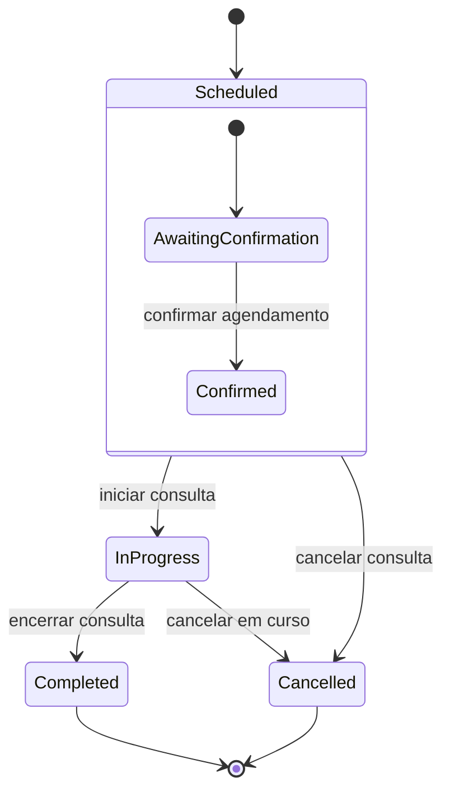

# Sprint 3 — Cenários de Uso, User Stories e Diagrama de Estados

## Objetivo da Sprint

Esta sprint foca a evolução do sistema MiaCaoMigo para a clínica veterinária, privilegiando a integração entre o website e a base de dados. As entregas centrais são:

- Seleção de CdU prioritários.
- Narrativas de fluxo principal e fluxos alternativos.
- User Stories com critérios de aceitação.
- Mockups de interface para os requisitos selecionados.
- Diagrama de estados para uma classe mais adequada.

---

## CdU Prioritários Selecionados

Escolhemos dois CdU principais que são críticos para o funcionamento da clínica e têm impacto direto na aplicação web e na base de dados:

1. **Autenticar Usuário**
   - Permite que clientes e funcionários façam login no sistema.
   - É pré-requisito para consultar e agendar consultas.

2. **Agendar Consulta**
   - Permite que um cliente marque uma consulta para o seu animal.
   - Inclui também a visão de consulta por functionário e a mudança de estado da consulta.

---

## Persona

### Cliente — Mariana

- Tem 28 anos e é dona de um cão e um gato.
- Usa o site para marcar consultas, ver histórico e consultar status das consultas.
- Precisa de um processo rápido e claro, com confirmação visível após marcar.

### Funcionário/Veterinário — Dr. João

- Utiliza o sistema para iniciar e fechar consultas.
- Consulta marcações dos clientes e gere horários.
- Precisa de informações imediatas do cliente e do animal.

---

## CdU 1 — Autenticar Usuário

### Descrição

O sistema permite que um utilizador existente faça login com e-mail e password. O login carrega um JWT que identifica se o utilizador é cliente ou staff.

### Fluxo Principal

1. O utilizador abre a página de login.
2. O utilizador insere o e-mail e a password.
3. O sistema valida as credenciais.
4. Se as credenciais estiverem corretas, o sistema emite um token JWT.
5. O utilizador recebe confirmação de login e é redirecionado para a página inicial ou painel.

### Fluxos Alternativos

- A1: E-mail não encontrado.
  - O sistema mostra a mensagem "Conta não encontrada."
  - O utilizador permanece na página de login.

- A2: Password incorreta.
  - O sistema mostra a mensagem "Password incorreta."
  - O utilizador pode tentar novamente.

- A3: Conta desativada.
  - O sistema mostra a mensagem "Conta desativada. Contacte a clínica."

- A4: Já existe sessão ativa.
  - O sistema mostra a mensagem "Já existe uma sessão ativa."

### User Stories

#### US1 - Login do Cliente

Como cliente,
quero autenticar-me com e-mail e password,
para aceder ao meu histórico de consultas e marcar novas consultas.

Critérios de aceitação:

- O formulário aceita e-mail e password.
- O sistema valida entrada não vazia.
- Em caso de sucesso, retorna token JWT e dados do utilizador.
- Em caso de falha, mostra mensagem de erro adequada.

#### US2 - Login do Funcionário

Como funcionário,
quero entrar no sistema com o meu e-mail institucional,
para poder aceder às funções de gestão de consultas.

Critérios de aceitação:

- O login valida e-mail e password.
- Identifica se o utilizador é staff a partir do e-mail.
- Se staff, retorna a lista de permissões.

### Testes de Aceitação

#### TC1 - Login com sucesso (cliente)

- Dado que o cliente tem conta válida,
- Quando inserir e-mail e password corretos,
- Então o sistema deve retornar token JWT e `success: true`.

#### TC2 - Login com e-mail inválido

- Dado que o e-mail não existe,
- Quando tentar autenticar,
- Então o sistema deve retornar status 401 e mensagem "Conta não encontrada.".

#### TC3 - Login com password errada

- Dado que o e-mail existe e a password está errada,
- Quando submeter o formulário,
- Então o sistema deve retornar status 401 e mensagem "Password incorreta.".

---

## CdU 2 — Agendar Consulta

### Descrição

O sistema permite que um cliente marque uma nova consulta para o seu animal e que um funcionário visualize todas as consultas e atualize o estado de uma consulta.

### Fluxo Principal

1. O cliente autenticado acede ao painel de marcação de consultas.
2. Seleciona o animal e a data/hora desejada.
3. Escolhe um veterinário disponível.
4. Submete o pedido de marcação.
5. O sistema grava a consulta na tabela `appointment`.
6. O cliente recebe confirmação de que a consulta foi criada.

### Fluxos Alternativos

- A1: Campos obrigatórios em falta.
  - O sistema sinaliza os campos que faltam.
  - O cliente corrige e tenta novamente.

- A2: Veterinário indisponível / erro de FK.
  - O sistema devolve erro se `id_vet` ou `id_usr` não existir.
  - O cliente/funcionário escolhe outro veterinário ou verifica os dados.

- A3: Staff cria consulta em nome de cliente.
  - Um funcionário preenche `id_usr` do cliente.
  - O sistema valida se o cliente existe e cria a consulta.

- A4: Cliente tenta ver consultas de outro cliente.
  - O sistema devolve 403 e nega o acesso.

### User Stories

#### US3 - Marcar Consulta como Cliente

Como cliente autenticado,
quero agendar uma consulta para o meu animal,
para receber atendimento veterinário.

Critérios de aceitação:

- O cliente só consegue marcar consultas quando autenticado.
- O formulário pede animal, data/hora e veterinário.
- A API grava o registo na tabela `appointment`.
- O cliente vê confirmação de sucesso.

#### US4 - Ver histórico de consultas do cliente

Como cliente,
quero ver a lista das minhas consultas marcadas,
para saber quando ocorrerão e o seu estado.

Critérios de aceitação:

- O cliente só vê as próprias consultas.
- O sistema usa `/appointments/client/:id_usr`.
- Consultas de outros clientes não são visíveis.

#### US5 - Iniciar e Encerrar Consulta (staff)

Como funcionário,
quero iniciar e fechar uma consulta,
para registar quando a consulta começou e terminou.

Critérios de aceitação:

- Staff autorizado acede às rotas `PATCH /appointments/:id_app/start` e `/appointments/:id_app/close`.
- O estado temporal da consulta é atualizado no banco.
- Se a consulta não existir, o sistema devolve 404.

### Testes de Aceitação

#### TC4 - Marcar consulta com sucesso

- Dado um cliente autenticado com animal cadastrado,
- Quando submeter data, veterinário e animal válidos,
- Então a API deve retornar status 201 e o registo `appointment` criado.

#### TC5 - Visualizar próprias consultas

- Dado um cliente autenticado,
- Quando aceder à rota `/appointments/client/:id_usr` com o seu id,
- Então o sistema retorna apenas as consultas desse cliente.

#### TC6 - Iniciar consulta como staff

- Dado um staff autenticado,
- Quando submeter `PATCH /appointments/:id_app/start` para uma consulta existente,
- Então o registo deve ter `sta_dat_app` preenchido.

#### TC7 - Encerrar consulta como staff

- Dado um staff autenticado,
- Quando submeter `PATCH /appointments/:id_app/close` para uma consulta existente,
- Então o registo deve ter `end_dat_app` preenchido.

---

## Mockups de Interface

### Mockup 1 — Página de Login

Elementos principais:

- Campo `E-mail`
- Campo `Password`
- Botão `Entrar`
- Espaço para mensagens de erro
- Link de recuperação de password (opcional)

> O layout deve ser simples e responsivo, com entrada centralizada e feedback claro.

### Mockup 2 — Página de Agendamento de Consulta

Elementos principais:

- Dropdown `Animal`
- Campo `Data e Hora`
- Dropdown `Veterinário`
- Botão `Confirmar consulta`
- Resumo da consulta após submissão
- Mensagens de validação em linha

> O cliente deve perceber facilmente quais são os campos obrigatórios.

### Mockup 3 — Painel de Consultas do Cliente

Elementos principais:

- Lista de consultas agendadas
- Estado da consulta (`Agendada`, `Em Curso`, `Concluída`)
- Data/hora, veterinário e animal
- Link para detalhes da consulta

> Deve permitir confirmar que a consulta está registada e visualizar o histórico.

---

## Diagrama de Estados — Classe `Appointment`

A classe mais adequada para o diagrama de estados é `Appointment`, pois o fluxo de vida da consulta implica transições de estado explícitas.

### Observações

- O sistema atual já implementa a criação e as transições `start` / `close`.
- A transição `cancel` pode ser adicionada em sprints futuras.

---

## Como Usar este Documento

1. Rever os CdU com a equipa e validar se estes são os de maior prioridade na sprint.
2. Implementar primeiro a autenticação e depois o agendamento de consultas.
3. Usar os mockups como guia para o desenvolvimento frontend.
4. Validar cada US com os testes de aceitação propostos.

---

## Referências Técnicas

- API de agendamento: `POST /appointments`, `GET /appointments/client/:id_usr`, `PATCH /appointments/:id_app/start`, `PATCH /appointments/:id_app/close`
- API de autenticação: `POST /users/auth/login`, `GET /users/auth/me`
- Tabelas relevantes na base de dados: `user_account`, `login_record`, `appointment`, `animal`, `employee`, `client`.
