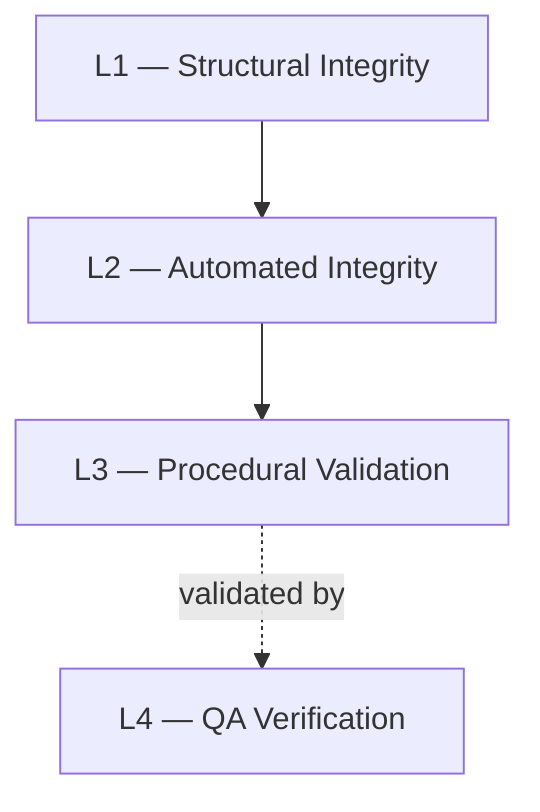

# Integrity Architecture

## Overview

This document defines the high-level integrity architecture adopted within the **MiaCaoMigo** database system.

The system enforces integrity through a layered architecture where declarative validation, automated safeguards, procedural workflows, and QA verification operate together to preserve consistency and prevent invalid operational states.

The purpose of this architecture is to ensure:

- relational consistency;
- deterministic integrity enforcement;
- transactional reliability;
- operational predictability;
- controlled validation boundaries;
- maintainability across all modules.

> These standards are mandatory for all database modules and contributors.

---

# Global Integrity Consistency

All modules must preserve the same integrity philosophy and architectural organization.

Modules 1, 2, 3, and 4 must maintain:

- identical integrity layering principles;
- identical enforcement priorities;
- identical validation boundaries;
- identical architectural responsibilities;
- identical integrity governance standards.

There are no module-specific integrity exceptions.

---

# Integrity Philosophy

The database is the primary authority for integrity enforcement.

Integrity mechanisms must prioritize:

- deterministic enforcement;
- transactional consistency;
- prevention of invalid states;
- semantic clarity;
- operational predictability;
- maintainability across all modules.

Applications must interact with the database exclusively through controlled service contracts.

Integrity rules should not be duplicated unnecessarily across multiple validation layers.

When duplication is unavoidable, the rationale must be explicitly documented.

---

# Integrity Enforcement Priority

Integrity rules should be enforced at the lowest deterministic layer capable of guaranteeing consistency.

Recommended enforcement order:

1. Structural integrity
2. Automated integrity
3. Procedural validation
4. QA verification

---

# Layered Integrity Model

---

# Integrity Layers

| Layer | Responsibility |
|---|---|
| Structural Integrity | Declarative relational enforcement |
| Automated Integrity | Automatic operational safeguards |
| Procedural Validation | Workflow orchestration and business validation |
| QA Verification | Regression and integrity validation |

---

# Layer Responsibility Boundaries

| Layer | Must Not |
|---|---|
| Structural Integrity | Orchestrate workflows |
| Automated Integrity | Expose public APIs |
| Procedural Validation | Replace declarative validation |
| QA Verification | Replace production enforcement |

---

# Integrity Isolation Principles

Each integrity layer must preserve isolated responsibilities.

Cross-layer duplication should be minimized whenever technically feasible.

Integrity mechanisms must remain:

- deterministic;
- semantically explicit;
- operationally predictable;
- architecturally isolated.

---

# Repository Architecture

Integrity governance documentation is organized into specialized layers.

| Layer | Governance Document |
|---|---|
| Structural Integrity | `00_Structural_Integrity.md` |
| Automated Integrity | `01_Automated_Integrity.md` |
| Procedural Validation | `03_Procedural_Validation.md` |
| QA Verification | `04_QA_Verification.md` |

---

# Design Principles

The adopted integrity architecture intentionally prioritizes:

- deterministic integrity enforcement;
- architectural consistency;
- transactional reliability;
- operational predictability;
- maintainability across all modules;
- validation clarity;
- long-term scalability.

---

# Final Statement

Integrity is considered a core architectural responsibility of the MiaCaoMigo database system.

All integrity standards defined in this architecture must be preserved across:

- all modules;
- all validation layers;
- all transactional workflows;
- all integrity mechanisms;
- all future system extensions.