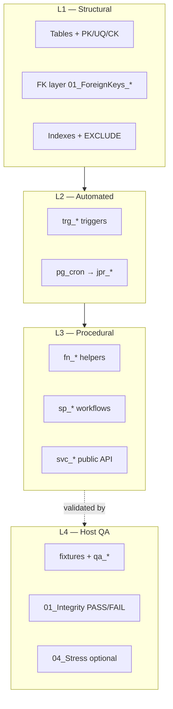

# Integrity Strategy

## Purpose

How MiaCaoMigo enforces correctness: **in-database** rules plus **host-side QA** that validates behaviour without shipping test SQL in the default Docker init.

Implementation: `01_MiaCaoMigo_DataLayer/DataBase/`.

---

## Integrity philosophy

The database is the **primary authority** for:

- relational consistency (PK, FK, UNIQUE, CHECK, EXCLUDE)
- automated guards (triggers, pg_cron)
- business workflows (`sp_*`, invoked via `svc_*`)
- audit structures (`login_record`, timestamps, …)

The application should call **`svc_*` only**; it must not bypass triggers or reimplement constraint logic in app code for rules already enforced in PostgreSQL.

---

## Layered model (as implemented)

| Layer | Mechanism | Where |
|-------|-----------|-------|
| **Structural** | Declarative constraints | `Schema/*/00_Tables`, `01_ForeignKeys`, `04_Indexes` |
| **Automated** | Triggers, scheduled jobs | `03_Triggers`, `06_Jobs` |
| **Procedural** | Functions, procedures, views | `02_Functions`, `05_Procedures`, `07_Views`, `Services/` |
| **Contract QA** | Executable tests | `QA/01_Integrity`, `ci.ps1` |
| **Stress QA** | Volume / contention probes | `QA/04_Stress`, optional `-IncludeStress` |

---

## Structural integrity

- **FK phase**: all modules’ tables exist before any `01_ForeignKeys_ModX.sql` runs (see [Schema build pipeline](../../00_Schema_Build_Pipeline.md)).
- **Exclusion constraints**: GiST-based (e.g. `ex_schedule_overlap` on schedule) — validated in QA `06_Schedule_Exclusion.sql`.
- **Cross-module FKs**: concentrated in owning module FK files (e.g. Module 4 links to animal, client, employee, invoice).
- **Optional references (Module 3):** four nullable columns use **soft references** — no physical FK; integrity via `sp_receive_purchase`, `tfn_return_restock`, and QA. SchemaSpy “implied” edges are expected. Detail: [M3 architecture](../../01_Schemas/00_Public_Schema/03_Module3_Architecture.md#soft-references-logical-not-physical-fk).

Module-level constraint inventories: [Module 1 structural](01_Module1_Integrity/00_Structural_Integrity.md).

---

## Automated integrity

- **Triggers** (`trg_*`): block invalid transitions before commit.
- **Jobs** (`cron.schedule` → `call jpr_*()`): hygiene at midnight (M1 clock-in, absences); M4 may add schedules.

Details: [Module 1 automated](01_Module1_Integrity/01_Automated_Integrity.md).

---

## Procedural integrity

| Module | Business workflows | Public API |
|--------|-------------------|------------|
| **1** | `sp_*` in Services | `svc_*` in `99_Public_API/` |
| **2–4** | `sp_*` in Schema procedures | `svc_*` in bundled `99_Public_API.sql` |

Authentication example: `svc_auth_login` → `sp_auth_login` → `fn_*` + `login_record`.

Details: [Module 1 procedural](01_Module1_Integrity/03_Procedural_Validation.md).

---

## QA integrity (non-init)

QA does **not** replace triggers; it **proves** they fire under fixture-controlled scenarios.

| Stage | Script | Count / scope |
|-------|--------|----------------|
| Bootstrap contract | `00_Bootstrap/01_Master_Contract.sql` | Master counts, no DemoData in `init_qa` |
| Fixtures | `fixtures/seed/*.sql` | Semantic `QA-*` keys |
| Integrity | `01_Integrity/**/*.sql` | **21** tests |
| Stress | `04_Stress/**/*.sql` | **9** tests (optional) |

Runner: `DataBase/QA/runners/ci.ps1` (see [Governance README](../README.md)).

---

## Temporal and audit integrity

- Scheduling: exclusion constraints + trigger guards + QA overlap tests
- Attendance: clock-in triggers + `jpr_auto_close_clock_in_midnight`
- Auth: `login_record` / session rules — `02_Login_Session_Rules.sql`

---

## Module documentation map

| Module | Governance | Automated tests (DataLayer) |
|--------|------------|-------------------------------|
| 1 | [M1 structural](01_Module1_Integrity/00_Structural_Integrity.md) · [automated](01_Module1_Integrity/01_Automated_Integrity.md) · [procedural](01_Module1_Integrity/03_Procedural_Validation.md) | 6 integrity scripts |
| 2 | [M2 overview](02_Module2_Integrity/00_Overview.md) | 5 integrity scripts |
| 3 | [M3 overview](03_Module3_Integrity/00_Overview.md) | 4 integrity scripts |
| 4 | [M4 overview](04_Module4_Integrity/00_Overview.md) | 6 integrity scripts |

---

## Consistency rules for new work

1. Prefer **structural** enforcement when sufficient (UNIQUE, EXCLUDE, FK).
2. Use **triggers** for row-level guards that need context.
3. Use **`sp_*` / `svc_*`** for multi-step business flows.
4. Add **`01_Integrity`** test with `PASS:`/`FAIL:` and fixture `REQUIRES` / `CONTRACT` headers.
5. Update module overview tables when adding tests or constraints.

---

## Final note

Integrity is **distributed by design**: declarative SQL for invariants, Services for workflows, QA for regression proof. Avoid duplicating the same rule in app, trigger, and test without justification — when duplicated, document why in the test header `RULE:` line.
