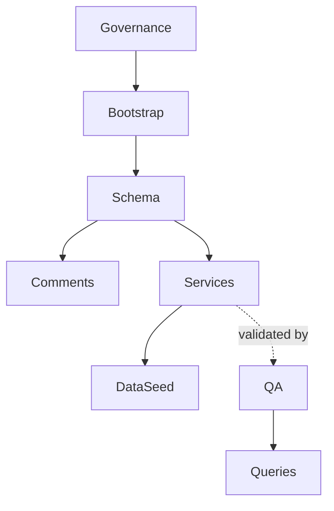
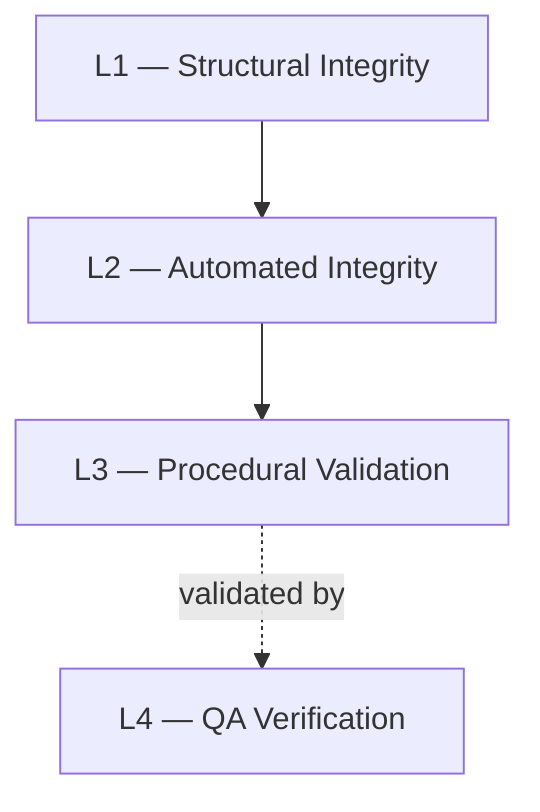

# Database Governance Overview

## Overview

This directory defines the official governance, standards, integrity architecture, and SQL development conventions adopted within the **MiaCaoMigo** database system.

The governance model establishes a consistent approach for:

- SQL development standards;
- naming conventions;
- integrity architecture;
- repository organization;
- validation boundaries;
- documentation consistency;
- maintainability across all modules.

The purpose of this governance structure is to ensure:

- architectural consistency;
- deterministic repository organization;
- standardized SQL readability;
- controlled integrity enforcement;
- maintainable database evolution;
- long-term scalability.

> All governance standards defined within this directory are mandatory for all database modules and contributors.

---

# Governance Structure

| Section | Responsibility |
|---|---|
| Naming Conventions | Naming philosophy and semantic consistency |
| SQL Standards | SQL formatting, repository structure, and execution standards |
| Integrity Architecture | Layered integrity architecture and enforcement boundaries |
| Structural Integrity | Declarative relational validation |
| Automated Integrity | Trigger and scheduled enforcement |
| Procedural Validation | Workflow orchestration and transactional validation |
| QA Verification | Integrity validation and regression verification |

---

# Governance Directory Structure

```text
00_Governance/
├── 00_Governance_Overview.md
├── 00_Naming_Conventions/
│   ├── 00_Naming_Philosophy.md
│   ├── 01_Schema_Objects.md
│   └── 02_SQL_Programming.md
├── 01_SQL_Standards/
│   └── 00_SQL_Standards.md
└── 02_Integrity_Rules/
    ├── 00_Integrity_Architecture.md
    ├── 01_Structural_Integrity.md
    ├── 02_Automated_Integrity.md
    ├── 03_Procedural_Validation.md
    └── 04_QA_Verification.md
```

---

# Governance Philosophy

The governance architecture adopts a layered and isolated standards model where each documentation layer preserves a clearly defined responsibility boundary.

The governance structure prioritizes:

- deterministic standards;
- architectural consistency;
- repository readability;
- semantic clarity;
- maintainability across all modules;
- controlled implementation boundaries.

All governance layers must remain:

- structurally isolated;
- semantically consistent;
- operationally deterministic;
- architecturally aligned.

---

# Repository Architecture

The database repository is organized into isolated operational layers.



---

# Integrity Architecture

The system enforces integrity through a layered validation architecture.



Integrity rules should be enforced at the lowest deterministic layer capable of guaranteeing consistency.

Recommended enforcement order:

1. Structural integrity
2. Automated integrity
3. Procedural validation
4. QA verification

---

# Architectural Conventions

## Module Consistency

Modules 1, 2, 3, and 4 must preserve:

- identical naming philosophy;
- identical repository organization;
- identical execution ordering;
- identical SQL formatting standards;
- identical integrity architecture;
- identical governance principles.

There are no module-specific governance exceptions.

---

## Repository Isolation

Each repository layer must preserve isolated responsibilities.

Cross-layer responsibility duplication should be minimized whenever technically feasible.

Repository layers must remain:

- deterministic;
- semantically explicit;
- operationally predictable;
- architecturally isolated.

---

# Bootstrap Architecture

The bootstrap system is responsible for deterministic database initialization and orchestration.

The bootstrap architecture must preserve:

- deterministic execution ordering;
- isolated initialization responsibilities;
- controlled dependency loading;
- predictable environment initialization.

---

# QA Architecture

QA validation remains isolated from the default initialization process.

QA validation is responsible for:

- integrity verification;
- regression validation;
- workflow validation;
- transactional consistency validation;
- stress validation.

QA mechanisms validate repository behavior but must not replace production integrity enforcement layers.

---

# Documentation Standards

All governance documentation must preserve:

- structural consistency;
- semantic clarity;
- deterministic terminology;
- isolated documentation responsibilities;
- maintainable architectural organization.

Governance documentation defines standards and implementation boundaries.

Repository implementations must preserve all standards defined within this governance structure.

---

# Design Principles

The adopted governance architecture intentionally prioritizes:

- architectural consistency;
- deterministic standards;
- repository readability;
- maintainability across all modules;
- controlled validation boundaries;
- procedural clarity;
- long-term scalability.

---

# Final Statement

Database governance is considered a core architectural responsibility of the **MiaCaoMigo** database system.

All governance standards defined within this structure must be preserved across:

- all modules;
- all repository layers;
- all integrity mechanisms;
- all procedural workflows;
- all future system extensions.