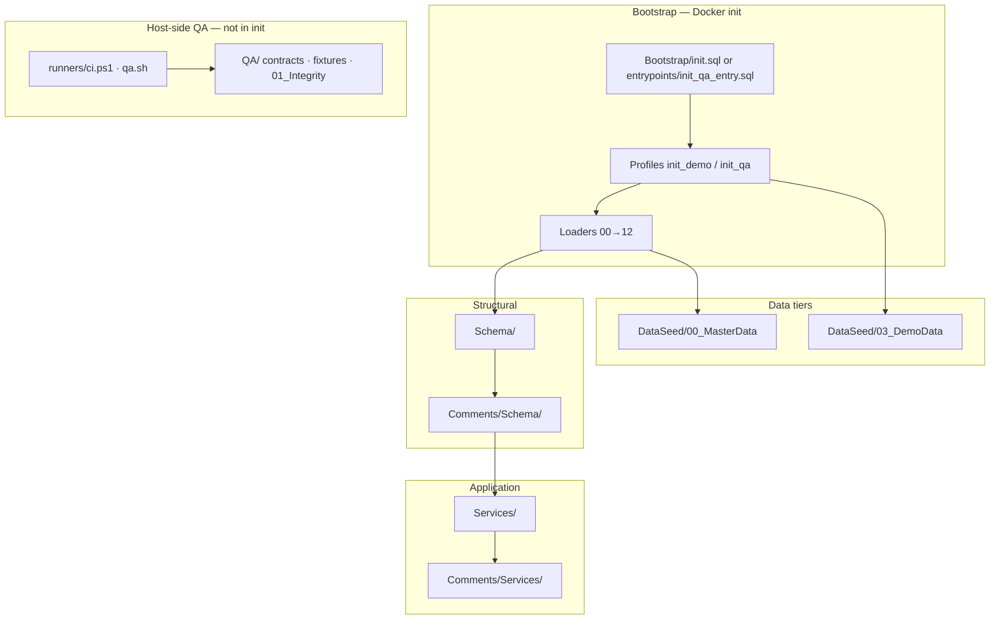

# Database governance

  As-implemented
  DataLayer-aligned
  MkDocs

Official standards for **`01_MiaCaoMigo_DataLayer`**. These documents describe what the project **actually does today** — not a future target architecture.

!!! info "Implementation repository"
    Runnable SQL, loaders, and QA live in the sibling repo:
    `01_MiaCaoMigo_DataLayer/DataBase/`.

!!! tip "Related documentation"
    - [Database hub](../README.md) — central index for `01_Database`
    - [Schema build pipeline](../00_Schema_Build_Pipeline.md) — loader order and FK phase
    - [Schemas overview](../01_Schemas/README.md) · [Database architecture](../01_Schemas/00_Public_Schema/00_Database_Architecture.md)
    - [Data dictionary](../04_Data_Dictionary/00_Overview.md) · [SchemaSpy](../05_SchemaSpy/schemaspy.md)

---

## Governance map

| Section | Documents | Reflects |
|---------|-----------|----------|
| **Naming** | [Philosophy](00_Naming_Conventions/00_Naming_Philosophy.md) · [Schema objects](00_Naming_Conventions/01_Schema_Objects.md) · [SQL programming](00_Naming_Conventions/02_SQL_Programming.md) | Tables, constraints, `fn_`/`sp_`/`svc_`/`qa_`/`jpr_`/`trg_` |
| **SQL standards** | [SQL standards](01_SQL_Standards/00_SQL_Standards.md) | Formatting, module files, layer folders |
| **Integrity** | [Strategy](02_Integrity_Rules/00_Integrity_Strategy.md) · [M1](02_Integrity_Rules/01_Module1_Integrity/) · [M2](02_Integrity_Rules/02_Module2_Integrity/00_Overview.md) · [M3](02_Integrity_Rules/03_Module3_Integrity/00_Overview.md) · [M4](02_Integrity_Rules/04_Module4_Integrity/00_Overview.md) | DDL + triggers + QA; M3 [soft refs](../01_Schemas/00_Public_Schema/03_Module3_Architecture.md#soft-references-logical-not-physical-fk) |
| **Templates** | [Templates index](03_Templates/README.md) | Copy-paste skeletons matching live code |

---

## DataLayer layer model (current)

| Layer | Path | Loaded at Docker init? |
|-------|------|------------------------|
| **Bootstrap** | `DataBase/Bootstrap/` | Yes (orchestration only) |
| **Schema** | `DataBase/Schema/` | Yes (via loaders) |
| **Comments** | `DataBase/Comments/` | Yes |
| **Services** | `DataBase/Services/` | Yes |
| **DataSeed** | `DataBase/DataSeed/` | Yes (profile-dependent) |
| **QA** | `DataBase/QA/` | No — `ci.ps1` / `qa.sh` |
| **Queries** | `DataBase/Queries/` | No — reference only |

---

## Architectural agreements (stable)

### Module 1 vs Modules 2–4

| Concern | Module 1 | Modules 2–4 |
|---------|----------|---------------|
| Business `sp_*` workflows | `Services/01_Module1/**` | `Schema/*/05_Procedures_Mod*.sql` |
| Public API `svc_*` | `Services/01_Module1/99_Public_API/` (split files) | `Services/0N_ModuleN/99_Public_API.sql` |
| Technical job procedures | `Schema/.../05_Procedures_Mod1.sql` (`jpr_*`) | M4 jobs; M2/M3 placeholders |
| Internal helpers | `fn_*` in Services + Schema trigger fns | Mostly Schema `fn_*` |

### Bootstrap profiles (active)

| Profile | Data | Typical use |
|---------|------|-------------|
| `init_demo` | Master + Demo | Local dev (default `init.sql`) |
| `init_qa` | Master only | CI / automated QA |
| `init_core` | DDL + services | Composed by demo/qa |
| `init_full_qa` | SQL alias → `init_qa` | Hint: run `QA/runners/ci.ps1` on host |

### QA / CI (active)

| Entry | Role |
|-------|------|
| `runners/ci.ps1` | PowerShell pipeline (single source of truth) |
| `runners/qa.sh` | Linux / GitHub Actions → `pwsh ci.ps1` |
| `stages/bootstrap.ps1` | Master contract |
| `stages/fixtures.ps1` | Contracts + `fixtures/seed/` |
| `stages/integrity.ps1` | 21 scripts in `01_Integrity/` |
| `stages/stress.ps1` | Optional `04_Stress/` |

!!! warning "Legacy (do not document as CI path)"
    - `04_Stress/00_Setup/01_Commercial_Stress_Fixture.sql` — superseded by `fixtures/seed/m3_stress_commercial.sql`
    - Former runners `run_ci.ps1`, `run_full_qa.ps1` — removed; use `ci.ps1`

---

## Header families (both valid)

Pick the variant used by neighbouring files in the same folder:

1. **Schema** — `MODULE`, `FILE`, `DESCRIPTION` or `PURPOSE`, `LOAD ORDER` / `LOADED BY`
2. **Services (M1)** — `PURPOSE`, `DEPENDENCIES`, `LOADED BY`, optional `BUSINESS WORKFLOW: sp_*`
3. **QA** — `INTEGRITY —` / `STRESS —` / `QUERIES —`, `REQUIRES`, `CONTRACT` (or `n/a`)
4. **Comments** — `comments: Schema — Module N` + loader reference (pilot on M1 tables)

See [Templates](03_Templates/README.md) for skeletons.

---

## Change policy

| Change type | Governance update? | DataLayer change? |
|-------------|-------------------|-------------------|
| New `svc_*` / `sp_*` | Yes — naming + module doc | Yes |
| New integrity test | Yes — QA template + module overview | Yes |
| Loader order | Yes — SQL standards + pipeline doc | Yes — **high risk** |
| Comment-only / README | Optional | No |

Governance changes **must not** alter SQL behaviour in DataLayer; they document and guide implementation only.
