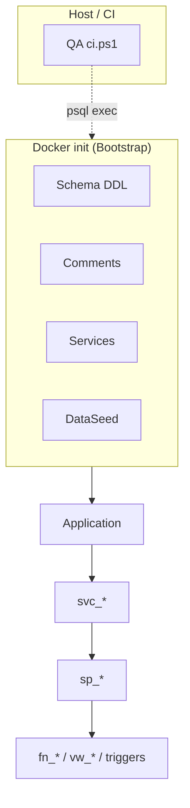
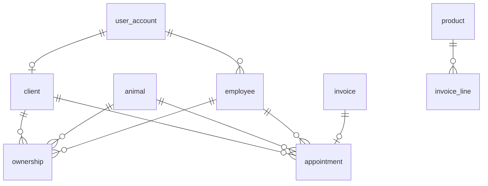

# Database architecture (public schema)

!!! info "Implementation source"
    **DDL:** `01_MiaCaoMigo_DataLayer/DataBase/Schema/`  
    **Governance:** [00_Governance](../../00_Governance/README.md) · **Pipeline:** [Schema build pipeline](../../00_Schema_Build_Pipeline.md)

## Purpose

Describes how the MiaCaoMigo database is **organized and loaded** today: four business modules in PostgreSQL `public`, bootstrap orchestration, Services public API, and host-side QA.

---

## Architectural philosophy

| Principle | Implementation |
|-----------|----------------|
| Modular domains | Four folders under `Schema/`, one FK layer per module |
| Database-centric integrity | Constraints, triggers, `sp_*` / `jpr_*`, then QA proofs |
| Controlled cross-module coupling | FKs in dedicated phase; no circular `CREATE TABLE` |
| Single public API surface | `svc_*` only in Services (not in Schema) |
| Academic pragmatism | One physical schema (`public`); logical modules in folders |

---

## Physical vs logical schema

All objects currently live in PostgreSQL **`public`**. Logical separation is by **directory and loader order**, not by separate PG schemas. Future PG schema split is possible without changing the module naming convention.

---

## Modular organization

| Module | Domain | Schema folder | Primary consumers |
|--------|--------|---------------|-------------------|
| **1** | Users, RBAC, auth, attendance | `01_Module1_User_Management/` | All modules |
| **2** | Animals, ownership, delivery, concession | `02_Module2_Animal_Management/` | M4, QA |
| **3** | Products, stock, purchases, invoices, returns | `03_Module3_Commercial_Management/` | M4 (invoice link) |
| **4** | Appointments, clinical notes, prescriptions | `04_Module4_Appointment_Management/` | Integrates M1–M3 |

Detailed module docs: [Schemas index](../README.md).

---

## Stack layers (beyond Schema)

| Layer | Repository path | Role |
|-------|-----------------|------|
| **Bootstrap** | `DataBase/Bootstrap/` | Profiles, loader order |
| **Schema** | `DataBase/Schema/` | Tables, integrity, views, M2–M4 `sp_*`, `jpr_*` |
| **Comments** | `DataBase/Comments/` | Metadata |
| **Services** | `DataBase/Services/` | M1 `sp_*`, all `svc_*` |
| **DataSeed** | `DataBase/DataSeed/` | Master + Demo data |
| **QA** | `DataBase/QA/` | Contracts, fixtures, 21+ integrity tests |
| **Queries** | `DataBase/Queries/` | Manual reference (not init) |

---

## Module 1 vs Modules 2–4 (procedural split)

!!! note "Agreed architecture"
    This split is **intentional** in the current codebase, not technical debt.

| | Module 1 | Modules 2–4 |
|---|----------|-------------|
| Business `sp_*` | `Services/01_Module1/**` | `Schema/*/05_Procedures_Mod*.sql` |
| Public `svc_*` | `Services/01_Module1/99_Public_API/` (4 files) | `Services/0N_ModuleN/99_Public_API.sql` |
| Job procedures `jpr_*` | `Schema/.../05_Procedures_Mod1.sql` | Module 4 active; M2/M3 job files placeholder |
| Triggers `trg_*` | Schema | Schema |

Flow: **`svc_*` → `sp_*` → `fn_*` / `vw_*` / triggers** ([naming](../../00_Governance/00_Naming_Conventions/02_SQL_Programming.md)).

---

## Cross-module relational integration

Dependencies are enforced in **`01_ForeignKeys_ModX.sql`** (after all `00_Tables_*`).

**Examples**

- M2 `ownership` → M1 `client`, `employee`; → M2 `animal`
- M3 `invoice` / `purchase` → M1 `client`, `employee`; → M3 `product`
- M4 `appointment` → M1 `client`, `employee`; M2 `animal`; M3 `invoice` (optional link)

Module 3 uses `fk_purchase_client` / `fk_purchase_employee` to avoid global FK name clashes with M4.

---

## Integrity enforcement model

| Mechanism | Where documented |
|-----------|------------------|
| PK, FK, UNIQUE, CHECK | [M1 structural](../../00_Governance/02_Integrity_Rules/01_Module1_Integrity/00_Structural_Integrity.md), module overviews |
| GiST EXCLUDE | `ex_schedule_overlap` (M1), `ex_ownership_overlap` (M2), `ex_appointment_vet_overlap` (M4) |
| Triggers `trg_*` | Per-module architecture pages |
| pg_cron → `jpr_*` | M1 + M4 `06_Jobs_*.sql` |
| QA `PASS:` / `FAIL:` | [Integrity strategy](../../00_Governance/02_Integrity_Rules/00_Integrity_Strategy.md) |

---

## Bootstrap and profiles

| Entry | Profile | Schema impact |
|-------|---------|---------------|
| `Bootstrap/init.sql` | `init_demo` | Full DDL + Master + Demo |
| `entrypoints/init_qa_entry.sql` | `init_qa` | Full DDL + Master only |

Load sequence: [Schema build pipeline](../../00_Schema_Build_Pipeline.md).  
**QA does not modify Schema files at runtime** — it executes test SQL against an initialized database.

---

## Scalability notes (realistic)

The current design supports:

- New integrity tests under `QA/01_Integrity/`
- New `svc_*` without exposing internal `sp_*`
- Additional modules following the same `0N_*_ModX.sql` pattern

Avoid documenting features not present in DataLayer (e.g. separate PG schemas, ETL loader `04_Data_Migration` — **not in repo**).

---

## Related links

- [Schemas documentation index](../README.md)
- DataLayer `DataBase/Services/README.md` — public API and M1 workflows
- [ER model](../../../03_Diagrams/00_ER_Model/er_model.md)
