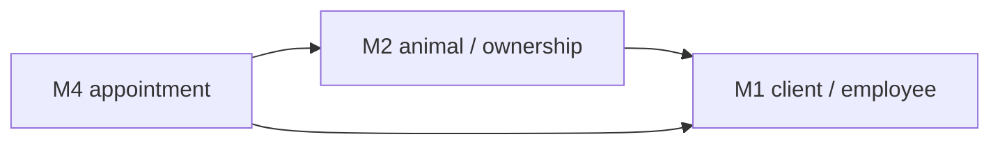

# Module 2 — Animal management

!!! info "Implementation"
    **Schema DDL:** `DataBase/Schema/02_Module2_Animal_Management/`  
    **Public API:** `DataBase/Services/02_Module2/99_Public_API.sql`  
    **Domain `sp_*`:** `Schema/.../05_Procedures_Mod2.sql`

## Purpose

Species, breeds, animals, ownership, external entities, deliveries, and concessions. Provides the clinical subject layer for appointments and adoption workflows.

---

## Schema artefacts

| File | Contents |
|------|----------|
| `00_Tables_Mod2.sql` | 8 tables |
| `01_ForeignKeys_Mod2.sql` | Links to M1 `client`, `employee`; internal animal graph |
| `02_Functions_Mod2.sql` | Trigger helpers |
| `03_Triggers_Mod2.sql` | 4 triggers |
| `04_Indexes_Mod2.sql` | Indexes + **`ex_ownership_overlap`** (GiST) |
| `05_Procedures_Mod2.sql` | Domain `sp_*` workflows |
| `06_Jobs_Mod2.sql` | Placeholder (skipped at bootstrap) |
| `07_Views_Mod2.sql` | 3 `vw_*` |

---

## Core entities

| Table | Role |
|-------|------|
| `species`, `breed` | Taxonomy |
| `animal` | Animal master record |
| `external_entity` | External partner orgs |
| `ownership` | Client–animal relationship over time |
| `concession` | Concession to external entity |
| `delivery`, `delivery_employee` | Delivery events and staff |

---

## Cross-module dependencies

| FK source (M2) | Targets M1 |
|----------------|------------|
| `ownership.id_cli` | `client` |
| `ownership.id_emp` | `employee` |
| `delivery_employee.id_emp` | `employee` |

---

## Domain procedures (`sp_*` in Schema)

| Procedure | Workflow |
|-----------|----------|
| `sp_register_animal` | New animal registration |
| `sp_assign_ownership` | Start ownership |
| `sp_end_ownership` | End ownership |
| `sp_record_delivery` | Delivery with employees |
| `sp_process_concession` | Concession processing |

---

## Public API (`svc_*` in Services)

| `svc_*` | Behaviour |
|---------|-----------|
| `svc_register_adoption` | `CALL sp_assign_ownership` |
| `svc_register_delivery` | `CALL sp_record_delivery` |
| `svc_animal_exit` | Controlled DML on `animal` + `ownership` |
| `svc_get_animal_history` | Custom read |
| `svc_list_internal_animals_available` | `vw_internal_animals_available` |
| `svc_get_active_ownership_by_animal` | Ownership read |
| `svc_get_animal_catalog_entry` | `vw_animal_catalog_detail` |

---

## Triggers

| Trigger | Purpose |
|---------|---------|
| `trg_block_ownership_if_animal_inactive` | Inactive animal guard |
| `trg_check_delivery_date_consistency` | Delivery dates |
| `trg_prevent_duplicate_active_ownership` | Single active ownership |
| `trg_validate_animal_breed_species` | Breed/species match |

---

## Exclusion constraint

**`ex_ownership_overlap`** — prevents overlapping ownership intervals per animal (GiST).  
QA: `01_Duplicate_Ownership.sql`, `02_Ownership_Lifecycle.sql`.

---

## Views

| View | Purpose |
|------|---------|
| `vw_active_ownership_detail` | Active ownership rows |
| `vw_animal_catalog_detail` | Catalog browse |
| `vw_internal_animals_available` | Internal availability |

---

## QA coverage (5 scripts)

| Script | Rule |
|--------|------|
| `01_Duplicate_Ownership.sql` | Overlap / duplicate |
| `02_Ownership_Lifecycle.sql` | Lifecycle |
| `03_Breed_Species_Consistency.sql` | Breed vs species |
| `04_Delivery_Date_Consistency.sql` | Delivery |
| `05_Concession_And_Inactive.sql` | Concession + inactive |

Fixture: `fixtures/seed/m2_animals_ownership.sql`. Reset: `fixtures/reset/m2_animal1_ownership.sql`.

Stress: `04_Stress/02_Module2/01_Concurrent_Adoption.sql`.

---

## Related

- [Database architecture](00_Database_Architecture.md)
- [M2 integrity overview](../../00_Governance/02_Integrity_Rules/02_Module2_Integrity/00_Overview.md)
