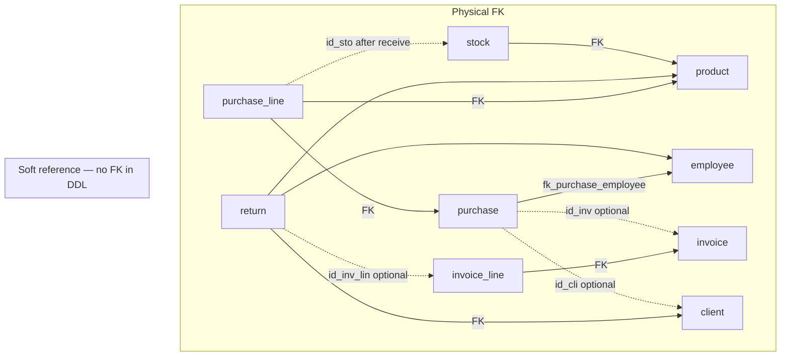

# Module 3 — Commercial management

  DataLayer M3
  8 tables

!!! info "Implementation"
    **Schema:** `DataBase/Schema/03_Module3_Commercial_Management/`  
    **Public API:** `DataBase/Services/03_Module3/99_Public_API.sql`  
    **Domain `sp_*`:** `05_Procedures_Mod3.sql`

## Purpose

Product catalog, stock, purchases, invoicing, and returns. Supplies commercial data and optional invoice linkage for Module 4 appointments.

Dual purchase semantics in one table:

- **Supplier PO** — often without `id_cli` / `id_inv`
- **Retail mirror** (demo narrative) — optional link to client and invoice after sale

---

## Schema artefacts

| File | Contents |
|------|----------|
| `00_Tables_Mod3.sql` | 8 tables (quoted `"return"`) |
| `01_ForeignKeys_Mod3.sql` | Required FKs only; soft columns documented below |
| `02_Functions_Mod3.sql` | Stock, invoice totals, return guards |
| `03_Triggers_Mod3.sql` | Sale, stock, return triggers |
| `04_Indexes_Mod3.sql` | `ix_purchase_line_id_pur`, `ix_invoice_line_id_inv` |
| `05_Procedures_Mod3.sql` | `sp_receive_purchase`, `sp_check_restock_needs` |
| `06_Jobs_Mod3.sql` | Empty placeholder — **skipped** at bootstrap |
| `07_Views_Mod3.sql` | `vw_product_stock_levels`, `vw_products_to_reorder` |

---

## Physical foreign keys (L1)

Enforced in `01_ForeignKeys_Mod3.sql`:

| Constraint | From → To | ON DELETE |
|------------|-----------|-----------|
| `fk_product_family` | `product.id_fam` → `family` | RESTRICT |
| `fk_stock_product` | `stock.id_pro` → `product` | CASCADE |
| `fk_purchase_employee` | `purchase.id_emp` → `employee` | SET NULL* |
| `fk_purchase_line_purchase` | `purchase_line.id_pur` → `purchase` | CASCADE |
| `fk_purchase_line_product` | `purchase_line.id_pro` → `product` | RESTRICT |
| `fk_invoice_line_invoice` | `invoice_line.id_inv` → `invoice` | CASCADE |
| `fk_invoice_line_product` | `invoice_line.id_pro` → `product` | RESTRICT |
| `fk_return_client` | `return.id_cli` → `client` | RESTRICT |
| `fk_return_employee` | `return.id_emp` → `employee` | RESTRICT |
| `fk_return_product` | `return.id_pro` → `product` | RESTRICT |

\* `purchase.id_emp` is **NOT NULL** in DDL — `SET NULL` on employee delete effectively behaves like **RESTRICT** in practice.

**Not present as physical FK** (dropped intentionally; names may exist only in comments/history):

- `fk_purchase_client`, `fk_purchase_invoice`, `fk_purchase_line_stock`, `fk_return_invoice_line`

Policy header in FK file: *“Only required (non-optional) relationships are enforced.”*

---

## Soft references (logical, not physical FK) {#soft-references-logical-not-physical-fk}

SchemaSpy marks these as **implied** relationships — that reflects naming (`id_*`), not a missing migration.

### Legend

| Símbolo | Significado |
|---------|-------------|
| Linha sólida (ER abaixo) | FK física PostgreSQL |
| Linha tracejada (diagrama) | Soft reference — coluna + integridade L2/L3 |
| SchemaSpy | “implies child of … but doesn't reference” — **esperado** |

### Diagrama — físico vs soft

### Tabela de soft references

| Column | Target | Cardinality (domain) | Integrity today | Lifecycle |
|--------|--------|----------------------|-----------------|-----------|
| `purchase.id_cli` | `client.id_cli` | 0..1 client / purchase; purchase 0..1 client | None at L1; demo seed valid IDs | Supplier POs omit client |
| `purchase.id_inv` | `invoice.id_inv` | 0..1 each way (not UNIQUE) | None at L1 | Retail mirror in demo; invoices can exist alone |
| `purchase_line.id_sto` | `stock.id_sto` | 0..1 until receive; stock not UNIQUE globally | `sp_receive_purchase` sets after INSERT stock | NULL until received |
| `return.id_inv_lin` | `invoice_line.id_inv_lin` | 0..1 line per return (not UNIQUE in DDL) | `tfn_return_restock` on INSERT | Optional sale trace; restock uses `id_pro` |

### Procedural integrity (L3)

| Path | Mechanism |
|------|-----------|
| Receive stock | `sp_receive_purchase` → INSERT `stock` → UPDATE `purchase_line.id_sto` |
| Return with line | `trg_return_restock` → `tfn_return_restock` validates line exists, product match, qty ≤ sold |
| Return without line | Allowed — restock from `return.id_pro` only |
| Sales | FIFO on `stock` by `id_pro` — **does not** use `purchase_line.id_sto` |

### Tradeoffs (decisão actual)

| Benefício | Custo |
|-----------|-------|
| PO fornecedor sem cliente/fatura | Órfãos possíveis em DML ad hoc |
| Receção em duas fases sem FK circular | QA `delete stock` não reconcilia `id_sto` automaticamente |
| Devolução opcional sem bloquear purge de faturas | `id_inv_lin` pode ficar inválido após DELETE de linhas |
| SchemaSpy alinhado com flexibilidade | ER/documentação deve distinguir soft vs FK |

!!! note "Melhorias futuras (identificadas, não implementadas)"
    Endurecer com FK físicas + `ON DELETE SET NULL` onde nullable — avaliar impacto em QA stress/reset antes de alterar DDL. Ver análise de impacto (tradeoffs) na memória do projeto; **sem alteração automática ao schema**.

---

## Cross-module links

| Link | Type | Module |
|------|------|--------|
| `purchase.id_emp`, `return.id_*` → M1 | Physical FK | M1 |
| `appointment.id_inv` → `invoice` | Physical FK | M4 |
| `invoice.id_app` | Soft / trigger sync | M4 → M3 |

---

## Triggers

| Trigger | Function | Concern |
|---------|----------|---------|
| `trg_check_stock_before_sale` | `tfn_check_stock_before_sale` | Stock before sale |
| `trg_stock_after_sale` | `tfn_stock_after_sale` | FIFO decrement |
| `trg_update_invoice_total` | `tfn_update_invoice_total` | Invoice total |
| `trg_return_restock` | `tfn_return_restock` | Return + optional line |
| `trg_prevent_inactive_product_sale` | `tfn_prevent_inactive_product_sale` | Inactive SKU |
| `trg_set_return_return_date` | `tfn_set_return_inactivation_date` | Return timestamp |
| `trg_warn_low_stock` | `tfn_warn_low_stock` | Low-stock notice |

---

## Procedures & public API

| Procedure | Role |
|-----------|------|
| `sp_receive_purchase` | Mark received; create stock; set `purchase_line.id_sto` |
| `sp_check_restock_needs` | Notice via `vw_products_to_reorder` |

| `svc_*` | Delegation |
|---------|------------|
| `svc_list_product_stock_levels` | View read |
| `svc_list_products_to_reorder` | View read |
| `svc_get_product_stock_level` | View read |
| `svc_receive_purchase` | `CALL sp_receive_purchase` |
| `svc_check_restock_needs` | `CALL sp_check_restock_needs` |

---

## QA (4 integrity + optional stress)

| Script | Rule |
|--------|------|
| `01_Stock_Before_Sale.sql` | Oversell blocked |
| `02_Inactive_Product_Sale.sql` | Inactive product |
| `03_Return_Quantity.sql` | Return qty vs sold (uses `id_inv_lin`) |
| `04_Invoice_Total_Update.sql` | Invoice totals |

Fixture: `fixtures/seed/m3_commercial_product.sql`  
Stress: `m3_stress_commercial.sql` + `04_Stress/03_Module3/` (optional `-IncludeStress`)

Legacy `04_Stress/00_Setup/` — **not** used by `ci.ps1`.

---

## Related

- [Database architecture](00_Database_Architecture.md)
- [M3 data dictionary](../../04_Data_Dictionary/03_Module3.md)
- [M3 integrity](../../00_Governance/02_Integrity_Rules/03_Module3_Integrity/00_Overview.md)
- [SchemaSpy implied relations](../../05_SchemaSpy/schemaspy.md)
- [Build pipeline](../../00_Schema_Build_Pipeline.md)
