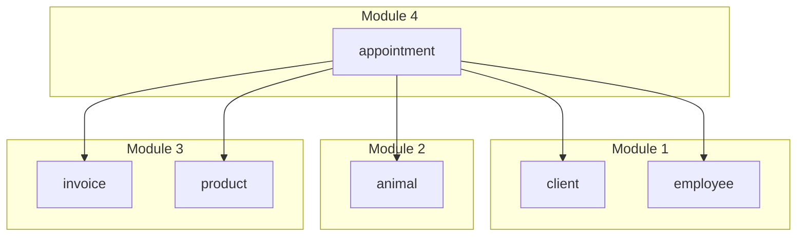

# Module 4 — Appointment management

!!! info "Implementation"
    **Schema DDL:** `DataBase/Schema/04_Module4_Appointment_Management/`  
    **Public API:** `DataBase/Services/04_Module4/99_Public_API.sql` (read-focused)  
    **Domain `sp_*` / `jpr_*`:** `Schema/.../05_Procedures_Mod4.sql`, `06_Jobs_Mod4.sql`

## Purpose

Appointment scheduling and lifecycle, clinical documentation (anamnesis, assessment), prescriptions, product links, and notifications. Primary **integration module** across M1 (people), M2 (animals), and M3 (products/invoice).

---

## Schema artefacts

| File | Contents |
|------|----------|
| `00_Tables_Mod4.sql` | 7 tables |
| `01_ForeignKeys_Mod4.sql` | **Cross-module FKs** to M1, M2, M3 |
| `02_Functions_Mod4.sql` | Validation helpers |
| `03_Triggers_Mod4.sql` | 8 appointment/prescription triggers |
| `04_Indexes_Mod4.sql` | **`ex_appointment_vet_overlap`** (GiST, 30-min slots) |
| `05_Procedures_Mod4.sql` | `sp_*` lifecycle + `jpr_*` notification/no-show |
| `06_Jobs_Mod4.sql` | pg_cron daily jobs |
| `07_Views_Mod4.sql` | Operational boards |

---

## Core entities

| Table | Role |
|-------|------|
| `appointment` | Scheduled visit (links client, animal, vet, optional invoice) |
| `overall_assessment`, `anamnesis` | Clinical documentation |
| `prescription` | Prescription timing vs appointment |
| `rel_app_product`, `rel_pre_prod` | Product associations |
| `appointment_notification` | Client notifications |

---

## Cross-module dependencies

Declared in `01_ForeignKeys_Mod4.sql`:

| Appointment field | References |
|-------------------|------------|
| `id_ani` | M2 `animal` |
| `id_emp` | M1 `employee` (veterinarian) |
| `id_cli` | M1 `client` |
| `id_inv` | M3 `invoice` (optional) |
| Product relations | M3 `product` |

---

## Domain procedures (`sp_*`)

| Procedure | Workflow step |
|-----------|---------------|
| `sp_create_appointment` | Schedule (QA and internal callers) |
| `sp_reschedule_appointment` | Reschedule |
| `sp_cancel_appointment` | Cancel |
| `sp_start_appointment` | Start visit |
| `sp_end_appointment` | Complete visit |
| `sp_prescription_for_appointment` | Add prescription |

!!! note "Public API scope"
    Module 4 `svc_*` functions are **read-oriented** (lists/details/history).  
    Writes such as scheduling use **`sp_*` directly** (e.g. integrity tests call `sp_create_appointment`). Application integration may wrap these in future `svc_*` if needed.

---

## Job procedures (`jpr_*`) and cron

| Cron name | Schedule | Procedure |
|-----------|----------|-----------|
| `daily_appointment_warnings` | `0 8 * * *` | `jpr_generate_appointment_warnings()` |
| `daily_no_show_appointment_updater` | `5 0 * * *` | `jpr_auto_update_no_show_appointments()` |

---

## Triggers (selection)

| Trigger | Guard |
|---------|--------|
| `trg_block_appointment_if_vet_unavailable` | Vet absence |
| `trg_validate_prescription_timing` | Prescription vs start time |
| `trg_deduct_product_stock` | Stock on appointment products |
| `trg_block_past_appointments` | Past scheduling |
| `trg_validate_animal_client_relationship` | Client owns animal |
| `trg_validate_appointment_vet_specialty` | Vet specialty |
| `trg_prevent_completed_appointment_modification` | Completed lock |
| `trg_sync_invoice_appointment_link` | Invoice link consistency |

Slot overlap: **`ex_appointment_vet_overlap`** (GiST) + `sp_create_appointment` — QA `02_Appointment_Overlap.sql`.

---

## Public API (`svc_*` — read)

| `svc_*` | Source |
|---------|--------|
| `svc_list_appointments_today` | `vw_appointments_today` |
| `svc_list_appointments_tomorrow` | `vw_scheduled_appointments_tomorrow` |
| `svc_get_appointment_detail` | `vw_appointment_detail` |
| `svc_list_vet_appointments_from` | Filtered `vw_appointment_detail` |
| `svc_list_animal_appointment_history` | History by animal |

---

## Views

| View | Use |
|------|-----|
| `vw_appointment_detail` | Rich appointment row |
| `vw_appointments_today` | Today board |
| `vw_scheduled_appointments_tomorrow` | Tomorrow board |

---

## QA coverage (6 scripts)

| Script | Focus |
|--------|-------|
| `01_Appointment_Scheduling.sql` | `sp_create_appointment`, triggers |
| `02_Appointment_Overlap.sql` | GiST overlap |
| `03_Vet_Absence.sql` | Absence vs booking |
| `04_Appointment_Lifecycle.sql` | Status transitions |
| `05_Prescription_Timing.sql` | Prescription rules |
| `06_Notifications.sql` | Notifications |

Fixtures: `m1_core_context`, `m2_animals_ownership`, `m4_appointment_slots` + `qa_*()` contracts.

Stress: `04_Stress/04_Module4/*` (booking + lifecycle load).

---

## Requirements coverage (Sprint 2)

**17 RF** for appointments — [M4 RF matrix](../../../../02_Requirements/Sprint2/01_RF_Traceability_Matrix.md#module-4--appointment-management-17-rf). Summary: clinical tables and state machine **IMP**; public `svc_*` **read-only**; mandatory diagnosis and auto-invoice **NAO**.

---

## Related

- [Database architecture](00_Database_Architecture.md)
- [M4 integrity overview](../../00_Governance/02_Integrity_Rules/04_Module4_Integrity/00_Overview.md)
