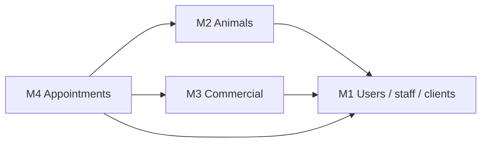

# Schema architecture documentation

<div style="display:flex; gap:8px; flex-wrap:wrap; margin-bottom:1rem;">
  <span style="background:#2563eb;color:#fff;padding:4px 10px;border-radius:6px;font-size:0.85rem;">As-implemented</span>
  <span style="background:#059669;color:#fff;padding:4px 10px;border-radius:6px;font-size:0.85rem;">01_MiaCaoMigo_DataLayer</span>
</div>

Documentation for the **logical modular schema** hosted in PostgreSQL `public`. Runnable DDL lives in the sibling repository:

`01_MiaCaoMigo_DataLayer/DataBase/Schema/`

!!! info "Navigation"
    - [Database hub](../README.md) — full portal for this folder  
    - [Governance](../00_Governance/README.md) — naming & integrity  
    - [Schema build pipeline](../00_Schema_Build_Pipeline.md) — loader order  
    - [Data dictionary](../04_Data_Dictionary/00_Overview.md) — table/column semantics

---

## Document map

| Document | Module | DataLayer folder |
|----------|--------|------------------|
| [Database architecture](00_Public_Schema/00_Database_Architecture.md) | Cross-cutting | `Schema/` + layer context |
| [Module 1](00_Public_Schema/01_Module1_Architecture.md) | User & access | `01_Module1_User_Management/` |
| [Module 2](00_Public_Schema/02_Module2_Architecture.md) | Animals & ownership | `02_Module2_Animal_Management/` |
| [Module 3](00_Public_Schema/03_Module3_Architecture.md) | Commercial | `03_Module3_Commercial_Management/` |
| [Module 4](00_Public_Schema/04_Module4_Architecture.md) | Appointments | `04_Module4_Appointment_Management/` |

---

## Layering (how Schema fits the stack)

```text
Bootstrap loaders
    → Schema/     (DDL, triggers, domain sp_* M2–M4, jpr_*, vw_*)
    → Comments/   (COMMENT ON)
    → Services/   (M1 sp_* workflows, all svc_* public API)
    → DataSeed/   (Master + Demo tiers)
Host: QA/runners/ci.ps1  →  validates behaviour (not loaded at init)
```

| Prefix | Primary home in current build |
|--------|------------------------------|
| Tables, FK, triggers, `vw_*` | **Schema** |
| `sp_*` business (M1) | **Services** |
| `sp_*` business (M2–M4) | **Schema** `05_Procedures_*` |
| `svc_*` | **Services** `99_Public_API*` |
| `jpr_*` | **Schema** (pg_cron targets) |
| `qa_*` | **QA/contracts** (not Schema) |

---

## Per-module DDL file set

Each module uses the same numbered layers (see [SQL standards](../00_Governance/01_SQL_Standards/00_SQL_Standards.md)):

`00_Tables` → `01_ForeignKeys` → `02_Functions` → `03_Triggers` → `04_Indexes` → `05_Procedures` → `06_Jobs` → `07_Views`

`00_Core/`: shared types and `00_Data_Cleanup.sql` (TRUNCATE before MasterData reload).

---

## Cross-module dependency (summary)



Foreign keys are declared in each module’s `01_ForeignKeys_ModX.sql` after all tables exist.

---

## Integrity validation map

| Module | QA integrity scripts | Governance overview |
|--------|---------------------|---------------------|
| 1 | 6 | [M1 integrity](../00_Governance/02_Integrity_Rules/01_Module1_Integrity/00_Structural_Integrity.md) |
| 2 | 5 | [M2 overview](../00_Governance/02_Integrity_Rules/02_Module2_Integrity/00_Overview.md) |
| 3 | 4 | [M3 overview](../00_Governance/02_Integrity_Rules/03_Module3_Integrity/00_Overview.md) |
| 4 | 6 | [M4 overview](../00_Governance/02_Integrity_Rules/04_Module4_Integrity/00_Overview.md) |

Run: `DataBase/QA/runners/ci.ps1` on `init_qa`.
