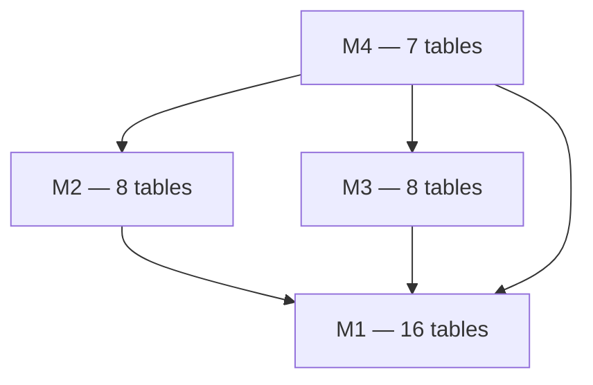

# Data Dictionary — Overview

  As-implemented
  01_MiaCaoMigo_DataLayer

Semantic reference for **tables and columns** in the MiaCaoMigo PostgreSQL model (`public` schema). Authoritative DDL: `01_MiaCaoMigo_DataLayer/DataBase/Schema/`.

!!! info "Related documentation"
    | Topic | Location |
    |-------|----------|
    | Layering, `svc_*`, QA | [Governance](../00_Governance/README.md) |
    | Module architecture | [Schemas](../01_Schemas/README.md) |
    | `COMMENT ON` text | DataLayer `DataBase/Comments/Schema/` |
    | ER diagrams | [ER model](../../../03_Diagrams/00_ER_Model/er_model.md) |
    | Triggers, jobs, `sp_*` | [Schema architecture](../01_Schemas/00_Public_Schema/00_Database_Architecture.md) |

---

## Document map

| File | Module | Tables (count) |
|------|--------|----------------|
| [01_Module1.md](01_Module1.md) | User & access | 16 |
| [02_Module2.md](02_Module2.md) | Animals & ownership | 8 |
| [03_Module3.md](03_Module3.md) | Commercial | 8 |
| [04_Module4.md](04_Module4.md) | Appointments | 7 |

**Core types:** `Schema/00_Core/01_Types.sql` — shared ENUMs (`absence_status`, `purchase_status`, `invoice_status`, `appointment_status`).

---

## Scope of this dictionary

| In scope | Out of scope (see other docs) |
|----------|------------------------------|
| Table/column names and meaning | `fn_*`, `sp_*`, `svc_*` signatures |
| PK / FK / UQ / soft refs | Trigger bodies |
| ENUM columns | pg_cron schedules |
| Associative (bridge) tables | QA contract keys |
| Cross-module FK targets | Bootstrap loader order |

---

## Attribute table legend

| Column | Meaning |
|--------|---------|
| **Attribute** | Physical column name |
| **Name** | Human-readable label |
| **Description** | Business semantics |
| **Key** | `PK`, `FK`, **Soft** (logical ref, no DDL FK), `UQ`, `CPK`, `ENUM` |

!!! note "Unique constraints"
    **UQ** marks single- or multi-column `UNIQUE` constraints (`AK` in legacy docs = alternate key = UQ).

---

## Modular dependency (tables)

---

## Integrity beyond columns

Documented per module:

| Mechanism | Example |
|-----------|---------|
| GiST `EXCLUDE` | `ex_schedule_overlap`, `ex_ownership_overlap`, `ex_appointment_vet_overlap` |
| ENUM types | `sta_abs`, `sta_pur`, `sta_inv`, `status_app` |
| Deferred FKs | All `01_ForeignKeys_ModX.sql` |
| Soft references (M3) | `purchase.id_cli`, `purchase.id_inv`, `purchase_line.id_sto`, `return.id_inv_lin` — [M3 doc](03_Module3.md) |

!!! tip "SchemaSpy vs dictionary"
    If SchemaSpy shows an **implied** FK that this dictionary marks **Soft**, the dictionary and DataLayer DDL prevail.

---

## How to maintain

When adding a table in DataLayer:

1. Update the module dictionary `.md` file.
2. Add `COMMENT ON` in `DataBase/Comments/Schema/`.
3. Extend [Schemas](../01_Schemas/) module page if responsibilities change.
4. Add QA fixture/integrity references if test-covered.
