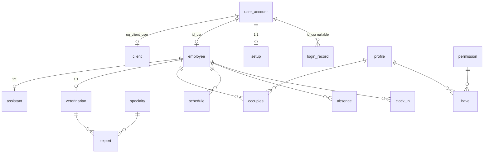

# Module 1 — User management (data dictionary)

!!! info "Source"
    `DataBase/Schema/01_Module1_User_Management/00_Tables_Mod1.sql`  
    Architecture: [Module 1 schema doc](../01_Schemas/00_Public_Schema/01_Module1_Architecture.md)

**16 tables** · ENUM: `absence_status` · GiST: `ex_schedule_overlap` on `schedule`

---

## Entity relationships (summary)

---

## 1. USER_ACCOUNT

General personal and contact data for any system user.

| Attribute | Name | Description | Key |
|-----------|------|-------------|-----|
| id_usr | User identifier | Surrogate identity | PK |
| nam_usr | Full name | Legal/display name | |
| add_usr | Address | Residential address | |
| pos_usr | Postal code | Format `xxxx-xxx` | |
| nif_usr | Tax number (NIF) | Nine digits | UQ |
| pho_usr | Personal phone | E.164 optional | |
| ema_usr | Personal email | Lowercase; not `@miacaomigo.pt` | UQ |

---

## 2. PROFILE

RBAC role templates (not PostgreSQL “schema”).

| Attribute | Name | Description | Key |
|-----------|------|-------------|-----|
| id_pro | Profile identifier | Surrogate id | PK |
| nam_pro | Profile name | Unique role name | UQ |
| des_pro | Description | Role narrative | |

---

## 3. PERMISSION

Granular permission catalog.

| Attribute | Name | Description | Key |
|-----------|------|-------------|-----|
| id_per | Permission identifier | Surrogate id | PK |
| nam_per | Permission name | Unique code | UQ |
| des_per | Description | Optional detail | |

---

## 4. SPECIALTY

Veterinary specialty catalog (used by `expert` and appointment `id_spe`).

| Attribute | Name | Description | Key |
|-----------|------|-------------|-----|
| id_spe | Specialty identifier | Surrogate id | PK |
| nam_spe | Specialty name | Unique | UQ |
| des_spe | Description | Required text | |

---

## 5. EMPLOYEE

Staff employment record linked to `user_account`.

| Attribute | Name | Description | Key |
|-----------|------|-------------|-----|
| id_emp | Employee identifier | Surrogate id | PK |
| id_usr | User identifier | Identity row | FK |
| reg_dat_emp | Registration time | Default now | |
| aut_reg_emp | Registered by | Employee id (self-FK) | FK |
| dea_dat_emp | Deactivation time | Nullable | |
| aut_ina_emp | Deactivated by | Employee id | FK |
| pho_emp | Work phone | E.164 | |
| pho_emg | Emergency phone | E.164 optional | |
| ema_emp | Corporate email | `@miacaomigo.pt` | UQ |
| pas_emp | Password hash | App-layer hash | |

---

## 6. ASSISTANT

Assistant specialization (1:1 with `employee`).

| Attribute | Name | Description | Key |
|-----------|------|-------------|-----|
| id_emp | Employee identifier | Must be employee | PK, FK |
| fun_ass | Function | Assistant duty label | |

---

## 7. VETERINARIAN

Veterinarian specialization (1:1 with `employee`).

| Attribute | Name | Description | Key |
|-----------|------|-------------|-----|
| id_emp | Employee identifier | Must be employee | PK, FK |
| num_omv_vet | OMV number | Professional registration | UQ |

---

## 8. EXPERT

Many-to-many: veterinarian ↔ specialty.

| Attribute | Name | Description | Key |
|-----------|------|-------------|-----|
| id_emp | Veterinarian employee | FK to veterinarian | CPK, FK |
| id_spe | Specialty | FK to specialty | CPK, FK |

---

## 9. CLIENT

Client credentials; **other modules reference `id_cli`**, not `id_usr`.

| Attribute | Name | Description | Key |
|-----------|------|-------------|-----|
| id_cli | Client identifier | Surrogate PK for FK targets | PK |
| id_usr | User identifier | At most one client per user | FK, UQ |
| pas_cli | Password hash | Client login hash | |
| reg_dat_cli | Registration time | | |
| ina_dat_cli | Inactivation time | Nullable | |

---

## 10. LOGIN_RECORD

Authentication audit trail (success and failure).

| Attribute | Name | Description | Key |
|-----------|------|-------------|-----|
| id_log | Log identifier | Surrogate id | PK |
| sig_tim_log | Sign-in time | Session start | |
| sou_tim_log | Sign-out time | Null = open session | |
| suc_log | Success flag | Boolean | |
| ip_add_log | Client IP | `inet` | |
| ema_log | Email snapshot | Attempted email (not `eml_usr`) | |
| id_usr | User identifier | Set when success | FK |

---

## 11. SCHEDULE

Weekly planned work intervals per employee.

| Attribute | Name | Description | Key |
|-----------|------|-------------|-----|
| id_emp | Employee | Schedule owner | CPK, FK |
| day_wee_sch | Weekday | 1–7 | CPK |
| sta_tim_sch | Start time | Time of day | CPK |
| fin_hou_sch | End time | After start | |

**GiST:** `ex_schedule_overlap` — no overlapping intervals per employee/day (see `04_Indexes_Mod1.sql`).

---

## 12. ABSENCE

Employee absence requests and outcomes.

| Attribute | Name | Description | Key |
|-----------|------|-------------|-----|
| id_abs | Absence identifier | Surrogate id | PK |
| id_emp | Employee | Subject | FK |
| sta_dat_tim_abs | Start | Timestamp | |
| end_dat_tim_abs | End | After start | |
| mot_abs | Reason | Free text | |
| sta_abs | Status | `absence_status` ENUM | ENUM |
| res_abs | Responsible | Approver employee; null = system | FK |
| cre_tim_abs | Created at | Default now | |

**ENUM `absence_status`:** `pending`, `approved`, `rejected`, `cancelled`, `detected`

---

## 13. CLOCK_IN

Attendance punch in/out.

| Attribute | Name | Description | Key |
|-----------|------|-------------|-----|
| id_clk | Record identifier | Surrogate id | PK |
| id_emp | Employee | Subject | FK |
| sta_dat_clk | Clock-in time | | |
| end_dat_clk | Clock-out time | Null = open | |

---

## 14. SETUP

Per-user UI preferences (1:1 `user_account`).

| Attribute | Name | Description | Key |
|-----------|------|-------------|-----|
| id_usr | User identifier | | PK, FK |
| the_set | Theme | `light` / `dark` | |
| lan_set | Language | e.g. `pt-pt` | |

---

## 15. OCCUPIES

Employee ↔ profile (RBAC assignment).

| Attribute | Name | Description | Key |
|-----------|------|-------------|-----|
| id_emp | Employee | | CPK, FK |
| id_pro | Profile | | CPK, FK |

---

## 16. HAVE

Profile ↔ permission.

| Attribute | Name | Description | Key |
|-----------|------|-------------|-----|
| id_pro | Profile | | CPK, FK |
| id_per | Permission | | CPK, FK |

---

## Programmatic surface (not column dictionary)

| Kind | Location |
|------|----------|
| Business `sp_*` / `svc_*` | `DataBase/Services/01_Module1/` |
| Job `jpr_*` | `05_Procedures_Mod1.sql` |
| Views `vw_*` | `07_Views_Mod1.sql` |
| Triggers `trg_*` | `03_Triggers_Mod1.sql` |

---

## Related

- [Overview](00_Overview.md) · [Module 2](02_Module2.md)
