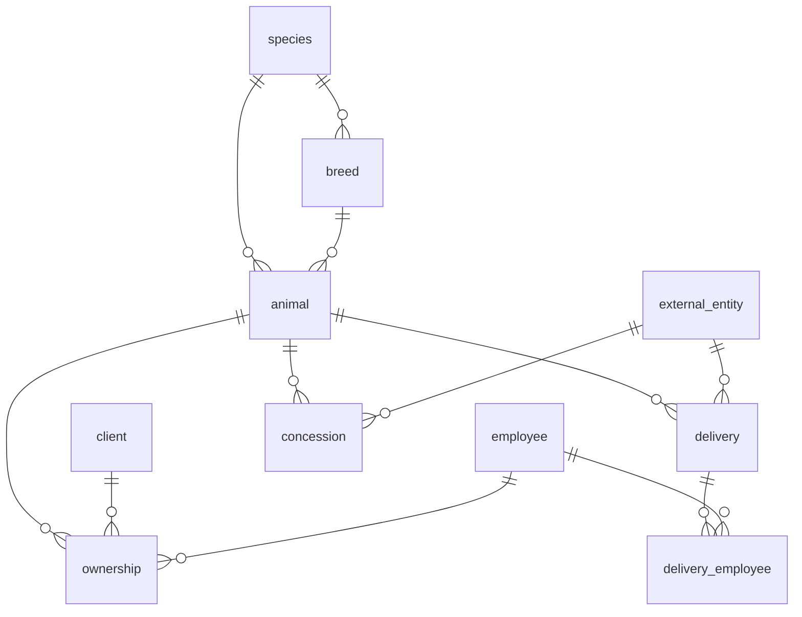

# Module 2 — Animals & ownership (data dictionary)

!!! info "Source"
    `DataBase/Schema/02_Module2_Animal_Management/00_Tables_Mod2.sql`  
    Architecture: [Module 2 schema doc](../01_Schemas/00_Public_Schema/02_Module2_Architecture.md)

**8 tables** · GiST: `ex_ownership_overlap` on `ownership`

---

## Cross-module references

| This table | FK target (Module 1) |
|------------|----------------------|
| `ownership.id_cli` | `client` |
| `ownership.id_emp`, `concession.id_emp`, `delivery_employee.id_emp` | `employee` |

---

## Entity relationships

---

## 1. SPECIES

Taxonomic species catalog.

| Attribute | Name | Description | Key |
|-----------|------|-------------|-----|
| id_spc | Species identifier | Surrogate id | PK |
| nam_spc | Common name | Display name | |
| sci_nam_spc | Scientific name | Optional Latin name | |

---

## 2. BREED

Breed within a species (`id_spc` FK in `01_ForeignKeys_Mod2.sql`).

| Attribute | Name | Description | Key |
|-----------|------|-------------|-----|
| id_bre | Breed identifier | Surrogate id | PK |
| nam_bre | Breed name | | |
| sci_nam_bre | Scientific name | Optional | |
| id_spc | Species | Required parent | FK |

---

## 3. ANIMAL

Individual animal record.

| Attribute | Name | Description | Key |
|-----------|------|-------------|-----|
| id_ani | Animal identifier | Surrogate id | PK |
| reg_id_ani | Registration code | Business key | UQ |
| nam_ani | Name | Optional | |
| dat_bir_ani | Birth date | | |
| gen_ani | Gender | `M` / `F` / null | |
| ori_ani | Origin | Free text | |
| sta_ani | Status | Free-text operational/clinical state | |
| id_spc | Species | Required | FK |
| id_bre | Breed | Optional | FK |
| reg_dat_ani | Registered on | Default today | |
| ina_dat_ani | Inactivated on | Nullable | |

---

## 4. EXTERNAL_ENTITY

Partner organizations (shelters, suppliers, etc.).

| Attribute | Name | Description | Key |
|-----------|------|-------------|-----|
| id_ext_ent | Entity identifier | Surrogate id | PK |
| nam_ext_ent | Name | | |
| loc_ext_ent | Location | | |
| pho_ext_ent | Phone | E.164 optional | |
| ema_ext_ent | Email | Optional | |
| typ_ext_ent | Type | Category label | |

---

## 5. OWNERSHIP

Client–animal relationship over time.

| Attribute | Name | Description | Key |
|-----------|------|-------------|-----|
| id_own | Ownership identifier | Surrogate id | PK |
| id_cli | Client | Owner | FK → M1 |
| id_ani | Animal | Subject | FK |
| sta_dat_own | Start date | | |
| end_dat_own | End date | Null = active | |
| mot_own | Motive | Adoption/transfer reason | |
| id_emp | Registrar | Responsible employee | FK → M1 |

**GiST:** `ex_ownership_overlap` — non-overlapping ownership intervals per animal.

---

## 6. CONCESSION

Transfer of animal care to external entity.

| Attribute | Name | Description | Key |
|-----------|------|-------------|-----|
| id_con | Concession identifier | Surrogate id | PK |
| dat_con | Concession date | | |
| mot_con | Motive | | |
| cli_sta_con | Clinical status | Snapshot | |
| id_ext_ent | External entity | | FK |
| id_emp | Employee | Responsible | FK → M1 |
| id_ani | Animal | | FK |

---

## 7. DELIVERY

Rescue / delivery workflow for an animal.

| Attribute | Name | Description | Key |
|-----------|------|-------------|-----|
| id_del | Delivery identifier | Surrogate id | PK |
| reg_dat_del | Registered at | | |
| res_dat_del | Rescue time | | |
| del_dat_del | Delivery time | | |
| res_loc_del | Rescue location | | |
| cli_sta_del | Clinical status | | |
| id_ext_ent | External entity | Optional | FK |
| id_ani | Animal | Required | FK |

---

## 8. DELIVERY_EMPLOYEE

Associative: staff involved in a delivery.

| Attribute | Name | Description | Key |
|-----------|------|-------------|-----|
| id_del | Delivery | | CPK, FK |
| id_emp | Employee | | CPK, FK → M1 |

---

## Programmatic surface

| Kind | Location |
|------|----------|
| Domain `sp_*` | `05_Procedures_Mod2.sql` |
| Public `svc_*` | `Services/02_Module2/99_Public_API.sql` |
| Views | `vw_active_ownership_detail`, `vw_animal_catalog_detail`, `vw_internal_animals_available` |

---

## Related

- [Overview](00_Overview.md) · [Module 1](01_Module1.md) · [Module 4](04_Module4.md)
