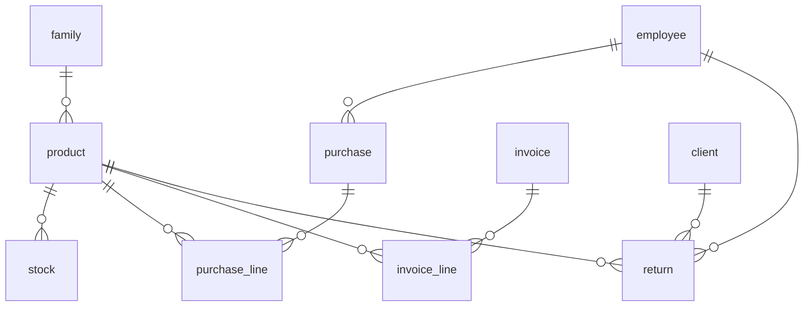
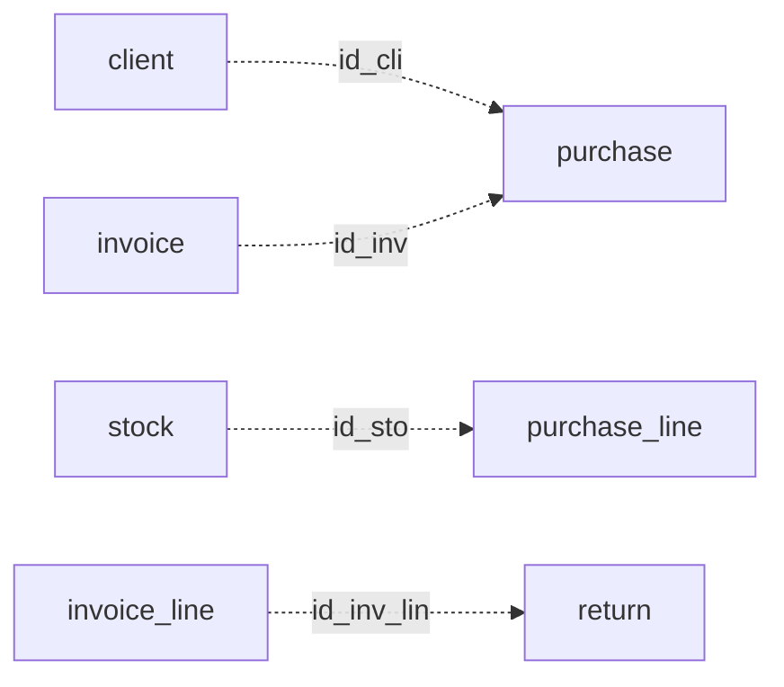

# Module 3 — Products, sales & invoicing (data dictionary)

  8 tables
  4 soft references

!!! info "Source"
    `DataBase/Schema/03_Module3_Commercial_Management/00_Tables_Mod3.sql`  
    Architecture: [Module 3](../01_Schemas/00_Public_Schema/03_Module3_Architecture.md) · [soft references](../01_Schemas/00_Public_Schema/03_Module3_Architecture.md#soft-references-logical-not-physical-fk)

**ENUMs:** `purchase_status`, `invoice_status`  
Table **`"return"`** uses a quoted identifier (SQL reserved word).

---

## Cross-module references

| Table / column | Target | L1 FK? |
|----------------|--------|:------:|
| `purchase.id_emp` | M1 `employee` | Yes (`fk_purchase_employee`) |
| `"return".id_cli`, `id_emp`, `id_pro` | M1 / M3 | Yes |
| `purchase.id_cli` | M1 `client` | **No** — soft |
| `purchase.id_inv` | `invoice` | **No** — soft |
| `purchase_line.id_sto` | `stock` | **No** — soft |
| `"return".id_inv_lin` | `invoice_line` | **No** — soft |
| `invoice.id_app` | M4 `appointment` | No — logical back-link |
| `appointment.id_inv` | M3 `invoice` | Yes (M4 FK) |

---

## Entity relationships

### Physical FK only

### Soft references (logical — dashed in architecture doc)

!!! tip "SchemaSpy"
    Implied relations for the four dashed edges are **documented and intentional**. See [SchemaSpy entry](../05_SchemaSpy/schemaspy.md).

---

## Soft reference summary

| Column | When set | Procedural guard |
|--------|----------|------------------|
| `purchase.id_cli` | Retail / optional | None — omit for supplier PO |
| `purchase.id_inv` | Optional billing link | None |
| `purchase_line.id_sto` | After `sp_receive_purchase` | Procedure only |
| `return.id_inv_lin` | Optional trace to sale | `tfn_return_restock` on INSERT |

---

## 1. FAMILY

| Attribute | Description | Key |
|-----------|-------------|-----|
| id_fam | Surrogate id | PK |
| nam_fam | Display name | |
| des_fam | Description | |

---

## 2. INVOICE

| Attribute | Description | Key |
|-----------|-------------|-----|
| id_inv | Surrogate id | PK |
| val_inv | Total (`numeric`) | Trigger-maintained |
| dat_inv | Issue time | |
| bod_inv | Notes | |
| sta_inv | `invoice_status` | ENUM |
| id_app | M4 appointment (soft back-link) | |

**ENUM `invoice_status`:** `pending`, `paid`, `overdue`, `cancelled`

---

## 3. PRODUCT

| Attribute | Description | Key |
|-----------|-------------|-----|
| id_pro | Product id (≠ M1 `profile.id_pro`) | PK |
| ref_pro, bar_pro, nam_pro, des_pro | Catalog | |
| pri_pro, iva_pro | Price / VAT | |
| reg_dat_pro, ina_dat_pro | Lifecycle | |
| id_fam | Family | FK |
| min_sto | Reorder threshold | |

---

## 4. STOCK

| Attribute | Description | Key |
|-----------|-------------|-----|
| id_sto | Batch row | PK |
| id_pro | Product | FK |
| bat_sto, qty_sto, val_dat_sto, ent_dat_sto | Batch / qty / dates | |

---

## 5. PURCHASE

| Attribute | Description | Key |
|-----------|-------------|-----|
| id_pur | Header id | PK |
| pur_dat_pur, tot_val_pur, ord_num_pur, pay_met_pur | Header fields | |
| sta_pur | `purchase_status` | ENUM |
| id_inv | Linked invoice | **Soft** |
| id_cli | Client (retail) | **Soft** |
| id_emp | Responsible employee | **FK** |

**ENUM `purchase_status`:** `pending`, `received`, `cancelled`

---

## 6. PURCHASE_LINE

| Attribute | Description | Key |
|-----------|-------------|-----|
| id_pur_lin | Line id | PK |
| id_pur, id_pro | Parent / product | FK |
| bat_pln, qty_pln, uni_cos_pln | Line economics | |
| id_sto | Stock after receive | **Soft** |

---

## 7. INVOICE_LINE

| Attribute | Description | Key |
|-----------|-------------|-----|
| id_inv_lin | Line id | PK |
| id_inv, id_pro | Parent / product | FK |
| qty_inv_lin, uni_pri_inv_lin, iva_inv_lin | Sale line | |

---

## 8. RETURN

| Attribute | Description | Key |
|-----------|-------------|-----|
| id_ret | Return id | PK |
| id_cli, id_emp, id_pro | Parties | FK |
| mot_ret, ina_dat_ret | Narrative / close | |
| id_inv_lin | Source sale line | **Soft** |
| qty_ret | Quantity | CHECK positive |

---

## Programmatic surface

| Kind | Location |
|------|----------|
| `sp_receive_purchase`, `sp_check_restock_needs` | `05_Procedures_Mod3.sql` |
| `svc_*` | `Services/03_Module3/99_Public_API.sql` |
| Views | `vw_product_stock_levels`, `vw_products_to_reorder` |
| Triggers | `03_Triggers_Mod3.sql` |

---

## Related

- [Overview](00_Overview.md) · [Module 4](04_Module4.md)
- [M3 architecture](../01_Schemas/00_Public_Schema/03_Module3_Architecture.md)
