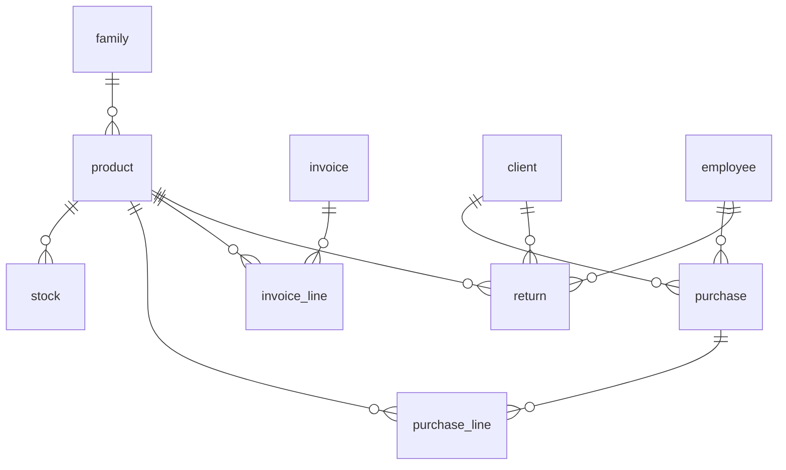

# Module 3 — Products, sales & invoicing (data dictionary)

!!! info "Source"
    `DataBase/Schema/03_Module3_Commercial_Management/00_Tables_Mod3.sql`  
    Architecture: [Module 3 schema doc](../01_Schemas/00_Public_Schema/03_Module3_Architecture.md)

**8 tables** · ENUMs: `purchase_status`, `invoice_status`  
Note: table **`"return"`** is a quoted identifier (SQL reserved word).

---

## Cross-module references

| Table / column | Target |
|----------------|--------|
| `purchase.id_cli`, `invoice` context, `"return".id_cli` | M1 `client` |
| `purchase.id_emp`, `"return".id_emp` | M1 `employee` |
| `invoice.id_app` | M4 `appointment` (logical back-reference; sync via M4 trigger) |
| `appointment.id_inv` | M3 `invoice` (FK in M4) |

Purchase FK constraint names: `fk_purchase_client`, `fk_purchase_employee`.

---

## Entity relationships

---

## 1. FAMILY

Product family / category.

| Attribute | Name | Description | Key |
|-----------|------|-------------|-----|
| id_fam | Family identifier | Surrogate id | PK |
| nam_fam | Name | Display label | |
| des_fam | Description | Optional | |

---

## 2. INVOICE

Sales invoice header (totals maintained by triggers).

| Attribute | Name | Description | Key |
|-----------|------|-------------|-----|
| id_inv | Invoice identifier | Surrogate id | PK |
| val_inv | Total value | `numeric(10,2)` | |
| dat_inv | Issue timestamp | | |
| bod_inv | Body / notes | Free text | |
| sta_inv | Status | `invoice_status` ENUM | ENUM |
| id_app | Appointment | Optional back-link to M4 | |

**ENUM `invoice_status`:** `pending`, `paid`, `overdue`, `cancelled`

---

## 3. PRODUCT

Sellable catalog item (`id_pro` = product id; distinct from M1 `profile.id_pro`).

| Attribute | Name | Description | Key |
|-----------|------|-------------|-----|
| id_pro | Product identifier | Surrogate id | PK |
| ref_pro | Reference code | Internal SKU | |
| bar_pro | Barcode | | |
| nam_pro | Product name | | |
| des_pro | Description | | |
| pri_pro | List price | Unit price | |
| iva_pro | VAT rate | Percentage | |
| reg_dat_pro | Registered at | | |
| ina_dat_pro | Inactivated at | Nullable | |
| id_fam | Family | Required | FK |
| min_sto | Minimum stock | Reorder threshold | |

---

## 4. STOCK

Quantity by product batch (FIFO consumption in procedures).

| Attribute | Name | Description | Key |
|-----------|------|-------------|-----|
| id_sto | Stock row identifier | Surrogate id | PK |
| id_pro | Product | | FK |
| bat_sto | Batch / lot | | |
| qty_sto | Quantity | Non-negative | |
| val_dat_sto | Expiry date | | |
| ent_dat_sto | Entry date | Warehouse | |

---

## 5. PURCHASE

Inbound purchase order.

| Attribute | Name | Description | Key |
|-----------|------|-------------|-----|
| id_pur | Purchase identifier | Surrogate id | PK |
| pur_dat_pur | Purchase date | Default now | |
| tot_val_pur | Order total | | |
| ord_num_pur | External order ref | | |
| pay_met_pur | Payment method | Label | |
| sta_pur | Status | `purchase_status` ENUM | ENUM |
| id_inv | Linked invoice | Optional; no FK in DDL | |
| id_cli | Client | Optional retail context | |
| id_emp | Employee | Responsible | FK → M1 |

**ENUM `purchase_status`:** `pending`, `received`, `cancelled`

---

## 6. PURCHASE_LINE

Lines on a purchase (receipt creates `stock`).

| Attribute | Name | Description | Key |
|-----------|------|-------------|-----|
| id_pur_lin | Line identifier | Surrogate id | PK |
| id_pur | Purchase | Parent | FK |
| id_pro | Product | | FK |
| bat_pln | Batch label | At receipt | |
| qty_pln | Quantity ordered | Positive | |
| uni_cos_pln | Unit cost | | |
| id_sto | Stock row | Set by `sp_receive_purchase` | |

---

## 7. INVOICE_LINE

Sale line (stock decremented by triggers).

| Attribute | Name | Description | Key |
|-----------|------|-------------|-----|
| id_inv_lin | Line identifier | Surrogate id | PK |
| id_inv | Invoice | Parent | FK |
| id_pro | Product | | FK |
| qty_inv_lin | Quantity sold | Positive | |
| uni_pri_inv_lin | Unit price | | |
| iva_inv_lin | VAT on line | | |

---

## 8. RETURN

Commercial return header (one product per row in current model).

| Attribute | Name | Description | Key |
|-----------|------|-------------|-----|
| id_ret | Return identifier | Surrogate id | PK |
| id_cli | Client | | FK → M1 |
| id_emp | Employee | | FK → M1 |
| id_pro | Product | Returned sku | FK |
| mot_ret | Reason | | |
| ina_dat_ret | Closed at | Nullable | |
| id_inv_lin | Source sale line | Optional traceability | |
| qty_ret | Quantity returned | Default 1 | |

---

## Programmatic surface

| Kind | Location |
|------|----------|
| `sp_receive_purchase`, `sp_check_restock_needs` | `05_Procedures_Mod3.sql` |
| `svc_*` reads/writes | `Services/03_Module3/99_Public_API.sql` |
| Views | `vw_product_stock_levels`, `vw_products_to_reorder` |
| Triggers | `03_Triggers_Mod3.sql` (stock, totals, returns) |

---

## Related

- [Overview](00_Overview.md) · [Module 4](04_Module4.md)
