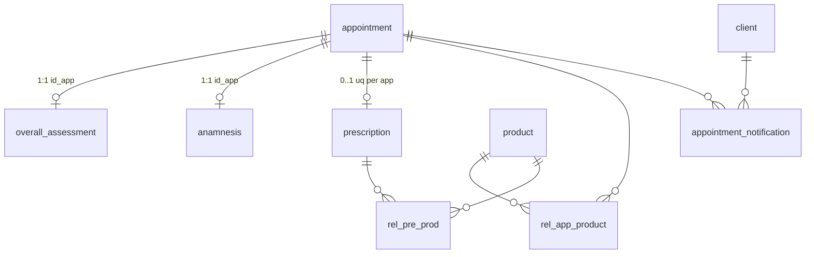

# Module 4 — Appointments & prescriptions (data dictionary)

!!! info "Source"
    `DataBase/Schema/04_Module4_Appointment_Management/00_Tables_Mod4.sql`  
    Architecture: [Module 4 schema doc](../01_Schemas/00_Public_Schema/04_Module4_Architecture.md)

**7 tables** · ENUM: `appointment_status` · GiST: `ex_appointment_vet_overlap`

---

## Cross-module references (`01_ForeignKeys_Mod4.sql`)

| Column | Module | Table |
|--------|--------|-------|
| `appointment.id_ani` | M2 | `animal` |
| `appointment.id_emp` | M1 | `employee` |
| `appointment.id_cli` | M1 | `client` |
| `appointment.id_spe` | M1 | `specialty` |
| `appointment.id_inv` | M3 | `invoice` |
| `rel_*`.id_pro | M3 | `product` |
| `appointment_notification.id_cli` | M1 | `client` |

`id_spe` on appointment = **consultation specialty** (may differ from full `expert` set on the vet).

---

## Entity relationships

---

## 1. APPOINTMENT

Consultation scheduling and lifecycle.

| Attribute | Name | Description | Key |
|-----------|------|-------------|-----|
| id_app | Appointment identifier | Surrogate id | PK |
| id_ani | Animal | | FK → M2 |
| id_emp | Veterinarian employee | | FK → M1 |
| id_cli | Client | | FK → M1 |
| id_spe | Consultation specialty | FK → M1 `specialty` | FK |
| id_inv | Invoice | Optional billing link | FK → M3 |
| sch_dat_app | Scheduled at | Required | |
| sta_dat_app | Actual start | Nullable until visit | |
| end_dat_app | Actual end | After start when set | |
| status_app | Status | `appointment_status` ENUM | ENUM |
| dia_app | Diagnosis | Filled on completion | |
| com_app | Comments | General notes | |

**ENUM `appointment_status`:** `scheduled`, `in_progress`, `completed`, `cancelled`, `no_show`, `late`

**GiST:** `ex_appointment_vet_overlap` — vet schedule slot overlap (30-minute windows for scheduled rows).

---

## 2. OVERALL_ASSESSMENT

Vitals and clinical snapshot (1:1 with appointment; PK = `id_app`).

| Attribute | Name | Description | Key |
|-----------|------|-------------|-----|
| id_app | Appointment | | PK, FK |
| bod_tmp_ova | Body temperature | °C | |
| wei_ova | Weight | kg | |
| hrt_rat_ova | Heart rate | bpm | |
| res_rat_ova | Respiratory rate | bpm | |
| gen_sta_ova | General notes | Text | |

---

## 3. ANAMNESIS

Clinical history for the visit (1:1, PK = `id_app`).

| Attribute | Name | Description | Key |
|-----------|------|-------------|-----|
| id_app | Appointment | | PK, FK |
| reg_dat_ana | Recorded at | Default now | |
| des_ana | History / symptoms | Narrative | |

---

## 4. PRESCRIPTION

Prescription header (at most one per appointment — `uq_prescription_per_appointment`).

| Attribute | Name | Description | Key |
|-----------|------|-------------|-----|
| id_pre | Prescription identifier | Surrogate id | PK |
| id_app | Appointment | | FK, UQ |
| reg_dat_pre | Issued at | | |
| des_pre | Instructions | Text | |

---

## 5. REL_APP_PRODUCT

Products used during the appointment (bridge).

| Attribute | Name | Description | Key |
|-----------|------|-------------|-----|
| id_app | Appointment | | CPK, FK |
| id_pro | Product | | CPK, FK → M3 |
| qty_pre_pro | Quantity | Positive | |
| dos_pre_pro | Dosage | Optional | |

---

## 6. REL_PRE_PROD

Products prescribed (bridge).

| Attribute | Name | Description | Key |
|-----------|------|-------------|-----|
| id_pre | Prescription | | CPK, FK |
| id_pro | Product | | CPK, FK → M3 |
| qty_pre_pro | Quantity | Positive | |
| dos_pre_pro | Dosage | Optional | |

---

## 7. APPOINTMENT_NOTIFICATION

Client notifications tied to appointments.

| Attribute | Name | Description | Key |
|-----------|------|-------------|-----|
| id_not | Notification identifier | Surrogate id | PK |
| id_cli | Client | Recipient | FK → M1 |
| id_app | Appointment | Context | FK |
| msg_not | Message body | Required | |
| cre_tim_not | Created at | Default now | |
| rea_not | Read flag | Default false | |

---

## Programmatic surface

| Kind | Location |
|------|----------|
| Lifecycle `sp_*` | `05_Procedures_Mod4.sql` (`sp_create_appointment`, …) |
| Job `jpr_*` | `jpr_generate_appointment_warnings`, `jpr_auto_update_no_show_appointments` |
| Read `svc_*` | `Services/04_Module4/99_Public_API.sql` |
| Views | `vw_appointment_detail`, `vw_appointments_today`, `vw_scheduled_appointments_tomorrow` |

!!! note "Writes vs API"
    Scheduling writes use **`sp_*`** (QA/integrity call directly). Module 4 `svc_*` are **read/list** facades.

---

## Related

- [Overview](00_Overview.md) · [Module 1](01_Module1.md) · [Module 2](02_Module2.md) · [Module 3](03_Module3.md)
