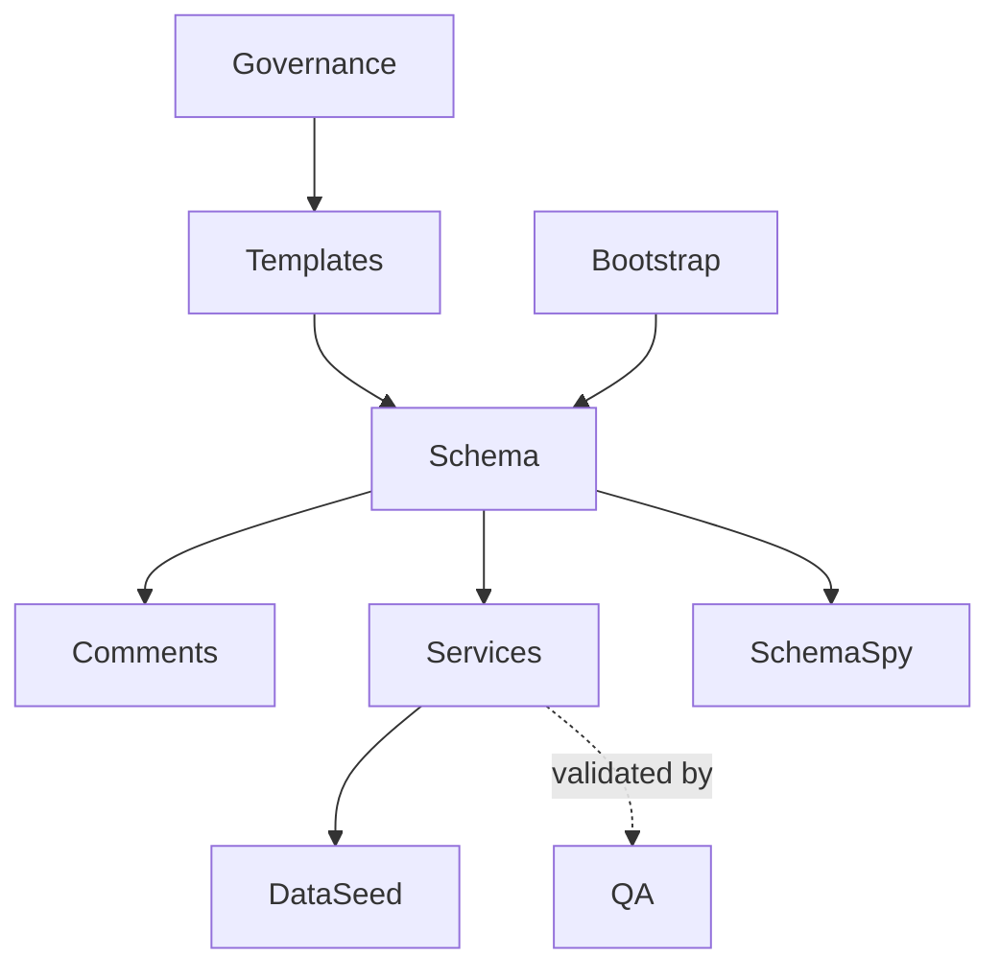

# Database Architecture Overview

## Overview

This directory defines the architectural organization of the **MiaCaoMigo** database system.

The database architecture is organized through isolated repository layers responsible for:

- bootstrap orchestration;
- schema definition;
- procedural services;
- integrity enforcement;
- QA validation;
- generated documentation;
- repository governance.

The architecture prioritizes:

- deterministic execution;
- modular organization;
- repository readability;
- maintainability across all modules;
- controlled validation boundaries;
- long-term scalability.

> All architectural standards defined within this structure are mandatory for all database modules and contributors.

---

# Repository Architecture

The database repository is organized into isolated operational layers.

```text
01_Database/
├── 00_Governance/
├── 01_Schemas/
├── 02_Templates/
├── 03_SchemaSpy/
```

---

# Operational Architecture



---

# Repository Layers

| Layer | Responsibility |
|---|---|
| Governance | Standards, integrity architecture, naming, SQL conventions |
| Templates | SQL authoring and structural readability patterns |
| Bootstrap | Database initialization and loader orchestration |
| Schema | Declarative relational structure and integrity |
| Comments | Repository documentation through `COMMENT ON` |
| Services | Procedural workflows and public APIs |
| DataSeed | Master and demonstration data |
| QA | Integrity and regression validation |
| SchemaSpy | Generated relational documentation |

---

# Modular Architecture

The database is organized into four isolated functional modules.

| Module | Responsibility |
|---|---|
| Module 1 | Users, authentication, employee management, attendance |
| Module 2 | Animals, ownership, veterinary domain |
| Module 3 | Commercial operations and inventory workflows |
| Module 4 | Appointments, schedules, notifications |

All modules must preserve:

- identical repository organization;
- identical naming philosophy;
- identical integrity architecture;
- identical SQL standards;
- identical governance principles.

There are no module-specific architectural exceptions.

---

# Integrity Architecture

The system enforces integrity through a layered validation architecture.

```text
Structural Integrity
    ↓
Automated Integrity
    ↓
Procedural Validation
    ↓
QA Verification
```

Integrity rules should be enforced at the lowest deterministic layer capable of guaranteeing consistency.

---

# Procedural Architecture

The procedural layer follows a controlled workflow architecture.

```text
Application
    ↓
svc_*
    ↓
sp_*
    ↓
fn_*
    ↓
vw_*
```

The database remains the primary authority for integrity enforcement and workflow validation.

---

# Generated Documentation

The repository includes automatically generated relational documentation through SchemaSpy.

SchemaSpy provides:

- relational diagrams;
- table exploration;
- constraints;
- indexes;
- procedural metadata;
- repository comments.

Generated documentation is considered read-only and must not replace the DataLayer source of truth.

---

# Governance Architecture

Repository standards and conventions are centralized within the governance layer.

The governance architecture defines:

- naming conventions;
- SQL standards;
- integrity architecture;
- repository organization;
- authoring templates;
- validation boundaries.

All repository implementations must preserve the standards defined by the governance structure.

---

# Design Principles

The adopted database architecture intentionally prioritizes:

- deterministic execution;
- modular organization;
- repository readability;
- maintainability across all modules;
- architectural consistency;
- procedural clarity;
- long-term scalability.

---

# Final Statement

The MiaCaoMigo database architecture is designed as a modular, deterministic, and governance-driven DataLayer.

All repository layers, workflows, integrity mechanisms, and documentation structures must preserve the architectural standards defined within this repository.