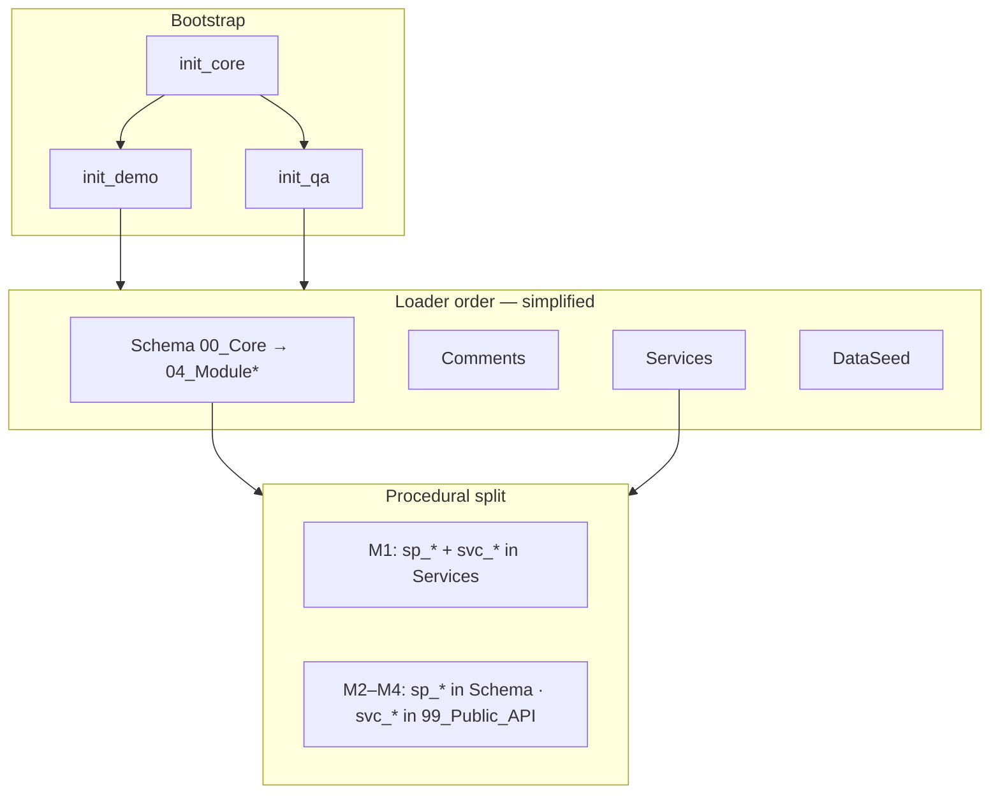

# Database architecture hub

  PostgreSQL
  As-implemented
  01_MiaCaoMigo_DataLayer

Single entry point for **database engineering** documentation. Describes the live MiaCaoMigo DataLayer — not speculative designs.

!!! info "Source of truth"
    Runnable artefacts: repository **`01_MiaCaoMigo_DataLayer`**, folder **`DataBase/`**.
    This Engineering tree documents, governs, and visualizes that implementation.

---

## Quick navigation

<strong>Build & bootstrap</strong> 
<a href="00_Schema_Build_Pipeline.md">Schema build pipeline</a> 
<small>Loaders, profiles, FK phase</small>

<strong>Governance</strong> 
<a href="00_Governance/README.md">Standards & integrity</a> 
<small>Naming, SQL, templates, QA contracts</small>

<strong>Modules</strong> 
<a href="01_Schemas/README.md">Schemas overview</a> 
<a href="01_Schemas/00_Public_Schema/00_Database_Architecture.md">Public schema</a>

<strong>Data dictionary</strong> 
<a href="04_Data_Dictionary/00_Overview.md">Overview</a> · M1–M4 tables 
<small>Columns, FKs, ENUMs, GiST</small>

<strong>SchemaSpy</strong> 
<a href="05_SchemaSpy/schemaspy.md">Interactive ERD</a> 
<small>Generated HTML — read-only</small>

<strong>System context</strong> 
<a href="../00_System_Architecture.md">System architecture</a> 
<a href="../README.md">Architecture index</a>

---

## Implementation map (`DataBase/`)

| Layer | Path | Docker init | Role |
|-------|------|:-----------:|------|
| **Bootstrap** | `Bootstrap/` | Yes | `init_core`, profiles `init_demo` / `init_qa`, loaders |
| **Schema** | `Schema/` | Yes | DDL: types, tables, constraints, triggers, views, procedures |
| **Comments** | `Comments/` | Yes | `COMMENT ON` for schema and services |
| **Services** | `Services/` | Yes | `svc_*` workflows; M1 also hosts `sp_*` |
| **DataSeed** | `DataSeed/` | Yes (profile) | Master data + demo narrative |
| **QA** | `QA/` | No | `ci.ps1` / `qa.sh` → integrity + stress |
| **Queries** | `Queries/` | No | Reference SQL only |

---

## Modular model (M1–M4)

| Module | Domain | Tables | Deep dive |
|--------|--------|:------:|-----------|
| **M1** | Users, roles, attendance, email | 16 | [Module 1 architecture](01_Schemas/00_Public_Schema/01_Module1_Architecture.md) · [Dictionary](04_Data_Dictionary/01_Module1.md) |
| **M2** | Animals & ownership | 8 | [Module 2](01_Schemas/00_Public_Schema/02_Module2_Architecture.md) · [Dictionary](04_Data_Dictionary/02_Module2.md) |
| **M3** | Commercial (purchases, invoices) | 8 | [Module 3](01_Schemas/00_Public_Schema/03_Module3_Architecture.md) · [Dictionary](04_Data_Dictionary/03_Module3.md) |
| **M4** | Appointments & notifications | 7 | [Module 4](01_Schemas/00_Public_Schema/04_Module4_Architecture.md) · [Dictionary](04_Data_Dictionary/04_Module4.md) |

**Cross-cutting:** [00_Database_Architecture.md](01_Schemas/00_Public_Schema/00_Database_Architecture.md) — `fn_*`, `vw_*`, `trg_*`, `jpr_*`, GiST exclusions, public API surface.

---

## Programming model (as implemented)

| Prefix | Typical location | Consumed by |
|--------|------------------|-------------|
| `fn_*` | Schema / Services helpers | Procedures, triggers, `svc_*` |
| `sp_*` | M1 Services; M2–M4 Schema | `svc_*`, QA, jobs |
| `svc_*` | `Services/…` and `99_Public_API` | Application layer |
| `qa_*()` | `QA/contracts/` | Integrity tests |
| `jpr_*` | Schema job procedures | pg_cron (M4 active; M2/M3 files skipped) |
| `trg_*` / `vw_*` | Schema | Integrity, read models |

Details: [SQL programming naming](00_Governance/00_Naming_Conventions/02_SQL_Programming.md).

---

## QA & CI (host-side)

| Entry | Stages |
|-------|--------|
| `QA/runners/ci.ps1` (Windows) | bootstrap → fixtures → integrity → stress |
| `QA/runners/qa.sh` (Unix) | same pipeline |

Contracts: `QA/contracts/` · Fixtures: `QA/fixtures/seed/` · Tests: `QA/01_Integrity/` (21 tests).

!!! note "Not loaded at Docker init"
    QA runs against an already bootstrapped database — typically profile **`init_qa`**.

---

## Documentation sections in this folder

| Folder | Contents |
|--------|----------|
| `00_Governance/` | Naming, SQL standards, integrity strategy, templates |
| `01_Schemas/` | Module architecture aligned to `Schema/` tree |
| `04_Data_Dictionary/` | Table/column semantic reference |
| `05_SchemaSpy/` | Generator scripts + **read-only** `02_Output/` |

Legacy empty folders (`02_Model*_Integrity`) may exist beside `02_Module*_Integrity` — use only the **`Module*`** paths linked from MkDocs.

---

## Suggested reading order

1. [Schema build pipeline](00_Schema_Build_Pipeline.md)
2. [Governance overview](00_Governance/README.md)
3. [Database architecture (public schema)](01_Schemas/00_Public_Schema/00_Database_Architecture.md)
4. Module pages M1 → M4 (schemas + dictionary)
5. [SchemaSpy interactive docs](05_SchemaSpy/schemaspy.md)

---

Database hub — aligned with <code>01_MiaCaoMigo_DataLayer</code>

