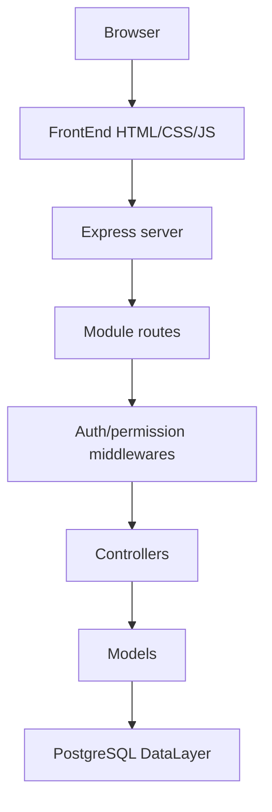

# Application overview

<div style="display:flex; gap:8px; flex-wrap:wrap; margin-bottom:1rem;">
  <span style="background:#2563eb;color:#fff;padding:4px 10px;border-radius:6px;font-size:0.85rem;">ApplicationLayer</span>
  <span style="background:#059669;color:#fff;padding:4px 10px;border-radius:6px;font-size:0.85rem;">Node + Express</span>
  <span style="background:#7c3aed;color:#fff;padding:4px 10px;border-radius:6px;font-size:0.85rem;">Frontend + API</span>
</div>

## Purpose

The ApplicationLayer provides the user-facing and API-facing part of the MiaCaoMigo ecosystem. It connects browser workflows to controlled backend endpoints and persists data through the PostgreSQL DataLayer.

Implementation repository:

```text
MiaCaoMigo_
```

---

## Technology stack

| Layer | Technology |
|-------|------------|
| Frontend | HTML5, CSS3, JavaScript vanilla, Bootstrap |
| Backend | Node.js, Express.js, CORS |
| Authentication | JSON Web Tokens |
| Database access | `pg` connection pool |
| API docs | Swagger/OpenAPI |
| Runtime | Local Node.js or Docker |

---

## Repository layout

| Path | Responsibility |
|------|----------------|
| `FrontEnd/` | Browser pages, CSS and client-side JavaScript |
| `Backend/server.js` | Express entry point, static files, API routes and documentation routes |
| `Backend/routes/` | Modular API routing by domain |
| `Backend/middlewares/` | JWT guards, staff guards, permission checks and error handling |
| `Backend/controllers/` | HTTP validation, orchestration and JSON responses |
| `Backend/Models/` | Database queries and service calls through the PostgreSQL pool |
| `Backend/config/db.js` | Shared PostgreSQL connection pool |
| `scripts_docs/` | Documentation generation scripts |
| `Docs/` | Generated/static documentation served by the application |

---

## Runtime boundary



The ApplicationLayer is responsible for request orchestration and user interaction. The DataLayer remains the integrity authority for relational constraints, SQL services, triggers, jobs and persisted data.

---

## Main API modules

| Module | API prefix | Scope |
|--------|------------|-------|
| Mod1 - Users | `/api/users` | Authentication, client registration, session state, staff permissions and user setup preferences |
| Mod2 - Animals | `/api/animals` | Species, breeds, client animals and staff-controlled animal operations |
| Mod3 - Commercial | Reserved/partial | Commercial integration exists structurally but is not fully exposed in the website API |
| Mod4 - Appointments | `/api/appointments` | Booking, availability, history, cancel/reschedule and appointment lifecycle |

---

## Documentation endpoints

When the application server is running, the website repository exposes:

| Endpoint | Purpose |
|----------|---------|
| `/api-docs/` | Swagger UI |
| `/api-docs.json` | OpenAPI JSON specification |

Application documentation is maintained in this Engineering portal under [Application documentation hub](04_Generated_Docs/README.md).

The static OpenAPI JSON can be regenerated in the website repository with:

```sh
npm run docs:generate
```

See [Update Docs](04_Generated_Docs/Update_Docs.md).

---

[← Application architecture](README.md)
