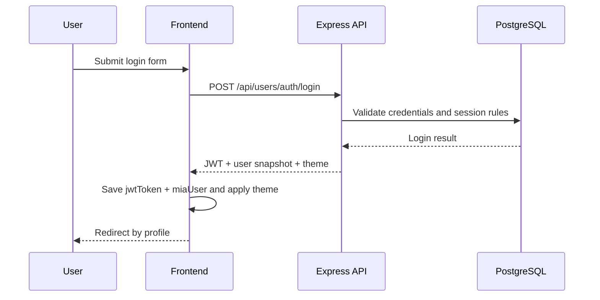
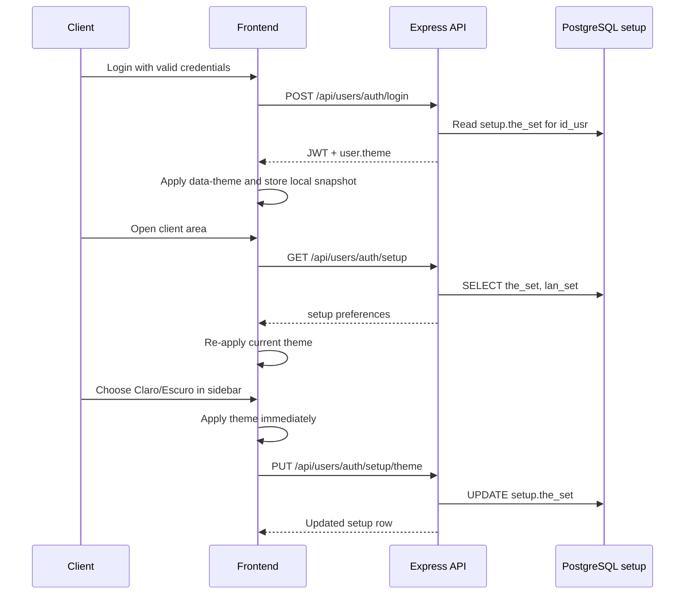
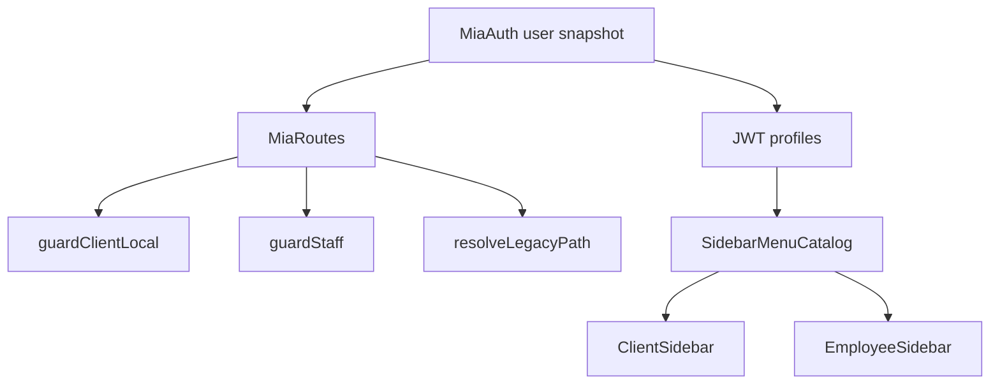
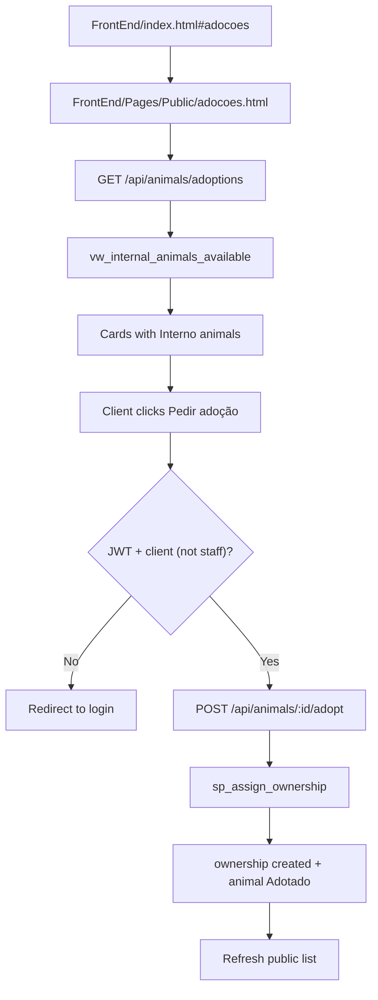
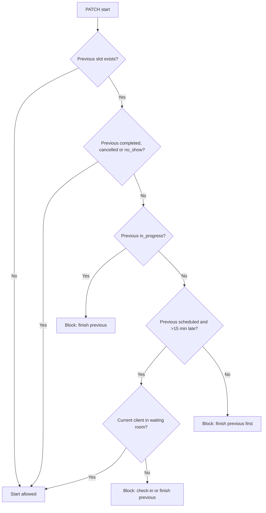

# Website flows

<div style="display:flex; gap:8px; flex-wrap:wrap; margin-bottom:1rem;">
  <span style="background:#2563eb;color:#fff;padding:4px 10px;border-radius:6px;font-size:0.85rem;">Flow view</span>
  <span style="background:#059669;color:#fff;padding:4px 10px;border-radius:6px;font-size:0.85rem;">Defense support</span>
</div>

This document summarizes the main website flows implemented in `MiaCaoMigo_`. It is written for presentation and defense usage; source-level endpoint details remain in Swagger/OpenAPI.

---

## API request flow

```text
Client request
  -> Backend/server.js
  -> Module route
  -> Auth/permission middleware
  -> Controller
  -> Model
  -> PostgreSQL
  -> JSON response
```

1. The browser sends an HTTP request, for example `POST /api/appointments`.
2. `Backend/server.js` receives the request, applies JSON parsing and CORS, and serves static frontend files.
3. The request is routed to the correct module:
   - `/api/users` for Mod1;
   - `/api/animals` for Mod2;
   - `/api/appointments` for Mod4.
4. Protected routes apply middleware such as `requireAuth`, `requireStaff`, `requirePermission` or `requireClinicSecretary`.
5. Controllers validate input, apply HTTP-level rules and call models.
6. Models call PostgreSQL through the shared pool in `Backend/config/db.js`.
7. PostgreSQL returns data or constraint/domain errors.
8. Controllers serialize the result as JSON for the frontend.

---

## Authentication flow



1. The user opens a public page and navigates to `FrontEnd/Pages/Mod1_Users/Autenticacao/login.html`.
2. `FrontEnd/Js/Mod1/login.js` submits email and password to `POST /api/users/auth/login`.
3. `authController.login` validates credentials through the authentication model.
4. A successful login returns a JWT, a user snapshot and the current theme from `setup.the_set`.
5. `FrontEnd/Js/geral/authSession.js` stores `jwtToken` and `miaUser` in `localStorage` and applies the theme through `data-theme`.
6. Staff users are redirected to `FrontEnd/Pages/Mod1_Users/Funcionarios/MainDashboard.html`.
7. Client users are redirected to `FrontEnd/Pages/Mod1_Users/Clientes/area_cliente.html`.
8. Protected requests include `Authorization: Bearer <token>`.
9. Logout calls `POST /api/users/auth/logout`, closes the database session and clears local storage.

---

## Client setup preference flow

The client theme preference implements `RF_M1_39` and `RF_M1_41` through the existing `setup` table. The database remains the source of truth, while `localStorage` is used only as a local UI cache.



1. The `setup` row is created automatically by the DataLayer when a user account is created.
2. On login, `authController.login` includes `theme` in the returned user snapshot.
3. On authenticated page load, `MiaAuth.loadSetupFromApi()` calls `GET /api/users/auth/setup` to synchronize with the database.
4. The client sidebar exposes a `Tema` selector with `Claro` and `Escuro`.
5. Changing the selector calls `MiaAuth.saveTheme()`, which applies the theme immediately and persists it with `PUT /api/users/auth/setup/theme`.
6. The API never receives `id_usr` from the frontend; it uses `req.user.sub` from the JWT, preventing one user from changing another user's preferences.
7. The backend validates the accepted values (`light`, `dark`), and the database constraint on `setup.the_set` enforces the same domain.

---

## Route and sidebar flow

`FrontEnd/Js/geral/routes.js` is the frontend navigation source. It defines current page paths, post-login redirects, staff/client guards and legacy path translation.



The sidebar catalog resolves client links from a fixed client menu and staff links from profile names (`administrador`, `veterinario`, `assistente`, `gestor rh`, etc.). Reserved entries for commercial/reporting navigation are visible in the catalog but remain non-operational in the current website.

---

## Public adoptions flow

Visitors can browse animals available for adoption without logging in. Adoption is registered immediately for authenticated clients (no pending-request table in the current schema).



| Step | Page/API | Behaviour |
|------|----------|-----------|
| Discover | `index.html#adocoes` | Header link scrolls to the landing-page adoption section, matching services/about navigation |
| Browse | `adocoes.html` + `adocoes.js` | Public list from `GET /api/animals/adoptions`; `photo_path` reserved for future static assets |
| Authenticate | `login.html` | Unauthenticated adopt action redirects with return URL to adoptions page |
| Adopt | `POST /api/animals/:id/adopt` | Client-only; calls `sp_assign_ownership` with platform registrar employee; staff receives `403` |

DataLayer sources (unchanged schema): `vw_internal_animals_available`, `sp_assign_ownership`.

---

## Client flow

The authenticated client area supports self-service viewing and appointment management.

| Area | Page/script | Behaviour |
|------|-------------|-----------|
| Client entry | `FrontEnd/Pages/Mod1_Users/Clientes/area_cliente.html` | Reserved area entry point |
| Theme preference | `FrontEnd/Js/geral/Sidebar/ClientSidebar.js` + `FrontEnd/Js/geral/authSession.js` | Lets the authenticated client choose light/dark theme |
| Animals | `FrontEnd/Pages/Mod2_Animals/animais.html` + `FrontEnd/Js/Mod2/clientAnimais.js` | Lists animals linked to the authenticated client |
| Add animal | `FrontEnd/Pages/Mod2_Animals/adicionar-animal.html` | Client/staff navigation target for animal registration flow |
| Appointments | `FrontEnd/Pages/Mod4_Appointments/consultas.html` + `FrontEnd/Js/Mod4/clientConsultas.js` | Lists, books, cancels and reschedules client appointments |

Access control rule:

```text
Client JWT -> only own client animals and appointments
```

---

## Appointment booking flow

```text
Open appointments page
  -> load own animals
  -> load veterinarians
  -> load specialties
  -> request availability
  -> submit appointment
  -> refresh appointment list
```

1. The client opens `FrontEnd/Pages/Mod4_Appointments/consultas.html`.
2. The frontend loads animals with `GET /api/animals/me`.
3. The frontend loads veterinarians with `GET /api/appointments/veterinarians`.
4. The frontend loads specialties with `GET /api/appointments/specialties`.
5. After choosing veterinarian and date, the frontend calls `GET /api/appointments/availability?vetId=<id>&date=<yyyy-mm-dd>`.
6. The client selects an available slot.
7. The frontend submits `POST /api/appointments` with animal, veterinarian, specialty and scheduled date/time.
8. The API validates authentication, ownership, veterinarian, specialty, availability and schedule conflicts.
9. The appointment is persisted and the client appointment table is refreshed.

---

## Client notification flow

Client notifications are shown in `FrontEnd/Pages/Mod1_Users/Clientes/area_cliente.html` and loaded by `FrontEnd/Js/geral/clientDashboard.js`.

| Action | Endpoint | Notes |
|--------|----------|-------|
| List notifications | `GET /api/appointments/notifications/me` | Returns reminder notifications and unread count for the authenticated client |
| Mark one as read | `PATCH /api/appointments/notifications/:id_not/read` | Validates notification ownership before updating `rea_not` |
| Mark all as read | `PATCH /api/appointments/notifications/read-all` | Bulk read action for the authenticated client |

The DataLayer already generates next-day reminders through `jpr_generate_appointment_warnings()` and the `daily_appointment_warnings` pg_cron job. The ApplicationLayer excludes the internal waiting-room marker (`__WAITING_ROOM__`) from the client feed so operational check-in data is not displayed as a user notification.

---

## Staff/admin flow

Staff users enter through the same authentication flow but are separated by institutional email and JWT permissions.

The staff area follows a hybrid model:

- **Self-service (`Minha Área`)**: every staff member sees their own agenda, schedule, clock-ins and absences through `/api/users/staff/me/*`.
- **Global operations (RBAC)**: management sections appear only when the JWT includes the matching permission (`manage_appointments`, `manage_employees`, `manage_animals`, etc.).

| Area | Page/script | Behaviour |
|------|-------------|-----------|
| Staff home | `FrontEnd/Pages/Mod1_Users/Funcionarios/MainDashboard.html` + `staffDashboardHome.js` | Personal widgets loaded from `GET /api/users/staff/me/agenda` |
| Full personal agenda | `FrontEnd/Pages/Mod1_Users/Funcionarios/AreaFuncionario.html` + `staffArea.js` | Intended detailed tables for appointments, schedule, attendance and absences; current HTML shell is empty in the website working tree |
| Permission shell | `FrontEnd/Js/geral/staffDashboard.js` | Shows/hides `[data-require]` sections according to JWT permissions |
| Team calendar | `FrontEnd/Pages/Mod1_Users/Funcionarios/CalendarioEquipa.html` | Staff team planning page |
| Employee board | `FrontEnd/Pages/Mod1_Users/Funcionarios/QuadroFuncionario.html` | Staff directory/employee board entry |
| Employee detail | `FrontEnd/Pages/Mod1_Users/Funcionarios/FuncionarioDetalhe.html` + `funcionarioDetalhe.js` | Employee detail page |
| HR presentation views | `FrontEnd/Pages/Mod1_Users/Funcionarios/Views/*.html` | Static/prototype partials for personal information, attendance, absences, schedules, roles, team calendar and operational impact |
| Global appointments | `FrontEnd/Pages/Mod4_Appointments/AdicionarConsulta.html` | Staff agenda: booking, check-in, start (`manage_appointments`) |
| Clinical record | `FrontEnd/Pages/Mod4_Appointments/RegistoConsulta.html` | Veterinarian consultation record, prescription and close |
| Staff animal registration | `FrontEnd/Pages/Mod2_Animals/RegistarAnimal.html` | Staff animal registration and ownership flows (`manage_animals`) |
| Employee onboarding | `FrontEnd/Pages/Mod1_Users/Funcionarios/AdicionarFuncionario.html` + `AdicionarFuncionario.js` | HR entry; calls `POST /api/users/employees` with `manage_employees` |

Authorization rules:

| Operation | Guard |
|-----------|-------|
| Staff-only reads | `requireStaff` |
| Personal agenda | `requireAuth` + `requireStaff` on `/api/users/staff/me/*` |
| Appointment lifecycle | `requirePermission('manage_appointments')` |
| Employee onboarding | `requirePermission('manage_employees')` on `POST /api/users/employees` |
| Employee directory | `manage_employees` in UI (`data-require`) |
| Animal association/removal | `requireClinicSecretary` |

Role-aware UI notes:

- Veterinarians focus on appointments where `appointment.id_emp` matches their employee row.
- Assistants see the same self-service area but global clinical management depends on RBAC profiles, not a fixed “assigned veterinarian” relationship in the database.
- The HR `Views/*.html` files are frontend presentation/prototype partials; the documented API-backed staff self-service data comes from `/api/users/staff/me/*`.
- `staffArea.js` and `/api/users/staff/me/agenda` support the full personal agenda, but `AreaFuncionario.html` currently needs its page shell restored before the route can validate.

---

## Staff appointment management flow

The staff agenda is implemented in `AdicionarConsulta.html` and `staffConsultas.js`. The clinical record page is `RegistoConsulta.html` with `registoConsulta.js`.

| Action | Endpoint | Notes |
|--------|----------|-------|
| List appointments | `GET /api/appointments` | Staff-only route |
| Load client animals | `GET /api/animals/client/:clientId` | Used when staff books on behalf of a client |
| Load veterinarians/specialties | `GET /api/appointments/veterinarians`, `GET /api/appointments/specialties` | Form catalogs |
| Load availability | `GET /api/appointments/availability?vetId=&date=&excludeAppId=` | `excludeAppId` is optional and used during rescheduling |
| Create appointment | `POST /api/appointments` | Staff may pass `id_cli`/`id_usr` |
| Waiting room check-in | `PATCH /api/appointments/:id_app/check-in` | Persists arrival via `appointment_notification` (`__WAITING_ROOM__`) without schema changes |
| Start consultation | `PATCH /api/appointments/:id_app/start` | Assigned veterinarian only; validates previous slot (see below) |
| Clinical workspace | `GET /api/appointments/prescriptions/consultation/:id_app` | Summary, history, prescription, vitals |
| Save clinical record | `PUT /api/appointments/prescriptions/consultation/:id_app/clinical-record` | `anamnesis`, `overall_assessment`, diagnosis/comments on `appointment` |
| Issue prescription | `POST /api/appointments/prescriptions/consultation/:id_app` | During `in_progress` |
| Prescription PDF | `GET /api/appointments/prescriptions/:id_pre/pdf` | Generated on demand with `pdfkit` (not stored in DB) |
| Close consultation | `PATCH /api/appointments/:id_app/close` | Sets `completed`; never auto-cancels delayed appointments |

### Start rules (same veterinarian, 30-minute slots)



Delayed appointments are never moved to `cancelled` automatically when the next slot begins; staff must explicitly close or manage the previous consultation.

### Client prescriptions

| Action | Endpoint | Notes |
|--------|----------|-------|
| List prescriptions | `GET /api/appointments/prescriptions/me` | Authenticated client |
| Download PDF | `GET /api/appointments/prescriptions/:id_pre/pdf` | Own prescriptions only |

---

## Defense reading

For defense purposes, this flow proves that the website is not just a static frontend. It includes:

- authenticated client and staff navigation;
- API-mediated access to protected data;
- role and permission checks;
- database-backed session handling;
- database-backed client setup preferences;
- appointment lifecycle operations;
- visible separation between public, client and admin areas.

---

[← Application architecture](README.md)
