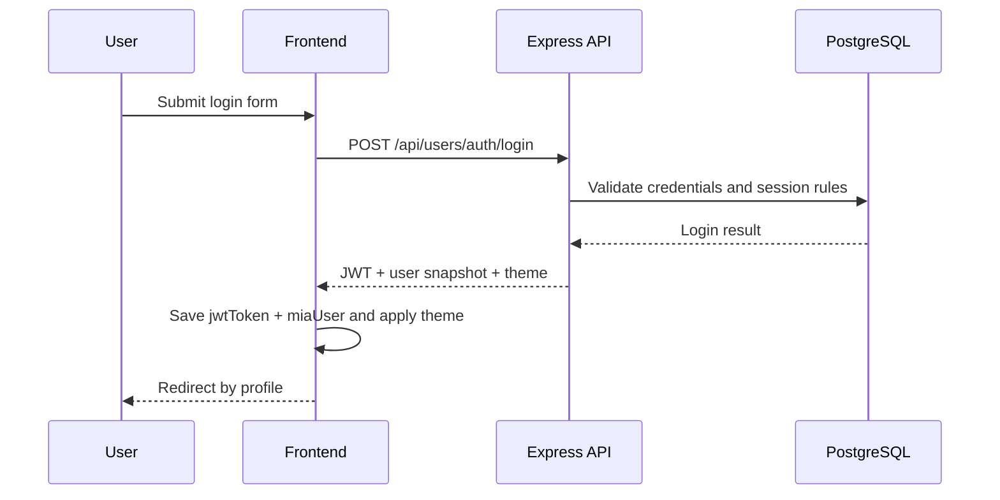
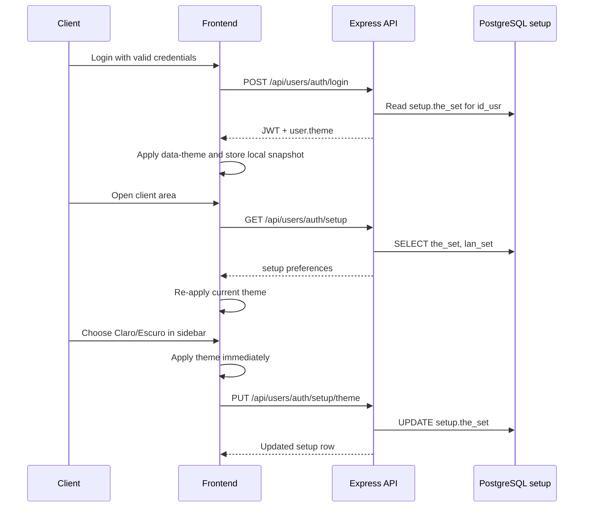

# Website flows

<div style="display:flex; gap:8px; flex-wrap:wrap; margin-bottom:1rem;">
  <span style="background:#2563eb;color:#fff;padding:4px 10px;border-radius:6px;font-size:0.85rem;">Flow view</span>
  <span style="background:#059669;color:#fff;padding:4px 10px;border-radius:6px;font-size:0.85rem;">Defense support</span>
</div>

This document summarizes the main website flows implemented in `MiaCaoMigo_`. It is written for presentation and defense usage; source-level endpoint details remain in Swagger/JSDoc.

---

## API request flow

```text
Client request
  -> Backend/server.js
  -> Module route
  -> Auth/permission middleware
  -> Controller
  -> Model
  -> PostgreSQL
  -> JSON response
```

1. The browser sends an HTTP request, for example `POST /api/appointments`.
2. `Backend/server.js` receives the request, applies JSON parsing and CORS, and serves static frontend files.
3. The request is routed to the correct module:
   - `/api/users` for Mod1;
   - `/api/animals` for Mod2;
   - `/api/appointments` for Mod4.
4. Protected routes apply middleware such as `requireAuth`, `requireStaff`, `requirePermission` or `requireClinicSecretary`.
5. Controllers validate input, apply HTTP-level rules and call models.
6. Models call PostgreSQL through the shared pool in `Backend/config/db.js`.
7. PostgreSQL returns data or constraint/domain errors.
8. Controllers serialize the result as JSON for the frontend.

---

## Authentication flow



1. The user opens a public page and navigates to `FrontEnd/Pages/UserView/Mod1/login.html`.
2. `FrontEnd/Js/Mod1/login.js` submits email and password to `POST /api/users/auth/login`.
3. `authController.login` validates credentials through the authentication model.
4. A successful login returns a JWT, a user snapshot and the current theme from `setup.the_set`.
5. `FrontEnd/Js/geral/authSession.js` stores `jwtToken` and `miaUser` in `localStorage` and applies the theme through `data-theme`.
6. Staff users are redirected to `FrontEnd/Pages/AdminPanel/MainDashboard.html`.
7. Client users are redirected to `FrontEnd/Pages/UserView/Mod1/area_cliente.html`.
8. Protected requests include `Authorization: Bearer <token>`.
9. Logout calls `POST /api/users/auth/logout`, closes the database session and clears local storage.

---

## Client setup preference flow

The client theme preference implements `RF_M1_39` and `RF_M1_41` through the existing `setup` table. The database remains the source of truth, while `localStorage` is used only as a local UI cache.



1. The `setup` row is created automatically by the DataLayer when a user account is created.
2. On login, `authController.login` includes `theme` in the returned user snapshot.
3. On authenticated page load, `MiaAuth.loadSetupFromApi()` calls `GET /api/users/auth/setup` to synchronize with the database.
4. The client sidebar exposes a `Tema` selector with `Claro` and `Escuro`.
5. Changing the selector calls `MiaAuth.saveTheme()`, which applies the theme immediately and persists it with `PUT /api/users/auth/setup/theme`.
6. The API never receives `id_usr` from the frontend; it uses `req.user.sub` from the JWT, preventing one user from changing another user's preferences.
7. The backend validates the accepted values (`light`, `dark`), and the database constraint on `setup.the_set` enforces the same domain.

---

## Client flow

The authenticated client area supports self-service viewing and appointment management.

| Area | Page/script | Behaviour |
|------|-------------|-----------|
| Client entry | `FrontEnd/Pages/UserView/Mod1/area_cliente.html` | Reserved area entry point |
| Theme preference | `FrontEnd/Pages/Geral/ClientSideBar.html` + `FrontEnd/Js/geral/ClientSideBar.js` | Lets the authenticated client choose light/dark theme |
| Animals | `FrontEnd/Pages/UserView/Mod2/animais.html` + `FrontEnd/Js/Mod2/clientAnimais.js` | Lists animals linked to the authenticated client |
| Appointments | `FrontEnd/Pages/UserView/Mod4/consultas.html` + `FrontEnd/Js/Mod4/clientConsultas.js` | Lists, books, cancels and reschedules client appointments |

Access control rule:

```text
Client JWT -> only own client animals and appointments
```

---

## Appointment booking flow

```text
Open appointments page
  -> load own animals
  -> load veterinarians
  -> load specialties
  -> request availability
  -> submit appointment
  -> refresh appointment list
```

1. The client opens `FrontEnd/Pages/UserView/Mod4/consultas.html`.
2. The frontend loads animals with `GET /api/animals/me`.
3. The frontend loads veterinarians with `GET /api/appointments/veterinarians`.
4. The frontend loads specialties with `GET /api/appointments/specialties`.
5. After choosing veterinarian and date, the frontend calls `GET /api/appointments/availability?vetId=<id>&date=<yyyy-mm-dd>`.
6. The client selects an available slot.
7. The frontend submits `POST /api/appointments` with animal, veterinarian, specialty and scheduled date/time.
8. The API validates authentication, ownership, veterinarian, specialty, availability and schedule conflicts.
9. The appointment is persisted and the client appointment table is refreshed.

---

## Staff/admin flow

Staff users enter through the same authentication flow but are separated by institutional email and JWT permissions.

| Area | Page/script | Behaviour |
|------|-------------|-----------|
| Admin dashboard | `FrontEnd/Pages/AdminPanel/MainDashboard.html` | Central staff entry point |
| Dashboard permissions | `FrontEnd/Js/geral/staffDashboard.js` | Shows/hides sections according to JWT permissions |
| Employee operations | `FrontEnd/Pages/AdminPanel/AdicionarFuncionario.html` | Staff-facing employee management entry |
| Appointment operations | `FrontEnd/Pages/AdminPanel/AdicionarConsulta.html` | Staff-facing appointment entry |

Authorization rules:

| Operation | Guard |
|-----------|-------|
| Staff-only reads | `requireStaff` |
| Appointment lifecycle | `requirePermission('manage_appointments')` |
| Animal association/removal | `requireClinicSecretary` |

---

## Defense reading

For defense purposes, this flow proves that the website is not just a static frontend. It includes:

- authenticated client and staff navigation;
- API-mediated access to protected data;
- role and permission checks;
- database-backed session handling;
- database-backed client setup preferences;
- appointment lifecycle operations;
- visible separation between public, client and admin areas.

---

[← Application architecture](README.md)
