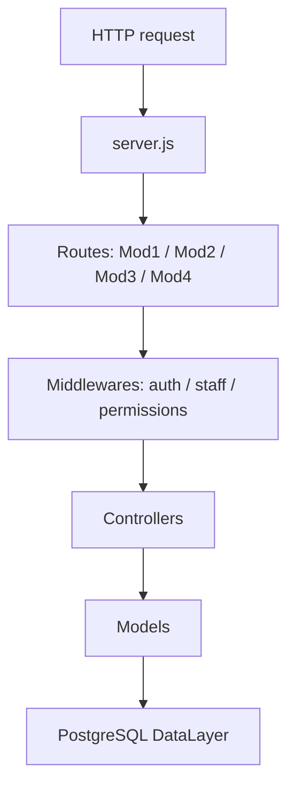
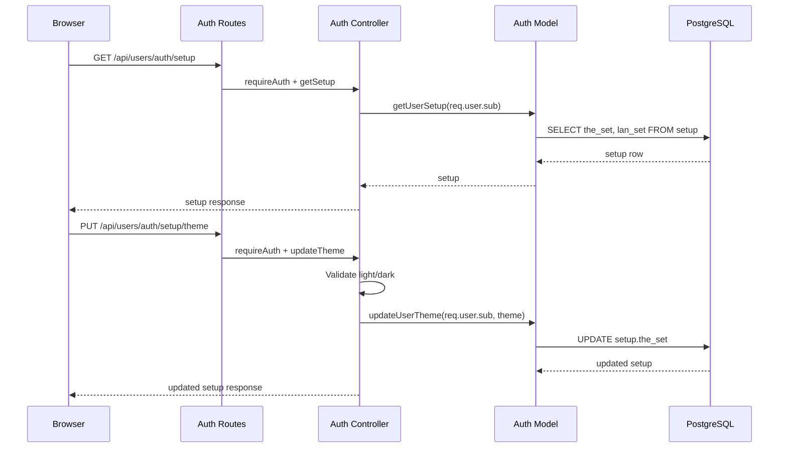
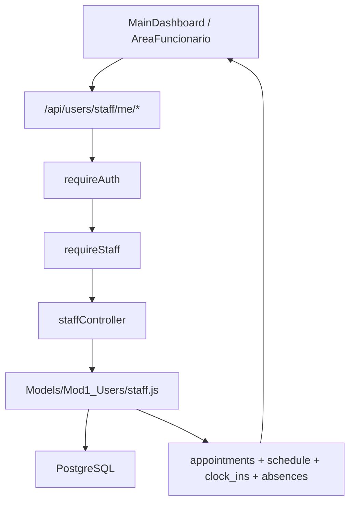

# Backend Documentation

This page summarizes how the Express backend exposes the application and the API documentation routes at runtime.

---

## Runtime Routes

| URL | Source | Description |
|-----|--------|-------------|
| `/` | `FrontEnd/` | Static website |
| `/api/users` | `Backend/routes/Mod1_Users` | Authentication, session management, user setup, staff self-service, client lookup and employee onboarding |
| `/api/animals` | `Backend/routes/Mod2_Animals` | Species, breeds, and animal data |
| `/api/stock` | `Backend/routes/Mod3_Commercial/stockRoutes.js` | Staff commercial product catalog and stock reads/creation |
| `/api/restock` | `Backend/routes/Mod3_Commercial/restockRoutes.js` | Staff purchase/restock registration |
| `/api/sales` | `Backend/routes/Mod3_Commercial/salesRoutes.js` | Staff counter sales, invoice generation and invoice PDF by sale route |
| `/api/return` | `Backend/routes/Mod3_Commercial/returnRoutes.js` | Staff return registration and listing |
| `/api/invoices` | `Backend/routes/Mod3_Commercial/invoiceRoutes.js` | Staff invoice list/details/PDF and client `/me` invoice reads |
| `/api/appointments` | `Backend/routes/Mod4_Appointments` | Appointments, veterinarians, specialties, and availability |
| `/api-docs/` | `swagger-ui-express` | Interactive Swagger UI |
| `/api-docs.json` | `swagger-jsdoc` | Runtime OpenAPI JSON |
| `/db-test` | `Backend/server.js` | Technical route for testing database connectivity |

---

## Key Files

| File | Purpose |
|------|---------|
| `Backend/server.js` | Express setup, middlewares, routes, and served documentation |
| `Backend/swaggerConfig.js` | OpenAPI configuration and global schemas |
| `Backend/swagger.js` | Exported generated OpenAPI document |
| `Backend/config/db.js` | PostgreSQL connection pool |
| `Backend/middlewares/authMiddleware.js` | JWT, staff, permission, and clinic secretary guards |
| `scripts_docs/generate-swagger.js` | Generates `Docs/Swagger/openapi.json` |

---

## Request Layers

See also [Website flows](../01_Website_Flows.md) for the full frontend/backend flow.

---

## Auth Setup And Theme

User visual preferences are persisted in the `setup` table and exposed through authenticated Mod1 auth routes.

| Endpoint | Guard | Responsibility |
|----------|-------|----------------|
| `GET /api/users/auth/setup` | `requireAuth` | Read `setup.the_set` and `setup.lan_set` for the authenticated user |
| `PUT /api/users/auth/setup/theme` | `requireAuth` | Update `setup.the_set` to `light` or `dark` |
| `PUT /api/users/auth/heartbeat` | `requireAuth` | Refresh the active database session heartbeat while the authenticated browser session is alive |

The user id comes from the JWT (`req.user.sub`); the browser never sends an arbitrary `id_usr` for these operations.

Documentation note: `heartbeat` is implemented, used by the website, and included in the generated OpenAPI contract.

---

## Public Adoptions (Mod2)

Animals in `Interno` status are listed from `vw_internal_animals_available`. Authenticated clients adopt through `sp_assign_ownership` (direct ownership, no pending-request table).

| Endpoint | Guard | Responsibility |
|----------|-------|----------------|
| `GET /api/animals/adoptions` | Public | List available animals; `photo_path` reserved (`null` until assets exist) |
| `POST /api/animals/:id/adopt` | `requireAuth` (clients only) | Direct adoption via `sp_assign_ownership`; staff receives `403` |

---

## Commercial Workflows (Mod3)

`Backend/routes/Mod3_Commercial/index.js` is mounted at `/api` and attaches commercial subroutes. Staff-only operations are protected by `requireAuth`, `requireStaff` and `requireCommercialAreaAccess`; client invoice reads use authenticated `/api/invoices/me*` endpoints.

| Prefix | Guard | Responsibility |
|--------|-------|----------------|
| `/api/stock` | Commercial staff only | Catalog reads, product creation and stock/reorder queries |
| `/api/restock` | Commercial staff only | Purchase/restock registration |
| `/api/sales` | Commercial staff only | Counter sale registration and sales invoice PDF endpoints |
| `/api/return` | Commercial staff only | Product return registration/listing |
| `/api/invoices` | Mixed | Staff invoice list/details/PDF; clients only `/me`, `/me/:id/details`, `/me/:id/pdf` |

Invoice PDFs are generated on demand with `pdfkit` and are not stored as binary data. The renderer uses the Mod3 invoice layout with clinic logo, document metadata panel, line-item table, VAT and totals.

---

## Staff Self-Service

Staff personal pages use `/api/users/staff/me/*` endpoints protected by `requireAuth` and `requireStaff`.

| Endpoint | Purpose |
|----------|---------|
| `GET /api/users/staff/me/agenda` | Full personal staff area payload |
| `GET /api/users/staff/me/appointments` | Authenticated staff member appointments |
| `GET /api/users/staff/me/schedule` | Weekly schedule |
| `GET /api/users/staff/me/clock-ins` | Recent clock-in/out records |
| `GET /api/users/staff/me/absences` | Recent or future absences |
| `POST /api/users/staff/me/clock-toggle` | Toggle clock-in/out through `svc_clock_toggle` |

---

## Staff Lookup And Employee Onboarding

The staff appointment and animal-management pages share the active-client lookup route. Employee creation posts to a mounted Mod1 route and is protected by staff RBAC.

| Endpoint | Guard | Responsibility |
|----------|-------|----------------|
| `GET /api/users/clients` | `requireAuth` + `requireStaff` + `requireAnyPermission(['manage_animals', 'manage_appointments'])` | Lookup active clients for animal association and staff appointment booking |
| `POST /api/users/employees` | `requireAuth` + `requireStaff` + `requirePermission('manage_employees')` | Create identity + employee through the DataLayer, attach a single RBAC profile and return the generated professional email |

Current implementation detail: the frontend collects a `schedule` object, and the backend accepts it, but schedule persistence is not active in this phase.

---

## Appointment Availability And Rescheduling

`GET /api/appointments/availability` returns 30-minute slots for a veterinarian/date pair. During rescheduling, the frontend may pass `excludeAppId` so the current appointment does not block its own original slot.

| Query parameter | Required | Purpose |
|-----------------|----------|---------|
| `vetId` | Yes | Veterinarian employee ID |
| `date` | Yes | Target date in `YYYY-MM-DD` format |
| `excludeAppId` | No | Appointment ID to ignore while recalculating availability for reschedule |

---

## Client Notifications

Appointment reminders use the existing DataLayer table `appointment_notification`, where `rea_not` stores read/unread state. The database procedure `jpr_generate_appointment_warnings()` and cron job `daily_appointment_warnings` generate next-day appointment reminders.

| Endpoint | Guard | Responsibility |
|----------|-------|----------------|
| `GET /api/appointments/notifications/me` | `requireAuth` (client only) | List client notifications and unread count |
| `PATCH /api/appointments/notifications/:id_not/read` | `requireAuth` (client only) | Mark one owned notification as read |
| `PATCH /api/appointments/notifications/read-all` | `requireAuth` (client only) | Mark all owned notifications as read |

The application filters out the operational waiting-room marker `__WAITING_ROOM__`, because that row is used internally by the check-in flow and is not a message for the client.

---

## OpenAPI

The API source of truth is the `@swagger` comments in mounted route files and the schemas defined in `Backend/swaggerConfig.js`.

Routes included in the current OpenAPI contract:

- `Backend/routes/Mod1_Users/authRoutes.js`
- `Backend/routes/Mod1_Users/clientRoutes.js`
- `Backend/routes/Mod1_Users/staffRoutes.js`
- `Backend/routes/Mod1_Users/employeeRoutes.js`
- `Backend/routes/Mod2_Animals/animais.js`
- `Backend/routes/Mod3_Commercial/stockRoutes.js`
- `Backend/routes/Mod3_Commercial/restockRoutes.js`
- `Backend/routes/Mod3_Commercial/salesRoutes.js`
- `Backend/routes/Mod3_Commercial/returnRoutes.js`
- `Backend/routes/Mod3_Commercial/invoiceRoutes.js`
- `Backend/routes/Mod4_Appointments/appointmentRoutes.js`
- `Backend/routes/Mod4_Appointments/prescricoesRoutes.js`

Clinical persistence uses existing Mod4 tables (`anamnesis`, `overall_assessment`, `prescription`, `rel_app_product`). Waiting-room check-in reuses `appointment_notification` with message `__WAITING_ROOM__` (no schema migration), while client notification endpoints read the same table and explicitly filter that internal marker. Prescription PDF export uses `Backend/services/prescriptionPdf.js` and the `pdfkit` dependency; it is generated on demand and rendered with the same invoice-style visual system used for Mod3 documents.

Only mounted routes should be treated as part of the runtime contract. Earlier unmounted/stub routes remain out of scope, but the current Mod3 commercial hub is mounted through `Backend/routes/Mod3_Commercial/index.js`.

Details: [Swagger](Swagger.md) · [OpenAPI](OpenAPI.md)

---

## Backend / Website Alignment Notes

| Website area | Backend status |
|--------------|----------------|
| Session heartbeat | Implemented as `PUT /api/users/auth/heartbeat` and documented in Swagger/OpenAPI |
| Employee detail | `FuncionarioDetalhe.html` still uses static/mock data; no mounted `GET /api/users/employees/:id` endpoint exists yet |
| Staff animal breeds | Backend exposes `GET /api/animals/breeds`; `staffAnimais.js` contains a fallback call to `/api/animals/breed`, which is not mounted |
| Mod3 commercial/billing | Mounted through `Backend/routes/Mod3_Commercial/index.js`; administrator/assistant staff can use stock, restock, counter sales, returns and invoice/PDF workflows, while clients only access their own invoice endpoints |

---

## Maintenance

1. Update `@swagger` comments when endpoints, payloads, or responses change.
2. In the **`MiaCaoMigo_`** repository, run `npm run docs:generate`.

Do not manually edit `Docs/Swagger/openapi.json`.

---

[<- Documentation hub](README.md)
