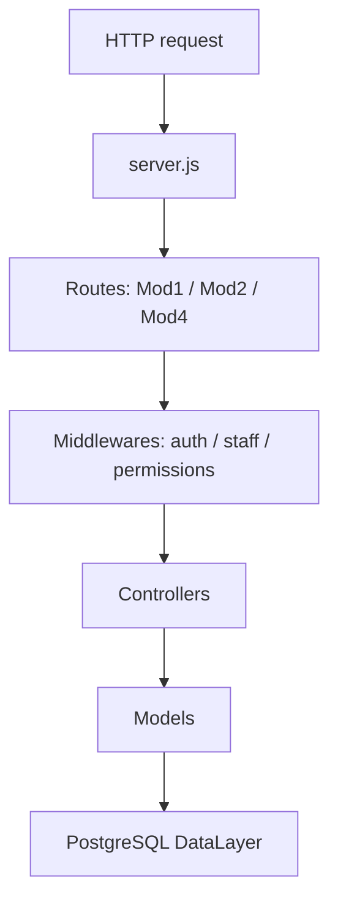
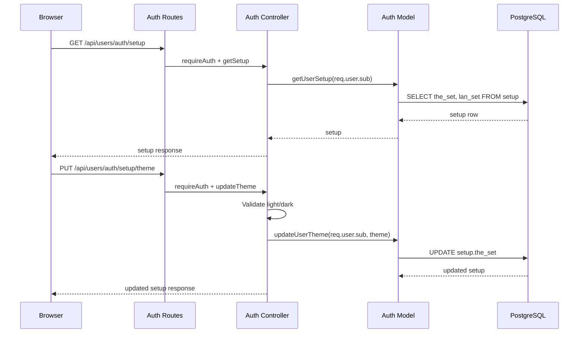
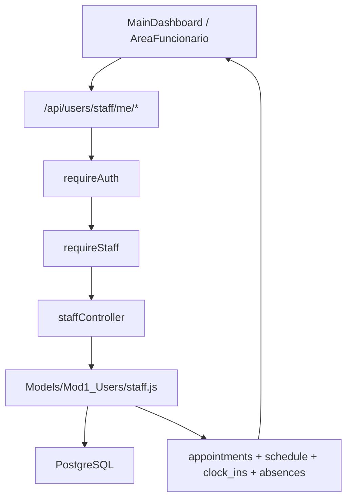

# Backend Documentation

This page summarizes how the Express backend exposes the application and the API documentation routes at runtime.

---

## Runtime Routes

| URL | Source | Description |
|-----|--------|-------------|
| `/` | `FrontEnd/` | Static website |
| `/api/users` | `Backend/routes/Mod1_Users` | Authentication, session management, user setup and staff self-service |
| `/api/animals` | `Backend/routes/Mod2_Animals` | Species, breeds, and animal data |
| `/api/appointments` | `Backend/routes/Mod4_Appointments` | Appointments, veterinarians, specialties, and availability |
| `/api-docs/` | `swagger-ui-express` | Interactive Swagger UI |
| `/api-docs.json` | `swagger-jsdoc` | Runtime OpenAPI JSON |
| `/db-test` | `Backend/server.js` | Technical route for testing database connectivity |

---

## Key Files

| File | Purpose |
|------|---------|
| `Backend/server.js` | Express setup, middlewares, routes, and served documentation |
| `Backend/swaggerConfig.js` | OpenAPI configuration and global schemas |
| `Backend/swagger.js` | Exported generated OpenAPI document |
| `Backend/config/db.js` | PostgreSQL connection pool |
| `Backend/middlewares/authMiddleware.js` | JWT, staff, permission, and clinic secretary guards |
| `scripts_docs/generate-swagger.js` | Generates `Docs/Swagger/openapi.json` |

---

## Request Layers

See also [Website flows](../01_Website_Flows.md) for the full frontend/backend flow.

---

## Auth Setup And Theme

User visual preferences are persisted in the `setup` table and exposed through authenticated Mod1 auth routes.

| Endpoint | Guard | Responsibility |
|----------|-------|----------------|
| `GET /api/users/auth/setup` | `requireAuth` | Read `setup.the_set` and `setup.lan_set` for the authenticated user |
| `PUT /api/users/auth/setup/theme` | `requireAuth` | Update `setup.the_set` to `light` or `dark` |

The user id comes from the JWT (`req.user.sub`); the browser never sends an arbitrary `id_usr` for these operations.

---

## Public Adoptions (Mod2)

Animals in `Interno` status are listed from `vw_internal_animals_available`. Authenticated clients adopt through `sp_assign_ownership` (direct ownership, no pending-request table).

| Endpoint | Guard | Responsibility |
|----------|-------|----------------|
| `GET /api/animals/adoptions` | Public | List available animals; `photo_path` reserved (`null` until assets exist) |
| `POST /api/animals/:id/adopt` | `requireAuth` (clients only) | Direct adoption via `sp_assign_ownership`; staff receives `403` |

---

## Staff Self-Service

Staff personal pages use `/api/users/staff/me/*` endpoints protected by `requireAuth` and `requireStaff`.

| Endpoint | Purpose |
|----------|---------|
| `GET /api/users/staff/me/agenda` | Full personal staff area payload |
| `GET /api/users/staff/me/appointments` | Authenticated staff member appointments |
| `GET /api/users/staff/me/schedule` | Weekly schedule |
| `GET /api/users/staff/me/clock-ins` | Recent clock-in/out records |
| `GET /api/users/staff/me/absences` | Recent or future absences |
| `POST /api/users/staff/me/clock-toggle` | Toggle clock-in/out through `svc_clock_toggle` |

---

## OpenAPI

The API source of truth is the `@swagger` comments in mounted route files and the schemas defined in `Backend/swaggerConfig.js`.

Routes included in the current OpenAPI contract:

- `Backend/routes/Mod1_Users/authRoutes.js`
- `Backend/routes/Mod1_Users/staffRoutes.js`
- `Backend/routes/Mod2_Animals/animais.js`
- `Backend/routes/Mod4_Appointments/appointmentRoutes.js`

Stub modules, such as partial Mod3 billing or unmounted prescription routes, are excluded from the contract to avoid publishing tags without real endpoints.

Details: [Swagger](Swagger.md) · [OpenAPI](OpenAPI.md)

---

## Maintenance

1. Update `@swagger` comments when endpoints, payloads, or responses change.
2. In the **`MiaCaoMigo_`** repository, run `npm run docs:generate`.

Do not manually edit `Docs/Swagger/openapi.json`.

---

[<- Documentation hub](README.md)
