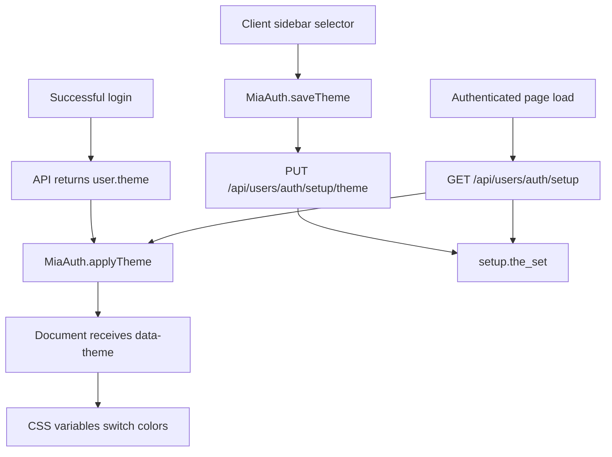

# Frontend Documentation

This page describes the current MiaCaoMigo frontend. User-facing UI text is in Portuguese; technical comments in code are in English.

---

## Structure

| Area | Path | Purpose |
|------|------|---------|
| Public page | `FrontEnd/index.html` | Landing page with sections for services, adoptions, about, contact, and links to public pages |
| Authentication | `FrontEnd/Pages/Mod1_Users/Autenticacao/` | Login and client registration |
| Client area | `FrontEnd/Pages/Mod1_Users/Clientes/` | Authenticated client dashboard |
| Staff area | `FrontEnd/Pages/Mod1_Users/Funcionarios/` | Staff dashboard, personal area, HR pages and employee views |
| Animals | `FrontEnd/Pages/Mod2_Animals/` | Client animal list, client add-animal page and staff animal registration |
| Appointments | `FrontEnd/Pages/Mod4_Appointments/` | Client bookings/prescriptions (`consultas.html`), staff agenda (`AdicionarConsulta.html`) and clinical record (`RegistoConsulta.html`) |
| Public pages | `FrontEnd/Pages/Public/` | Services, adoptions, shop, about, contact and cookie rejection pages |
| Shared pages | `FrontEnd/Pages/Geral/` | Shared sidebar partial |
| Scripts | `FrontEnd/Js/` | Session, dashboards, animals, appointments, and public UI behavior |
| CSS | `FrontEnd/CSS/` | Area-specific styles |

---

## Login Flow

1. Visitor opens `FrontEnd/index.html`.
2. Visitor navigates to `FrontEnd/Pages/Mod1_Users/Autenticacao/login.html`.
3. `FrontEnd/Js/Mod1/login.js` calls `POST /api/users/auth/login`.
4. `FrontEnd/Js/geral/authSession.js` stores the JWT and user snapshot in `localStorage`.
5. If the login response contains `user.theme`, `MiaAuth.applyTheme()` applies `data-theme="light"` or `data-theme="dark"` to the document.
6. Redirect:
   - Client -> `FrontEnd/Pages/Mod1_Users/Clientes/area_cliente.html`
   - Staff -> `FrontEnd/Pages/Mod1_Users/Funcionarios/MainDashboard.html`

Full diagram: [Frontend Flow](Frontend_Flow.md)

---

## Theme Flow

The client theme uses the database `setup` table as the source of truth and keeps a local browser cache for responsiveness.

| Element | Role |
|---------|------|
| `setup.the_set` | Persisted user preference (`light`/`dark`) |
| `MiaAuth.applyTheme()` | Applies `data-theme` and updates `miaTheme` |
| `localStorage.miaTheme` | Local cache for fast visual application |
| `MainDashboard.css` | Defines light/dark variables through `:root[data-theme="dark"]` |
| `Sidebar/ClientSidebar.js` | Connects the selector to the theme update endpoint |

---

## Route And Sidebar Model

| File | Role |
|------|------|
| `geral/routes.js` | Central route constants, guards, post-login redirect logic and legacy path mapping |
| `geral/Sidebar/SidebarMenuCatalog.js` | Menu catalog and staff profile-to-menu mapping |
| `geral/Sidebar/SidebarShell.js` | Loads the shared sidebar partial and renders menu items |
| `geral/Sidebar/ClientSidebar.js` | Client menu: main panel, appointments and animals |
| `geral/Sidebar/EmployeeSidebar.js` | Staff menu resolved from JWT profile names |

The current frontend still maps old `UserView` URLs and older staff `AdminPanel` URLs for redirect compatibility. Current pages live under `Pages/Mod1_Users`, `Pages/Mod2_Animals`, `Pages/Mod4_Appointments`, `Pages/Public`, and the Mod3 commercial staff UI remains canonical under `Pages/AdminPanel/`.

---

## Main Pages

| Page | Purpose |
|------|---------|
| `Mod1_Users/Autenticacao/login.html` | Login |
| `Mod1_Users/Autenticacao/criar_conta.html` | Client registration |
| `Mod1_Users/Clientes/area_cliente.html` | Client hub with notification feed and unread status |
| `Mod1_Users/User/Defenitions.html` | User settings/preferences page |
| `Mod2_Animals/animais.html` | Account animals |
| `Mod2_Animals/adicionar-animal.html` | Add animal page |
| `Mod2_Animals/RegistarAnimal.html` | Staff animal registration |
| `Mod4_Appointments/consultas.html` | Client appointments and appointment booking |
| `Mod4_Appointments/AdicionarConsulta.html` | Staff appointments page |
| `Public/adocoes.html` | Public adoptions listing and client adoption request |
| `Public/servicos.html` | Public services page |
| `Public/sobre_nos.html` | Public about page |
| `Public/formulário_contacto.html` | Public contact page |
| `Public/loja.html` | Shop placeholder |
| `Public/recusa_cookies.html` | Cookie rejection page |
| `AdminPanel/AreaComercial.html` | Commercial hub |
| `AdminPanel/productCatalog.html` | Product catalog |
| `AdminPanel/StockManagement.html` | Stock management |
| `AdminPanel/restock.html` | Restock/purchase entry |
| `AdminPanel/salesManagement.html` | Counter sales |
| `AdminPanel/returnManagement.html` | Returns |
| `AdminPanel/invoiceHistory.html` | Invoice history |
| `AdminPanel/invoiceDetails.html` | Invoice details |
| `Mod1_Users/Funcionarios/MainDashboard.html` | Staff dashboard with personal widgets and permission shortcuts |
| `Mod1_Users/Funcionarios/AreaFuncionario.html` | Full personal staff agenda shell; current working-tree file is empty and needs restoration |
| `Mod1_Users/Funcionarios/AdicionarFuncionario.html` | Staff employee onboarding |
| `Mod1_Users/Funcionarios/QuadroFuncionario.html` | Employee board |
| `Mod1_Users/Funcionarios/FuncionarioDetalhe.html` | Employee detail |
| `Mod1_Users/Funcionarios/CalendarioEquipa.html` | Team calendar |
| `Mod1_Users/Funcionarios/Views/*.html` | Static/prototype HR partials for information, attendance, absences, role history, schedule history, team calendar and operational impact |

---

## Main Scripts

| Script | Purpose |
|--------|---------|
| `geral/authSession.js` | `window.MiaAuth`, token, user, theme, logout, and public nav behavior |
| `Mod1/login.js` | Login and profile-based redirect |
| `Mod1/criarConta.js` | `POST /api/users/auth/register` |
| `geral/clientDashboard.js` | Session validation with `GET /api/users/auth/me` and client notifications (`GET /api/appointments/notifications/me`) |
| `Mod2/clientAnimais.js` | Species, breeds, and client animals |
| `Mod2/adocoes.js` | Public adoptions list and `POST /api/animals/:id/adopt` |
| `Mod4/clientConsultas.js` | Appointments, availability, and booking |
| `geral/Sidebar/SidebarShell.js` | Shared sidebar loader/shell |
| `geral/Sidebar/SidebarMenuCatalog.js` | Central menu catalog for role-aware navigation |
| `geral/Sidebar/SidebarConfig.js` | Sidebar configuration helpers |
| `geral/Sidebar/ClientSidebar.js` | Client sidebar, logout and light/dark theme persistence |
| `geral/Sidebar/EmployeeSidebar.js` | Staff sidebar |
| `geral/staffDashboard.js` | Staff page guard and `data-require` permission behavior |
| `geral/staffDashboardHome.js` | Staff home widgets loaded from `GET /api/users/staff/me/agenda` |
| `geral/staffArea.js` | Full staff personal agenda |
| `Mod1/AdicionarFuncionario.js` | Employee onboarding form and `POST /api/users/employees` |
| `Mod1/funcionarioDetalhe.js` | Employee detail view behavior |
| `Mod2/staffAnimais.js` | Staff animal operations |
| `Mod4/staffConsultas.js` | Staff appointment operations |
| `geral/cookies.js` | Cookie consent state |
| `geral/scroll.js` | Landing page carousel |

---

## Staff HR Views

The `Funcionarios/Views/` folder contains presentation partials used for HR-oriented screens:

| Partial | Purpose |
|---------|---------|
| `informacoes.html` | Personal and professional information blocks |
| `assiduidade.html` | Attendance table mock/prototype |
| `ausencias.html` | Absence listing/request presentation |
| `historico_cargos.html` | Role history presentation |
| `historico_horarios.html` | Schedule history presentation |
| `calendario_equipa.html` | Team coverage calendar prototype |
| `impacto_operacional.html` | Absence impact simulation prototype |

These files are frontend presentation assets; the API-backed staff self-service flow is documented through `/api/users/staff/me/*`.

Known current gap: `staffArea.js` implements the full agenda rendering flow, but the `AreaFuncionario.html` file in the website working tree is empty. The route validator therefore reports that this page is missing `routes.js` until the HTML shell is restored.

---

## APIs Consumed By The Frontend

| Area | Main endpoints |
|------|----------------|
| Auth | `POST .../login`, `POST .../register`, `GET .../me`, `GET .../setup`, `PUT .../setup/theme`, `PUT .../heartbeat`, `POST .../logout` |
| Clients | `GET /api/users/clients` for staff lookup flows |
| Staff | `GET .../staff/me/agenda`, `GET .../staff/me/appointments`, `GET .../staff/me/schedule`, `GET .../staff/me/clock-ins`, `GET .../staff/me/absences`, `POST .../staff/me/clock-toggle` |
| Employees | `POST /api/users/employees` for HR onboarding with `manage_employees` |
| Animals | `GET .../species`, `GET .../breeds`, `GET .../me`, `GET /api/animals`, `POST /api/animals`, `PUT .../:id`, `DELETE .../:id`, `POST .../associate` |
| Adoptions | `GET /api/animals/adoptions` (public), `POST /api/animals/:id/adopt` (authenticated client) |
| Appointments | `GET .../me`, `GET .../veterinarians`, `GET .../specialties`, `GET .../availability`, `POST /api/appointments`, `PATCH .../:id_app/cancel`, `PATCH .../:id_app/reschedule`, `PATCH .../:id_app/check-in`, `PATCH .../:id_app/start`, `PATCH .../:id_app/close`, `GET .../:id_app/clinical-record`, `GET .../notifications/me`, `PATCH .../notifications/:id_not/read`, `PATCH .../notifications/read-all` |
| Prescriptions and consultation record | `GET .../prescriptions/me`, `GET .../prescriptions/:id_pre/pdf`, `GET .../prescriptions/products`, `GET .../prescriptions/consultation/:id_app`, `POST .../prescriptions/consultation/:id_app`, `POST .../prescriptions/consultation/:id_app/products`, `PUT .../prescriptions/consultation/:id_app/clinical-record` |
| Commercial | `/api/stock/*`, `/api/restock/*`, `/api/sales/*`, `/api/return/*`, `GET /api/invoices/me`, `GET /api/invoices/me/:id/details`, `GET /api/invoices/me/:id/pdf`, `GET /api/invoices`, `GET /api/invoices/:id/details`, `GET /api/invoices/:id/pdf`, `GET /api/sales/invoices/:id/pdf` |

Base prefixes: `/api/users/auth`, `/api/users/clients`, `/api/users/staff`, `/api/users/employees`, `/api/animals`, `/api/appointments`, `/api/stock`, `/api/restock`, `/api/sales`, `/api/return`, `/api/invoices`.

Implementation notes:

- `authSession.js` sends `PUT /api/users/auth/heartbeat` every 30 seconds; the backend implements it and Swagger/OpenAPI documents it.
- Client and staff appointment forms set the date input minimum to the current day, and the API rejects past-date booking/rescheduling.
- Staff appointment rescheduling passes optional `excludeAppId` to `GET /api/appointments/availability`.
- Invoice PDFs are not pre-generated files; clicking PDF requests the API, which renders the current invoice layout with clinic logo, line-item table, VAT and totals.
- Staff animal registration currently calls the local API base URL (`http://localhost:3000`) directly and contains a fallback to `/api/animals/breed`; the backend route is `/api/animals/breeds`.
- `FuncionarioDetalhe.html` remains a static/prototype detail page until a future employee-detail API is implemented.

Full contract: [Swagger](Swagger.md) · runtime at `http://localhost:3000/api-docs/`

---

[<- Documentation hub](README.md)
