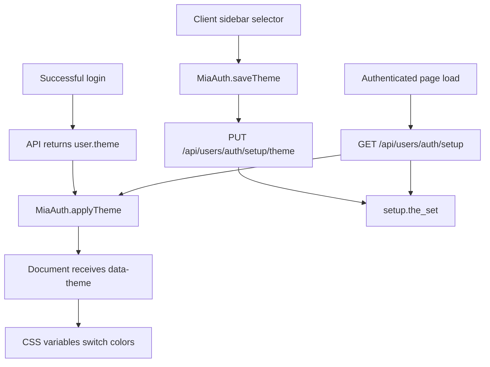

# Frontend Documentation

This page describes the current MiaCaoMigo frontend. User-facing UI text is in Portuguese; technical comments in code are in English.

---

## Structure

| Area | Path | Purpose |
|------|------|---------|
| Public page | `FrontEnd/index.html` | Landing page with sections for services, adoptions, about, contact, and links to public pages |
| Client area | `FrontEnd/Pages/UserView/` | Login, registration, client dashboard, animals, and appointments |
| Staff area | `FrontEnd/Pages/AdminPanel/` | Staff dashboard and administrative pages |
| Shared pages | `FrontEnd/Pages/Geral/` | Sidebars and shared general pages |
| Scripts | `FrontEnd/Js/` | Session, dashboards, animals, appointments, and public UI behavior |
| CSS | `FrontEnd/CSS/` | Area-specific styles |

---

## Login Flow

1. Visitor opens `FrontEnd/index.html`.
2. Visitor navigates to `FrontEnd/Pages/UserView/Mod1/login.html`.
3. `FrontEnd/Js/Mod1/login.js` calls `POST /api/users/auth/login`.
4. `FrontEnd/Js/geral/authSession.js` stores the JWT and user snapshot in `localStorage`.
5. If the login response contains `user.theme`, `MiaAuth.applyTheme()` applies `data-theme="light"` or `data-theme="dark"` to the document.
6. Redirect:
   - Client -> `FrontEnd/Pages/UserView/Mod1/area_cliente.html`
   - Staff -> `FrontEnd/Pages/AdminPanel/MainDashboard.html`

Full diagram: [Frontend Flow](Frontend_Flow.md)

---

## Theme Flow

The client theme uses the database `setup` table as the source of truth and keeps a local browser cache for responsiveness.

| Element | Role |
|---------|------|
| `setup.the_set` | Persisted user preference (`light`/`dark`) |
| `MiaAuth.applyTheme()` | Applies `data-theme` and updates `miaTheme` |
| `localStorage.miaTheme` | Local cache for fast visual application |
| `MainDashboard.css` | Defines light/dark variables through `:root[data-theme="dark"]` |
| `ClientSideBar.js` | Connects the selector to the theme update endpoint |

---

## Main Pages

| Page | Purpose |
|------|---------|
| `UserView/Mod1/login.html` | Login |
| `UserView/Mod1/criar_conta.html` | Client registration |
| `UserView/Mod1/area_cliente.html` | Client hub |
| `UserView/Mod2/animais.html` | Account animals |
| `UserView/Mod4/consultas.html` | Appointments and appointment booking |
| `UserView/Geral/adocoes.html` | Public adoptions listing and client adoption request |
| `UserView/Geral/servicos.html` | Public services page |
| `UserView/Geral/sobre_nos.html` | Public about page |
| `UserView/Geral/formulário_contacto.html` | Public contact page |
| `UserView/Mod3/loja.html` | Shop |
| `AdminPanel/MainDashboard.html` | Staff dashboard with personal widgets and permission shortcuts |
| `AdminPanel/AreaFuncionario.html` | Full personal staff agenda |
| `AdminPanel/AdicionarFuncionario.html` | Staff employee management |
| `AdminPanel/AdicionarConsulta.html` | Staff appointments page |

---

## Main Scripts

| Script | Purpose |
|--------|---------|
| `geral/authSession.js` | `window.MiaAuth`, token, user, theme, logout, and public nav behavior |
| `Mod1/login.js` | Login and profile-based redirect |
| `Mod1/criarConta.js` | `POST /api/users/auth/register` |
| `geral/clientDashboard.js` | Session validation with `GET /api/users/auth/me` |
| `Mod2/clientAnimais.js` | Species, breeds, and client animals |
| `Mod2/adocoes.js` | Public adoptions list and `POST /api/animals/:id/adopt` |
| `Mod4/clientConsultas.js` | Appointments, availability, and booking |
| `geral/ClientSideBar.js` | Client sidebar, logout and light/dark theme persistence |
| `geral/AdminSidebar.js` | Staff sidebar |
| `geral/staffDashboard.js` | Staff page guard and `data-require` permission behavior |
| `geral/staffDashboardHome.js` | Staff home widgets loaded from `GET /api/users/staff/me/agenda` |
| `geral/staffArea.js` | Full staff personal agenda |
| `geral/cookies.js` | Cookie consent state |
| `geral/scroll.js` | Landing page carousel |

---

## APIs Consumed By The Frontend

| Area | Main endpoints |
|------|----------------|
| Auth | `POST .../login`, `POST .../register`, `GET .../me`, `GET .../setup`, `PUT .../setup/theme`, `POST .../logout` |
| Staff | `GET .../staff/me/agenda`, `GET .../staff/me/appointments`, `GET .../staff/me/schedule`, `GET .../staff/me/clock-ins`, `GET .../staff/me/absences`, `POST .../staff/me/clock-toggle` |
| Animals | `GET .../species`, `GET .../breeds`, `GET .../me`, `POST /api/animals`, `DELETE .../:id` |
| Adoptions | `GET /api/animals/adoptions` (public), `POST /api/animals/:id/adopt` (authenticated client) |
| Appointments | `GET .../me`, `GET .../veterinarians`, `GET .../specialties`, `GET .../availability`, `POST /api/appointments` |

Base prefixes: `/api/users/auth`, `/api/animals`, `/api/appointments`.

Full contract: [Swagger](Swagger.md) · runtime at `http://localhost:3000/api-docs/`

---

[<- Documentation hub](README.md)
