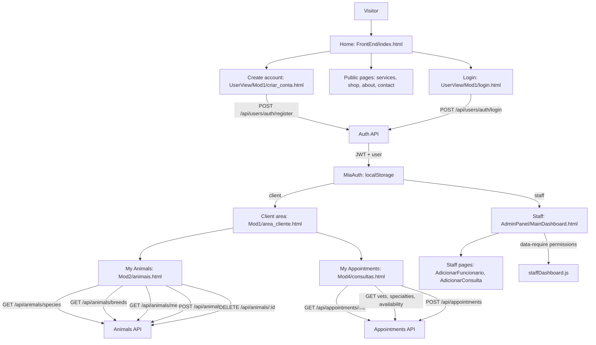

# MiaCaoMigo Frontend Flow

Source in the website repository: `MiaCaoMigo_/Docs/Frontend_Flow.md`

Real navigation diagram and API call flow between frontend pages and backend endpoints. For the defense-oriented narrative, see also [Website flows](../01_Website_Flows.md).

---

## Overview

The frontend is split into:

- public pages for visitors;
- authenticated client pages;
- administrative staff pages.

---

## Navigation Diagram

---

## Public Pages

| Page | Description |
|------|-------------|
| `FrontEnd/index.html` | Landing page |
| `UserView/Geral/servicos.html` | Services |
| `UserView/Geral/sobre_nos.html` | About the clinic |
| `UserView/Geral/formulário_contacto.html` | Contact |
| `UserView/Mod3/loja.html` | Online shop |
| `UserView/Mod1/login.html` | Login |
| `UserView/Mod1/criar_conta.html` | Client registration |

---

## Authentication And Session

- `login.js` -> `POST /api/users/auth/login`
- `authSession.js` -> `window.MiaAuth`, `jwtToken` + `miaUser` in `localStorage`
- `clientDashboard.js` -> `GET /api/users/auth/me` in the client area
- `staffDashboard.js` -> requires `staff === true` and checks `data-require` permissions
- Logout -> `POST /api/users/auth/logout` when a token exists

---

## Client Flow

| Page | Script | Purpose |
|------|--------|---------|
| `Mod1/area_cliente.html` | `geral/clientDashboard.js` | Client hub and session validation |
| `Mod2/animais.html` | `Mod2/clientAnimais.js` | Lists, adds, and removes animals |
| `Mod4/consultas.html` | `Mod4/clientConsultas.js` | Lists and books appointments |

---

## Staff Flow

| Page | Script | Purpose |
|------|--------|---------|
| `AdminPanel/MainDashboard.html` | `staffDashboard.js`, `AdminSidebar.js` | Permission-aware staff dashboard |
| `AdminPanel/AdicionarFuncionario.html` | `staffDashboard.js` | Staff form page |
| `AdminPanel/AdicionarConsulta.html` | `staffDashboard.js` | Staff appointments page |

---

## Related Documentation

| Resource | URL / page |
|----------|------------|
| Interactive API | [http://localhost:3000/api-docs/](http://localhost:3000/api-docs/) |
| JSDoc | [http://localhost:3000/jsdoc/](http://localhost:3000/jsdoc/) |
| Frontend pages and scripts | [Frontend](Frontend.md) |
| Backend routes | [Backend](Backend.md) |

---

[<- Documentation hub](README.md)
