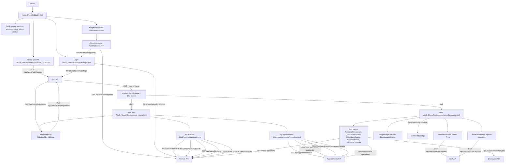

# MiaCaoMigo Frontend Flow

Real navigation diagram and API call flow between frontend pages and backend endpoints. For the defense-oriented narrative, see also [Website flows](../01_Website_Flows.md).

---

## Overview

The frontend is split into:

- public pages for visitors;
- authenticated client pages;
- administrative staff pages.

---

## Navigation Diagram

---

## Public Pages

| Page | Description |
|------|-------------|
| `FrontEnd/index.html` | Landing page |
| `Public/adocoes.html` | Animals available for adoption (`Interno`) |
| `Public/servicos.html` | Services |
| `Public/sobre_nos.html` | About the clinic |
| `Public/formulário_contacto.html` | Contact |
| `Public/loja.html` | Online shop placeholder |
| `Public/recusa_cookies.html` | Cookie rejection page |
| `Mod1_Users/Autenticacao/login.html` | Login |
| `Mod1_Users/Autenticacao/criar_conta.html` | Client registration |

---

## Authentication And Session

- `login.js` -> `POST /api/users/auth/login`
- `authSession.js` -> `window.MiaAuth`, `jwtToken` + `miaUser` in `localStorage`, and `data-theme` on the document
- `clientDashboard.js` -> `GET /api/users/auth/me` in the client area
- Client setup -> `GET /api/users/auth/setup` and `PUT /api/users/auth/setup/theme`
- `staffDashboard.js` -> requires `staff === true` and checks `data-require` permissions
- Logout -> `POST /api/users/auth/logout` when a token exists

---

## Client Flow

| Page | Script | Purpose |
|------|--------|---------|
| `Mod1_Users/Clientes/area_cliente.html` | `geral/clientDashboard.js` | Client hub and session validation |
| Client sidebar partial | `geral/Sidebar/ClientSidebar.js` | Loads client navigation and persists light/dark theme preference |
| `Mod2_Animals/animais.html` | `Mod2/clientAnimais.js` | Lists, adds, and removes animals |
| `Mod2_Animals/adicionar-animal.html` | `Mod2/clientAnimais.js` | Add animal navigation target |
| `Mod4_Appointments/consultas.html` | `Mod4/clientConsultas.js` | Lists and books appointments |

---

## Staff Flow

| Page | Script | Purpose |
|------|--------|---------|
| `Mod1_Users/Funcionarios/MainDashboard.html` | `staffDashboard.js`, `staffDashboardHome.js`, `Sidebar/EmployeeSidebar.js` | Staff home with personal widgets + RBAC global shortcuts |
| `Mod1_Users/Funcionarios/AreaFuncionario.html` | `staffArea.js`, `staffDashboard.js` | Full personal agenda flow exists in JS/API; current HTML shell is empty and needs restoration |
| `Mod1_Users/Funcionarios/AdicionarFuncionario.html` | `Mod1/AdicionarFuncionario.js`, `staffDashboard.js` | Staff onboarding form using `POST /api/users/employees` |
| `Mod1_Users/Funcionarios/QuadroFuncionario.html` | `staffDashboard.js` | Employee board entry |
| `Mod1_Users/Funcionarios/FuncionarioDetalhe.html` | `Mod1/funcionarioDetalhe.js` | Employee detail page |
| `Mod1_Users/Funcionarios/CalendarioEquipa.html` | `staffDashboard.js` | Team calendar page |
| `Mod1_Users/Funcionarios/Views/*.html` | Static partials | HR presentation/prototype views |
| `Mod2_Animals/RegistarAnimal.html` | `Mod2/staffAnimais.js`, `staffDashboard.js` | Staff animal registration |
| `Mod4_Appointments/AdicionarConsulta.html` | `Mod4/staffConsultas.js`, `staffDashboard.js` | Staff appointments page |

---

## Related Documentation

| Resource | URL / page |
|----------|------------|
| Interactive API | [http://localhost:3000/api-docs/](http://localhost:3000/api-docs/) |
| Frontend pages and scripts | [Frontend](Frontend.md) |
| Backend routes | [Backend](Backend.md) |

---

[<- Documentation hub](README.md)
