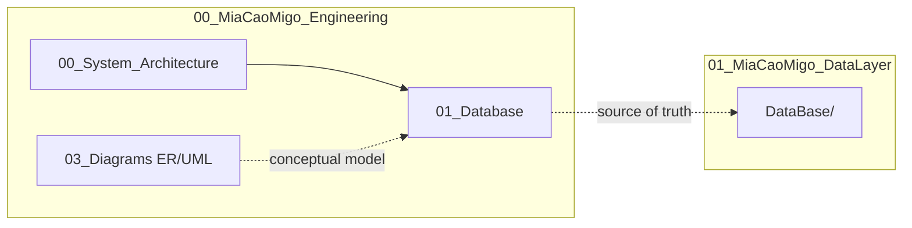

# Architecture documentation

  Engineering
  MkDocs

Central index for **system** and **database** architecture in MiaCaoMigo Engineering. All database content is validated against the implementation repository **`01_MiaCaoMigo_DataLayer`**.

---

## Start here

| Document | Purpose |
|----------|---------|
| [System architecture](00_System_Architecture.md) | Ecosystem layers: DataLayer, ApplicationLayer, DataEngineering |
| [Database hub](01_Database/README.md) | PostgreSQL model, governance, dictionary, SchemaSpy |

---

## Architecture map

---

## Database section (`01_Database`)

| Area | Entry point |
|------|-------------|
| **Overview** | [01_Database/README.md](01_Database/README.md) |
| **Build pipeline** | [00_Schema_Build_Pipeline.md](01_Database/00_Schema_Build_Pipeline.md) |
| **Governance** | [00_Governance/README.md](01_Database/00_Governance/README.md) |
| **Schemas (M1–M4)** | [01_Schemas/README.md](01_Database/01_Schemas/README.md) |
| **Data dictionary** | [04_Data_Dictionary/00_Overview.md](01_Database/04_Data_Dictionary/00_Overview.md) |
| **SchemaSpy** | [05_SchemaSpy/schemaspy.md](01_Database/05_SchemaSpy/schemaspy.md) |

!!! warning "SchemaSpy output"
    Do not edit generated files under `05_SchemaSpy/02_Output/`. Open the interactive site via [schemaspy.md](01_Database/05_SchemaSpy/schemaspy.md).

---

## Related sections (same portal)

| Section | Location |
|---------|----------|
| ER model & attributes | [03_Diagrams/00_ER_Model/](../03_Diagrams/00_ER_Model/er_model.md) |
| UML | [03_Diagrams/01_UML.md](../03_Diagrams/01_UML.md) |
| Requirements | [02_Requirements/](../02_Requirements/00_Functional_Requirements.md) |
| Home portal | [index.md](../index.md) |

---

MiaCaoMigo Engineering — Architecture • Database • Governance

