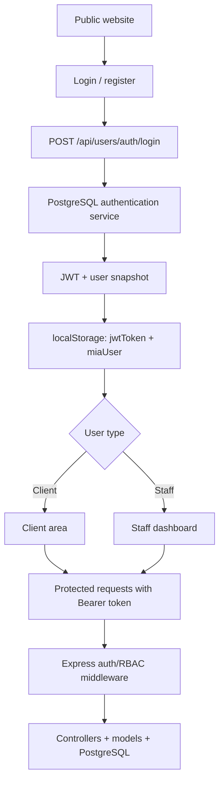
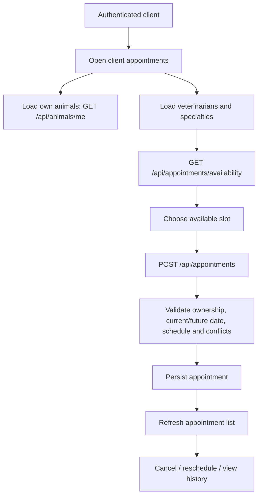
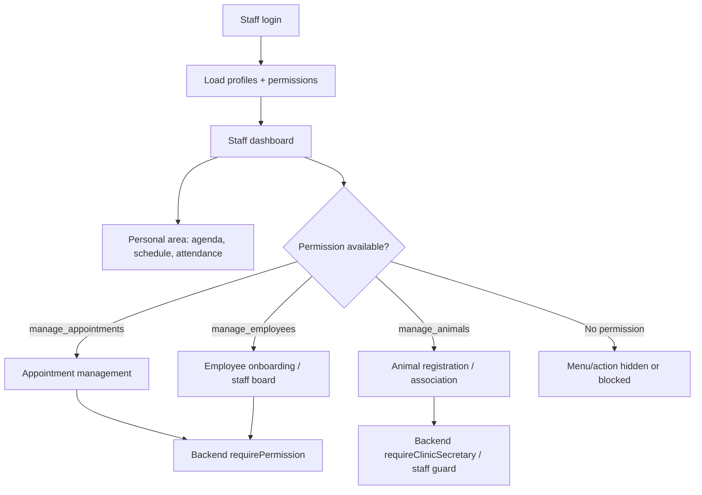
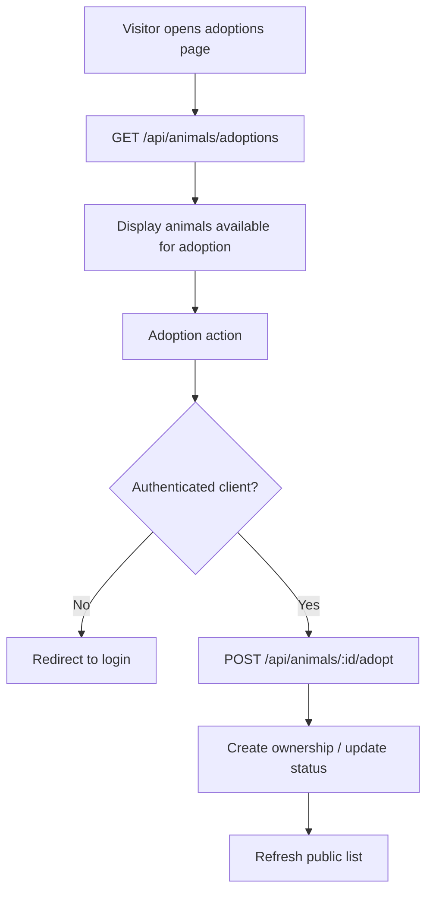
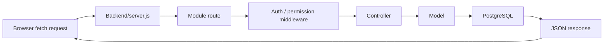

# Academic Web Application Report

<div style="display:flex; gap:8px; flex-wrap:wrap; margin-bottom:1rem;">
  <span style="background:#2563eb;color:#fff;padding:4px 10px;border-radius:6px;font-size:0.85rem;">ApplicationLayer</span>
  <span style="background:#059669;color:#fff;padding:4px 10px;border-radius:6px;font-size:0.85rem;">15 min presentation</span>
  <span style="background:#64748b;color:#fff;padding:4px 10px;border-radius:6px;font-size:0.85rem;">Academic defense</span>
</div>

This report presents the web application implemented in the `MiaCaoMigo_` repository, placing it within the MiaCaoMigo project’s documentation and technical ecosystem. The application demonstrates integration between a static frontend, a Node/Express API, and a PostgreSQL database, using JWT authentication, profile-based permissions, and Swagger/OpenAPI documentation.

---

## 1. Context / Introduction

The **MiaCaoMigo** system is a platform that supports the management of a veterinary clinic. Its main goal is to centralise operations that, in a real-world setting, would be spread across reception, clinical staff, animal management, appointment scheduling, and client follow-up.

The web application is organised into three main layers:

| Layer | Responsibility |
|--------|----------------|
| Frontend | HTML/CSS/JavaScript pages, public navigation, authenticated client and staff areas |
| Backend | REST API in Node.js/Express, authentication, authorisation, request validation, and model access |
| DataLayer | PostgreSQL, business functions, tables, profiles, permissions, sessions, and integrity rules |

The system is presented as a modular solution: users interact with web pages, the frontend communicates with the API through `fetch`, and the API delegates persistence and critical business rules to the database. This separation shows not only the visual interface, but also an application architecture with authentication, authorisation, data integration, and technical documentation.

---

## 2. Users

The website distinguishes public users, authenticated clients, and authenticated staff. Separation is enforced through login, account type, and profiles/permissions loaded from the database.

| User | Main access | Example actions |
|------|-------------|-----------------|
| Visitor | Public pages | Browse services, adoptions, public shop, contact and institutional information |
| Client | Client area | View animals, book appointments, reschedule/cancel appointments, view notifications, prescriptions and own invoices |
| Staff | Internal area | View personal agenda, attendance, absences, and operations according to permissions |
| Administrator / HR | Staff area | Create employees, view staff board, access management views |
| Veterinarian / clinical team | Clinical area | Manage appointments, view patients, record clinical lifecycle when authorised |
| Assistant / reception | Front-desk and commercial operations | Register/associate animals, support booking, issue invoices and handle commercial counter operations |
| Commercial manager | Reserved / future profile | Profile exists in RBAC seed data, while the implemented commercial area is currently exposed to administrator and assistant profiles |

The client/staff distinction uses the institutional domain `@miacaomigo.pt` and staff profiles associated in the database.

---

## 3. Functionality

### 3.1 Overview by module

| Module | Website status | Demonstrable features |
|--------|----------------|------------------------|
| Mod1 - Users | Centrally implemented | Client registration, login, logout, JWT session, light/dark theme, client area, staff area, RBAC, employee creation |
| Mod2 - Animals | Partially implemented / operational | Species/breed catalogues, client animal list, public adoptions, internal animal operations |
| Mod3 - Commercial | Partially implemented / operational | Staff commercial area for administrators and assistants, counter sales, invoice history/details, invoice PDF downloads, returns, stock/catalog operations, and client invoice visibility |
| Mod4 - Appointments | Substantially implemented | Booking, availability, listing, cancellation, rescheduling with past-date prevention, notifications, prescriptions, appointment lifecycle |

### 3.2 Main system flows

The application should be read through a small set of core flows rather than a single linear path. These flows represent the most relevant behaviours for the defence: authentication, client self-service, staff/RBAC operations, public adoptions, and API request handling.

#### Authentication and routing flow

<div style="display:flex; justify-content:center; width:100%;" markdown="1">



</div>

This flow shows how the system moves from public access into authenticated areas. The JWT is the bridge between the browser session and protected API routes.

#### Client appointment flow

<div style="display:flex; justify-content:center; width:100%;" markdown="1">



</div>

This is the main client self-service workflow. It proves that the website does not only display static data: it performs authenticated reads and writes through the API.

#### Staff and RBAC flow

<div style="display:flex; justify-content:center; width:100%;" markdown="1">



</div>

This flow is important for defence because it separates **what the UI shows** from **what the backend enforces**. The sidebar adapts to the user profile, but protected operations still require middleware validation.

#### Public adoptions flow

<div style="display:flex; justify-content:center; width:100%;" markdown="1">



</div>

This flow demonstrates the link between public browsing and authenticated client action. It also connects the visual adoption page with Mod2 backend behaviour.

#### API request flow

<div style="display:flex; justify-content:center; width:100%;" markdown="1">



</div>

This cross-cutting flow applies to most API-backed features. It explains how frontend actions become validated backend operations and database queries.

For a more detailed technical breakdown of these flows, including endpoint-level behaviour and staff/client operational variants, see the complementary architecture document: [Website Flow Specification](../../04_Architecture/02_Application/01_Website_Flows.md).

### 3.3 Visual evidence

The collected visual evidence is divided into two complementary groups. First, the module diagrams show the functional scope of each project module and how the modules connect. Second, the application screenshots demonstrate the implemented website screens and API documentation used during the defence.

#### Module diagrams

<div style="display:flex; justify-content:center; margin:1.5rem 0;">
  <table>
    <thead>
      <tr>
        <th>Figure</th>
        <th>Module</th>
        <th>Purpose</th>
      </tr>
    </thead>
    <tbody>
      <tr>
        <td>1</td>
        <td>Mod1 - Users</td>
        <td>Authentication, profiles, clients, staff and permissions</td>
      </tr>
      <tr>
        <td>2</td>
        <td>Mod2 - Animals</td>
        <td>Animal catalogues, ownership, adoptions and internal animal operations</td>
      </tr>
      <tr>
        <td>3</td>
        <td>Mod3 - Commercial</td>
        <td>Commercial scope, stock, shop, purchases, billing and reports</td>
      </tr>
      <tr>
        <td>4</td>
        <td>Mod4 - Appointments</td>
        <td>Appointment booking, clinical lifecycle, prescriptions and notifications</td>
      </tr>
      <tr>
        <td>5</td>
        <td>All modules</td>
        <td>Integrated view of the application modules and their relationships</td>
      </tr>
    </tbody>
  </table>
</div>

<figure>
  
  <figcaption><strong>Figure 1</strong> — Mod1 Users: authentication, clients, staff, profiles and permissions.</figcaption>
</figure>

<figure>
  
  <figcaption><strong>Figure 2</strong> — Mod2 Animals: animal data, ownership and adoption-related flows.</figcaption>
</figure>

<figure>
  
  <figcaption><strong>Figure 3</strong> — Mod3 Commercial: implemented stock, counter sales, billing/PDF, returns and reporting concepts.</figcaption>
</figure>

<figure>
  
  <figcaption><strong>Figure 4</strong> — Mod4 Appointments: booking, clinical process, prescriptions and notifications.</figcaption>
</figure>

<figure>
  
  <figcaption><strong>Figure 5</strong> — Integrated view of all application modules.</figcaption>
</figure>

#### Application screenshots

<div style="display:flex; justify-content:center; margin:1.5rem 0;">
  <table>
    <thead>
      <tr>
        <th>Figure</th>
        <th>Screen</th>
        <th>Relevance</th>
      </tr>
    </thead>
    <tbody>
      <tr>
        <td>6</td>
        <td>Home page</td>
        <td>Public entry and institutional presentation of the clinic</td>
      </tr>
      <tr>
        <td>7</td>
        <td>Login</td>
        <td>Entry point for authentication and JWT issuance</td>
      </tr>
      <tr>
        <td>8</td>
        <td>Client area</td>
        <td>Personal dashboard with client-account operations</td>
      </tr>
      <tr>
        <td>9</td>
        <td>Client settings</td>
        <td>Profile preferences and client account configuration</td>
      </tr>
      <tr>
        <td>10</td>
        <td>Client appointments</td>
        <td>Booking, listing and appointment management</td>
      </tr>
      <tr>
        <td>11</td>
        <td>Adoptions</td>
        <td>Public feature linked to the animals module</td>
      </tr>
      <tr>
        <td>12</td>
        <td>Staff area</td>
        <td>Internal experience separated with profile-based menus</td>
      </tr>
      <tr>
        <td>13</td>
        <td>Appointment management</td>
        <td>Internal clinical operations and appointment lifecycle</td>
      </tr>
      <tr>
        <td>14</td>
        <td>Swagger UI</td>
        <td>Technical documentation and REST API contract</td>
      </tr>
    </tbody>
  </table>
</div>

<figure>
  
  <figcaption><strong>Figure 6</strong> — Public home page of the MiaCaoMigo application.</figcaption>
</figure>

<figure>
  
  <figcaption><strong>Figure 7</strong> — Authentication screen used by clients and staff.</figcaption>
</figure>

<figure>
  
  <figcaption><strong>Figure 8</strong> — Authenticated client dashboard.</figcaption>
</figure>

<figure>
  
  <figcaption><strong>Figure 9</strong> — Client settings and account preferences.</figcaption>
</figure>

<figure>
  
  <figcaption><strong>Figure 10</strong> — Appointment management in the client area.</figcaption>
</figure>

<figure>
  
  <figcaption><strong>Figure 11</strong> — Public view of animals available for adoption.</figcaption>
</figure>

<figure>
  
  <figcaption><strong>Figure 12</strong> — Internal staff area with contextual navigation.</figcaption>
</figure>

<figure>
  
  <figcaption><strong>Figure 13</strong> — Internal interface for operational appointment management.</figcaption>
</figure>

<figure>
  
  <figcaption><strong>Figure 14</strong> — Swagger UI documenting API endpoints. Interactive version: <a href="http://localhost:3000/api-docs/" target="_blank" rel="noopener">http://localhost:3000/api-docs/</a>.</figcaption>
</figure>

### 3.4 Authentication

Authentication uses **JWT (JSON Web Tokens)** via the `jsonwebtoken` package.

Implemented flow:

1. The login form calls `POST /api/users/auth/login`.
2. The backend invokes the database authentication function through the `authModel`.
3. The password is converted to SHA-256 before validation in the database.
4. On success, the backend issues a JWT with `sub`, `email`, `staff`, `permissions`, and `profiles`.
5. The frontend stores the token in `localStorage` under the key `jwtToken`.
6. Protected requests use the header `Authorization: Bearer <token>`.
7. The `requireAuth` middleware validates signature, issuer, and expiration.

The JWT issuer is `miacaomigo-api` and lifetime is configurable via `JWT_EXPIRES_IN`, with a development default of `6h`.

#### JWT internal structure

In this project, the access token follows the standard JWT format:

```text
header.payload.signature
```

Each part has a specific role:

| JWT part | Purpose in the project |
|----------|------------------------|
| Header | Identifies the token type and signing algorithm. With `jsonwebtoken`, the token is signed with an HMAC-based algorithm such as `HS256`. |
| Payload | Contains the claims used by the application: `sub` (user id), `email`, `staff`, `permissions`, `profiles`, `iss`, `iat`, and `exp`. |
| Signature | Proves that the token was issued by the backend and was not modified by the client. |

The signature is produced on the server using the secret loaded from the backend environment:

```text
HMAC-SHA256(base64url(header) + "." + base64url(payload), JWT_SECRET)
```

The `JWT_SECRET` value is read from `Backend/.env` through `dotenv`. This secret must remain server-side only: the frontend receives the signed token but never receives the secret used to create or validate it. If the payload is changed in the browser, the signature no longer matches and `verifyAccessToken` rejects the request.

The token also includes:

| Claim | Meaning |
|-------|---------|
| `sub` | Authenticated user id |
| `email` | User email |
| `staff` | Boolean flag that separates staff from clients |
| `permissions` | RBAC permissions loaded from the database |
| `profiles` | Staff profiles loaded from the database |
| `iss` | Issuer, fixed as `miacaomigo-api` |
| `exp` | Expiration time, controlled by `JWT_EXPIRES_IN` |

This design allows the API to identify the caller quickly while still enforcing authorisation on the server through middleware.

### 3.5 Permissions and access control

The system combines access control on the frontend and backend.

| Layer | Mechanism |
|-------|-----------|
| Frontend | Local guards, profile-based menus, client/staff page redirects |
| JWT | Carries `staff`, `permissions`, and `profiles` |
| Backend | `requireAuth`, `requireStaff`, `requirePermission`, and `requireClinicSecretary` middlewares |
| Database | Profiles and permissions from RBAC tables (`profile`, `permission`, occupation/permission relations) |

Example permissions:

| Permission | Use |
|------------|-----|
| `manage_employees` | Create employees and access HR management |
| `manage_animals` | Look up active clients for animal association |
| `manage_appointments` | Manage appointments, check-in, start and close |
| `manage_sales` | Commercial sale/invoice capability; website access is further restricted to `administrador` and `assistente` profiles |
| `manage_invoices` | Invoice lifecycle capability used by commercial workflows |
| `view_reports` | Reserved entry for reports |

Even when the frontend hides or disables menu entries, authorisation is enforced on the backend. Critical operations are not protected by the UI alone.

### 3.6 Security

Security is implemented across several layers:

| Area | Implementation |
|------|----------------|
| Authentication | Server-signed JWT |
| Session | Login/logout recorded in the database; open sessions closed on server startup |
| Authorisation | Staff, permission/profile middlewares, commercial-area profile guard, and clinic secretary validation |
| Passwords | SHA-256 hash before validation/persistence via database services |
| SQL | Parameterised queries with `pg`, reducing SQL injection risk |
| Configuration | Environment variables for database and JWT |
| Documentation | Swagger/OpenAPI exposes the technical contract and supports controlled testing |

Key security points:

- The token identifies the user but does not replace server-side permission checks.
- Permissions come from the database and are carried in the JWT to guide frontend and backend.
- The commercial area is guarded by staff profile: only `administrador` and `assistente` can access internal sales, invoices, stock, returns and counter workflows.
- The backend rejects requests without a token, with an expired token, or with insufficient permissions.
- The API uses JSON and REST routes organised by module.

### 3.7 Usability

The website uses straightforward area-based navigation:

| Aspect | Evidence |
|--------|----------|
| Context separation | Public area, client area, and staff area |
| Sidebars | Client and staff menus generated from profile |
| User feedback | Loading, error, and success messages in forms and tables |
| Visual consistency | Shared CSS across dashboards, cards, tables, and buttons |
| Theme | Light/dark preference persisted in user setup |
| Basic responsiveness | Viewport meta tag and grid/flex layouts on several pages |

The experience is suitable for academic demonstration: users quickly understand where they are, which actions they can perform, and which sections remain under development.

### 3.8 API and database integration

The backend starts from `Backend/server.js`, serves static files from `FrontEnd/`, and mounts the main API routes:

| Prefix | Responsibility |
|--------|----------------|
| `/api/users/auth` | Login, registration, logout, current session, preferences |
| `/api/users/clients` | Client lookup/listing for authorised staff |
| `/api/users/staff/me` | Personal agenda, schedule, attendance, absences, clock toggle |
| `/api/users/employees` | Employee creation with `manage_employees` permission |
| `/api/animals` | Catalogues, client animals, adoptions, internal management |
| `/api/stock`, `/api/sales`, `/api/return`, `/api/restock` | Internal commercial workflows reserved to administrator and assistant profiles |
| `/api/invoices` | Staff invoice history/details and authenticated client invoice reads through `/api/invoices/me` |
| `/api/appointments` | Bookings, availability, notifications, lifecycle, history |
| `/api-docs` | API Swagger UI |
| `/api-docs.json` | OpenAPI specification in JSON |

Models use `pg` and a shared PostgreSQL pool. Some business logic—login, logout, client creation—is delegated to database functions, aligning the application with the DataLayer.

### 3.9 Navigation architecture

Frontend navigation is centralised in `FrontEnd/Js/geral/routes.js`, which defines current routes, legacy paths, and redirect/guard helpers.

Sidebars are built from:

| File | Role |
|------|------|
| `SidebarMenuCatalog.js` | Central item catalogue and profile → menu mapping |
| `SidebarShell.js` | Shared sidebar structure |
| `ClientSidebar.js` | Client menu |
| `EmployeeSidebar.js` | Staff menu |

This avoids duplicating links on every page and keeps the menu aligned with the authenticated user’s profile.

### 3.10 Technical documentation

The API includes Swagger/OpenAPI documentation at:

- [`Interactive routes`](http://localhost:3000/api-docs/) for interactive visual browsing;
- [`OpenAPI JSON contract`](http://localhost:3000/api-docs.json) for the JSON contract.

This shows that the application is not limited to the visual layer: there is a navigable technical contract with endpoints, schemas, expected responses, and protected routes.

### 3.11 Performance and security validation

The project includes a dedicated performance area under [`06_Performance/`](../../06_Performance/README.md). Measurements were taken in a local development environment (`http://localhost:3000`) using **Mozilla Firefox 151.0.2** (DevTools → Network/Console) and automated `curl` baselines. Evidence screenshots are stored in `00_Assets/01_Screenshots/Performance/`.

Current evidence is classified as an **initial baseline**, not final production validation. Summary:

| Area | Evidence | Result |
|------|----------|--------|
| Database health | `GET /db-test` | **Green** — &lt; 5 ms (localhost) |
| Adoption API | `GET /api/animals/adoptions` | **Green** — HTTP 200, &lt; 2 ms after query fix |
| Login API | `POST /api/users/auth/login` | **Green** — &lt; 20 ms; 8/10 demo users &lt; 2 s (RNF_M1_01) |
| Homepage (Firefox) | 16 requests, ~2,72 MB, ~165 ms finish | **Green** locally; **Yellow** asset weight |
| Login page (Firefox) | 10 requests, ~210 kB, ~79 ms finish | **Green** |
| Adoptions page (Firefox) | 16 requests, `GET /api/animals/adoptions` 200 | **Green** |
| Client dashboard (Firefox) | 18 requests, authenticated `GET` APIs 200 | **Green** |
| Login submit (Firefox) | `POST /api/users/auth/login` visible with Persist Log | **Green** |

**Conclusion (baseline):** In localhost, critical flows respond quickly and meet the measured non-functional targets (RNF_M1_01 login ≤ 2 s, RNF_M2_13 adoptions &lt; 1 s). The main improvement opportunity is the homepage hero asset `background_pagInicial.jpeg` (~2 MB, ~70% of transferred bytes). The file is actually **AVIF content with a `.jpeg` extension**; converting or resizing it would reduce load on slower networks.

Full tables, methodology, and screenshots: [`04_Test_Results.md`](../../06_Performance/04_Test_Results.md). Recommendations: [`05_Recommendations.md`](../../06_Performance/05_Recommendations.md).

Security testing has not yet been formalised as a complete test campaign. However, the system already includes security mechanisms that can be used as the basis for future tests:

| Security area | Possible validation |
|---------------|---------------------|
| Authentication | Attempt requests without token, with invalid token, and with expired token |
| Authorisation | Test staff-only endpoints with client tokens and verify HTTP 403 responses |
| RBAC | Test protected actions such as `manage_employees` or `manage_appointments` with users lacking those permissions |
| JWT integrity | Modify token payload manually and confirm that signature validation rejects it |
| Input/API robustness | Submit incomplete or invalid payloads and verify controlled error responses |
| CORS and deployment hardening | Restrict accepted origins before production deployment |

At this stage, security is implemented through JWT, middleware, RBAC, parameterised SQL queries, and environment-based configuration. A formal security test section can be added later if time allows, using the Swagger UI and browser/dev tools to demonstrate access control failures and expected API responses.

### 3.12 Technical strengths

Beyond visible interface features, the project includes technical elements that reinforce solution maturity:

| Topic | Significance |
|-------|--------------|
| Modular separation | Organisation by functional areas M1–M4 |
| DataLayer alignment | Application respects database architecture |
| RBAC | Structured permission management |
| Swagger/OpenAPI | Documentation and testability |
| Performance baseline | Initial measurements and improvement records under `06_Performance/` |
| Docker | Reproducible execution |
| Acknowledged limitations | Technical awareness and transparency |

---

## 4. Tools, frameworks, and packages

| Category | Tools / packages |
|----------|------------------|
| Frontend | HTML5, CSS3, JavaScript, Font Awesome, Bootstrap |
| Backend | Node.js, Express |
| Database | PostgreSQL, `pg` package |
| Authentication | `jsonwebtoken`, JWT Bearer |
| Configuration | `dotenv`, environment variables |
| API / documentation | `swagger-jsdoc`, `swagger-ui-express`, OpenAPI |
| API security | `cors`, Express middlewares |
| PDF / documents | `pdfkit` for prescription/document generation |
| Containers | Docker and Docker Compose |
| External integration | `@supabase/supabase-js`, included as a dependency prepared for future integration |

The application `docker-compose.yml` exposes the service at `http://localhost:3000`, runs `npm start`, and connects the API to PostgreSQL through environment variables.

---

## 5. Limitations

The current state is suitable for academic demonstration, but important limitations remain:

| Limitation | Impact |
|------------|--------|
| Project time constraints | The available development time limited the depth of implementation, testing and polishing possible before delivery |
| Mod3 commercial scope still partial | Stock, sales, returns, invoices and PDFs are mounted for administrator/assistant workflows, but public shop checkout, advanced reports and full commercial manager role separation remain future work |
| Animal images | The current database model was not prepared to persist animal image metadata or file references, so animal visuals are limited to frontend/static placeholders |
| Some HR views are presentation/prototype | They support the visual narrative but not all represent full API-backed workflows |
| Token in `localStorage` | Simple for academic context; production would require XSS risk analysis and possibly `HttpOnly` cookies |
| Development JWT secret | Fallback if `JWT_SECRET` is unset; production should require an explicit secret |
| SHA-256 password hashing | Matches the database format, but production would prefer adaptive hashing (bcrypt/argon2) |
| Open CORS | Useful in development; should be restricted by origin in production |
| Variable frontend/backend validation | Relevant checks exist, but a more uniform input schema layer would help |
| Limited automated tests | Validation relies mainly on manual runs, Swagger, and demonstration flows |

These limitations do not invalidate the academic solution; they show critical awareness of the gap between a functional prototype and a production-ready system.

---

## 6. Future improvements

Future work should prioritise improvements that transform the current academic prototype into a more complete and production-oriented platform:

| Improvement | Expected value |
|-------------|----------------|
| Animal image support | Add database fields or a media table for animal photo metadata, combined with a controlled upload/static asset strategy |
| Extend Mod3 commercial workflows | Add public shop checkout, advanced commercial reports and full commercial manager role separation on top of the current stock/sales/invoice/return implementation |
| Formal security testing | Add repeatable tests for invalid tokens, missing permissions, protected endpoints, input validation and CORS configuration |
| Homepage hero asset | Convert `background_pagInicial.jpeg` (AVIF mislabel) to optimised JPEG/WebP and update CSS reference |
| Extended performance validation | Repeat Firefox baselines for Mod3 commercial and Mod4 when routes are stable |
| Stronger password hashing | Replace SHA-256 with an adaptive hashing strategy such as bcrypt or argon2 in a production scenario |
| Session storage hardening | Evaluate `HttpOnly` cookies or another safer token storage strategy for production deployment |
| Automated test coverage | Add focused tests for authentication, RBAC, appointment booking, adoption and staff workflows |
| HR API completion | Replace remaining prototype/static HR views with fully API-backed employee detail and history endpoints |

These improvements are natural continuations of the current architecture. They do not require changing the overall modular design, but they would strengthen reliability, security, maintainability and user experience.

---

## 7. Conclusion

The MiaCaoMigo website demonstrates a modular web application integrated with a database, appropriate for the proposed academic context. The solution covers public pages, authentication, distinct client and staff areas, animal management, appointment booking and follow-up, access profiles, and API technical documentation.

The main strengths are separation between frontend, backend, and DataLayer; JWT with RBAC; centralised navigation; and Swagger/OpenAPI. A complete demonstration path is: visitor → login → client area → book appointment → staff area → protected operation → Swagger.

The project’s final message is that the solution is not merely a set of static pages, but a modular application with real integration between interface, API, permissions, and database, while keeping clear limitations for future evolution.

---

[← Academic reports](README.md) · [Application architecture](../../04_Architecture/02_Application/README.md)
