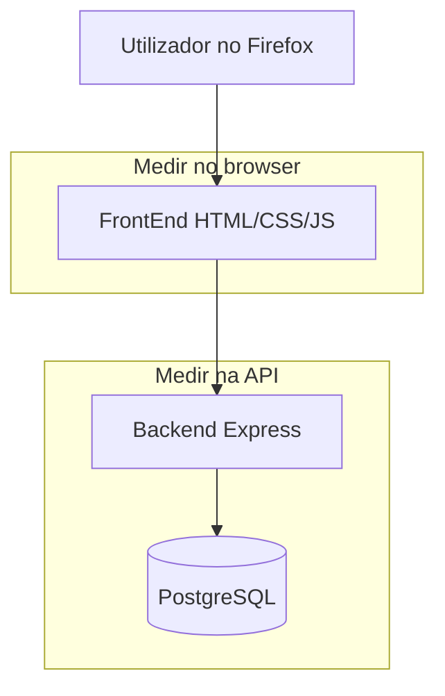

# Estratégia de performance — MiaCaoMigo

Guia introdutório para testar e documentar o desempenho do website MiaCaoMigo, com foco em **Mozilla Firefox**.

**Relacionado:** [README](README.md) · [RNF Performance](../02_Requirements/01_Non_Functional_Requirements.md) · [Application overview](../04_Architecture/02_Application/00_Application_Overview.md)

---

## Índice

1. [O que significa performance num website](#1-o-que-significa-performance-num-website)
2. [O que deve ser testado no MiaCaoMigo](#2-o-que-deve-ser-testado-no-miacaomigo)
3. [Métricas a registar](#3-métricas-a-registar)
4. [Ferramentas recomendadas (Mozilla Firefox)](#4-ferramentas-recomendadas-mozilla-firefox)
5. [Critérios de aceitação (projeto académico)](#5-critérios-de-aceitação-projeto-académico)
6. [Plano de trabalho em fases](#6-plano-de-trabalho-em-fases)
7. [Primeiro exercício prático (Firefox)](#7-primeiro-exercício-prático-firefox)
8. [O que documentar em cada teste](#8-o-que-documentar-em-cada-teste)

---

## 1. O que significa performance num website

Performance web é a **velocidade e fluidez** com que o utilizador consegue usar o site. Não corresponde a um único número; deve ser analisada em três camadas principais.

### 1.1 Carregamento (frontend)

O que acontece quando o utilizador abre um URL (ex.: página inicial ou login).

| Aspeto | Questão de análise |
|--------|-------------------------|
| Peso | Quantos KB/MB são transferidos? |
| Pedidos | Quantos ficheiros o browser pede (HTML, CSS, JS, imagens, fontes)? |
| Bloqueios | Há scripts ou CSS que atrasam a página de aparecer? |
| Recursos | Imagens ou fontes demasiado grandes? |

**Ferramenta principal no Firefox:** separador **Rede** (Network).

### 1.2 Interação (experiência)

O que acontece **depois** da página carregar: clicar em “Entrar”, abrir a área de cliente, listar animais.

| Aspeto | Questão de análise |
|--------|-------------------------|
| Feedback | O botão responde de imediato ou “congela”? |
| API | Quanto tempo demora o pedido ao servidor? |
| Erros | Aparecem erros na consola JavaScript? |

**Ferramentas:** **Rede** (pedidos `fetch`/XHR) + **Consola** + opcionalmente **Desempenho** (Performance).

### 1.3 Servidor (backend + base de dados)

O tempo que o **Node/Express** e o **PostgreSQL** demoram a processar um pedido HTTP.

| Aspeto | Questão de análise |
|--------|-------------------------|
| Latência API | Tempo entre pedido e resposta JSON |
| Consultas | Operações pesadas (listas grandes, joins) |
| Carga | Comportamento com vários pedidos seguidos (opcional, fase avançada) |

**Ferramentas:** cliente HTTP (Postman, Insomnia, `curl`) e logs do servidor.



---

## 2. O que deve ser testado no MiaCaoMigo

Não é necessário testar todas as páginas. Deve ser selecionado um **conjunto representativo**, alinhado com os módulos do projeto.

### 2.1 Páginas frontend (sugestão inicial)

| Prioridade | Página / fluxo | Repositório `MiaCaoMigo_` (exemplos) | Módulo |
|------------|------------------|--------------------------------------|--------|
| Alta | Página inicial | `FrontEnd/index.html` | Geral |
| Alta | Login | `FrontEnd/Pages/Mod1_Users/Autenticacao/login.html` | M1 |
| Alta | Área do cliente | `FrontEnd/Pages/Mod1_Users/Clientes/area_cliente.html` | M1 |
| Média | Adoções / animais | `FrontEnd/Pages/Public/adocoes.html` | M2 |
| Média | Área funcionário / consultas | `FrontEnd/Pages/AdminPanel/...` | M4 |
| Baixa | Loja / serviços | páginas em `FrontEnd/Pages/...` | M3 |

A lista final deve constar em `02_Frontend_Performance.md`.

### 2.2 Endpoints API (sugestão inicial)

| Operação | Exemplo de rota | RNF relacionado |
|----------|-----------------|-----------------|
| Login | `POST` autenticação | RNF_M1_01 |
| Listar animais | rotas Mod2 | RNF_M2_13 |
| Consulta produto/stock | rotas Mod3 | RNF_M3_19 |
| Histórico / consultas | rotas Mod4 | RNF_M4_01 |

Rotas exactas: ver Swagger no runtime da aplicação ou [Swagger.md](../04_Architecture/02_Application/04_Generated_Docs/Swagger.md).

### 2.3 Ambiente de teste

Para obter resultados comparáveis, cada teste deve registar:

- Data e hora do teste
- Versão do Firefox (`about:support`)
- SO e máquina (aproximado: portátil/desktop, RAM quando conhecida)
- Modo de execução do projeto: Docker vs `node` local
- URL base (ex.: `http://localhost:3000`)
- Rede: local (sem throttling) — opcionalmente repetir com limitação de rede no Firefox (ver §7)

---

## 3. Métricas a registar

### 3.1 Frontend (Firefox — Rede)

| Métrica | Onde ver no Firefox | Significado |
|---------|---------------------|-------------|
| **Tempo total de carregamento** | Rede → coluna ou resumo no rodapé | Tempo até os pedidos principais terminarem |
| **DOMContentLoaded** | Rede / Desempenho | HTML parseado; DOM disponível |
| **load** | Rede / Desempenho | Recursos da página carregados |
| **Tamanho transferido** | Rede → “Transferido” | Dados efectivamente recebidos |
| **Número de pedidos** | Rede → contagem | Muitos pedidos pequenos podem atrasar |
| **Erros 4xx/5xx** | Rede (estado vermelho) | Falhas de API ou recursos em falta |

### 3.2 Frontend (qualidade percebida)

| Métrica | Como medir |
|---------|------------|
| Erros na **Consola** | F12 → Consola → erros (vermelho) |
| Página utilizável | Critério qualitativo: o conteúdo principal fica legível e interativo em &lt; 3 s em ambiente local? |
| Responsividade | Modo de design responsivo (F12 → ícone telemóvel/tablet) |

### 3.3 Core Web Vitals (opcional, complementar)

Métricas standard da indústria (LCP, INP, CLS). O Firefox **não inclui Lighthouse** integrado como o Chrome.

Para referência académica, podem ser usados serviços online **sem alterar o browser principal de desenvolvimento**:

- [PageSpeed Insights](https://pagespeed.web.dev/) — permite testar o URL público do site (requer deploy ou túnel tipo ngrok)
- [WebPageTest](https://www.webpagetest.org/) — teste de laboratório com relatório exportável

Isto é **opcional** na Fase 1; o núcleo do trabalho pode basear-se apenas em Firefox DevTools + testes de API.

### 3.4 Backend

| Métrica | Ferramenta |
|---------|------------|
| Tempo de resposta (ms) | Postman / Insomnia / Thunder Client — campo “Time” |
| Código HTTP | 200, 401, 500, etc. |
| Tamanho do body | Útil para listas grandes |

---

## 4. Ferramentas recomendadas (Mozilla Firefox)

### 4.1 Firefox Developer Tools (obrigatório)

Abrir: **F12** ou `Ctrl+Shift+I` (Linux/Windows) / `Cmd+Option+I` (macOS).

| Separador | Uso no MiaCaoMigo |
|-----------|-------------------|
| **Inspetor** | Ver estrutura HTML/CSS (não mede tempo, mas ajuda a encontrar recursos pesados) |
| **Consola** | Erros JavaScript que podem quebrar fluxos |
| **Rede** | **Principal** — tempos, tamanhos, pedidos à API |
| **Desempenho** | Gravação de carregamento ou clique (análise mais avançada) |
| **Armazenamento** | Cookies/sessão (contexto de login, não é métrica de tempo) |

**Recomendação:** no separador Rede, deve ativar-se “Desativar cache” durante os testes, para simular uma primeira visita (ícone de engrenagem ou barra da Rede).

### 4.2 Modo de design responsivo

**Ctrl+Shift+M** — testar se páginas pesadas em mobile (ligação a RNF de usabilidade móvel).

### 4.3 Limitação de rede (throttling)

Na barra **Rede**, menu de limitação (ex.: “Regular 3G”) para simular ligação mais lenta. Útil para 1–2 capturas comparativas, não para todos os testes.

### 4.4 Cliente HTTP (API)

Pode ser usado qualquer cliente HTTP familiar ao projeto ou à unidade curricular:

- Postman
- Insomnia
- Extensão **Thunder Client** no VS Code/Cursor
- `curl` na linha de comandos

### 4.5 O que **não** é obrigatório no início

| Ferramenta | Nota |
|------------|------|
| Chrome Lighthouse | Muito citado em tutoriais; **não é a ferramenta principal desta documentação**. Pode ser ignorado na Fase 1. |
| k6 / Apache Bench | Testes de carga — fase opcional em `03_Backend_Performance.md` |
| Firefox Profiler (profiler.firefox.com) | Profiling profundo; apenas necessário para analisar JavaScript muito lento |

---

## 5. Critérios de aceitação (projeto académico)

Critérios **pragmáticos** para ambiente local + alinhamento com RNF existentes.

### 5.1 Frontend (páginas estáticas + JS)

| Critério | Meta sugerida | Notas |
|----------|---------------|-------|
| Carregamento percebido | ≤ 3 s em localhost, rede sem throttling | Página principal utilizável |
| Erros na consola | 0 erros em fluxos críticos testados | Warnings podem ser listados à parte |
| Pedidos falhados | 0 recursos essenciais em 404 | CSS/JS/API em falta degradam a nota |
| Tamanho total (página típica) | Registar valor; alerta se &gt; ~2–3 MB sem justificação | Imagens são causa comum |

### 5.2 API (alinhado aos RNF)

Devem ser usados os valores já definidos no projeto quando aplicável:

| RNF | Meta |
|-----|------|
| RNF_M1_01 | Autenticação ≤ 2 s |
| RNF_M2_13 | Consultas simples animais &lt; 1 s |
| RNF_M3_19 | Consultas simples comercial &lt; 1 s |
| RNF_M4_01 | Histórico clínico &lt; 3 s |

**Como demonstrar “95% dos pedidos” em contexto académico:** repetir o mesmo pedido **5–10 vezes**, registar mínimo/média/máximo e indicar quantas execuções cumpriram a meta.

### 5.3 Classificação simples (para relatório)

| Nível | Significado |
|-------|-------------|
| **Verde** | Cumpre critério + sem erros bloqueantes |
| **Amarelo** | Funciona mas acima da meta ou com warnings |
| **Vermelho** | Erros na consola, falhas HTTP ou tempo inaceitável |

---

## 6. Plano de trabalho em fases

### Fase 1 — Compreensão (esta documentação)

- [x] Ler este documento
- [x] Executar o [primeiro exercício §7](#7-primeiro-exercício-prático-firefox)
- [x] Registar valores da página inicial em `04_Test_Results.md`
- [x] Confirmar versão Firefox: 151.0.2
- [ ] Confirmar estado da Consola (opcional; `indexConsoleResult.jpeg` mostra Rede)
- [x] Corrigir e repetir `GET /api/animals/adoptions` (2026-06-01)

### Fase 2 — Frontend

- [x] `02_Frontend_Performance.md` com lista de páginas baseline
- [x] Páginas baseline: tabela Rede + capturas Firefox
- [x] Registar em `04_Test_Results.md`
- [ ] Opcional: print real da Consola da página inicial

### Fase 3 — Backend

- [x] `03_Backend_Performance.md` com endpoints e payloads
- [x] Medições mín/média/máx (db-test, adoptions, login 10×)
- [x] Registar em `04_Test_Results.md`

### Fase 4 — Síntese

- [x] `05_Recommendations.md` — melhorias priorizadas
- [x] Parágrafo e tabela em `Application_Report.md` §3.11

---

## 7. Primeiro exercício prático (Firefox)

Objetivo: demonstrar como medir performance **sem ferramentas extra**, usando apenas o Firefox.

### Passo 1 — Arrancar o site

Deve seguir-se [02_Runtime_Setup](../04_Architecture/02_Application/02_Runtime_Setup.md) até ser possível abrir a URL local no Firefox (ex.: `http://localhost:3000`).

### Passo 2 — Abrir ferramentas de desenvolvimento

1. Abrir a **página inicial** no Firefox.
2. Pressionar **F12**.
3. Abrir o separador **Rede**.
4. Ativar **Desativar cache** (se disponível).
5. Recarregar a página com **Ctrl+Shift+R** (recarregar ignorando cache).

### Passo 3 — Ler o resumo da Rede

No rodapé ou barra de resumo da Rede, devem ser registados os seguintes valores:

| Campo | Valor observado |
|-------|-------------|
| Número de pedidos | |
| Transferido (tamanho) | |
| Tempo (finish / DOMContentLoaded se visível) | |

### Passo 4 — Inspecionar pedidos lentos

1. Clicar na coluna **Tempo** para ordenar do mais lento para o mais rápido.
2. Identificar os **3 pedidos mais lentos** (ficheiros ou chamadas API).
3. Registar o tipo: `.css`, `.js`, `.png`, `fetch`/XHR, etc.

### Passo 5 — Consola

1. Abrir o separador **Consola**.
2. Registar se existem **erros** (texto a vermelho). Se existirem, a mensagem deve ser copiada como evidência para `04_Test_Results.md`.

### Passo 6 — Um clique com API (se aplicável)

1. Com a Rede ainda aberta, executar **login** ou outra ação que chame o backend.
2. Filtrar por **XHR** ou **Fetch** na Rede.
3. Abrir o pedido da API e registar:
   - URL
   - Estado HTTP (ex.: 200)
   - Tempo (ms)

Este exercício conclui o primeiro ciclo de medição. O documento `02_Frontend_Performance.md` formalizará o mesmo processo para todas as páginas escolhidas.

### Resultado actual do exercício

O primeiro ciclo já tem evidência em Firefox para:

- Página inicial: 16 pedidos, ~2,72 MB transferidos, tempo total ~165 ms.
- `/db-test`: resposta HTTP 200 validada no browser.

Os valores e prints estão registados em [04_Test_Results.md](04_Test_Results.md). A baseline inicial já inclui página inicial, login, adoções, área cliente, `db-test`, `adoptions` e login; a continuação natural passa por repetir medições quando Mod3/Mod4 estiverem estáveis ou por optimizar assets pesados identificados.

---

## 8. O que documentar em cada teste

O modelo seguinte deve ser usado posteriormente em `04_Test_Results.md`:

```markdown
### Teste: [Nome da página ou endpoint]

- **Data:**
- **Firefox:**
- **URL:**
- **Ambiente:** local Docker / node

#### Resultados
| Métrica | Valor |
|---------|-------|
| Pedidos HTTP | |
| Transferido | |
| Tempo total | |
| Erros consola | sim/não — detalhe |
| RNF aplicável | RNF_Mx_yy |

#### Evidências
- Captura: Rede (Firefox)
- Captura: Consola (se erros)

#### Observações
- ...
```

---

## Resumo

| Camada | Ferramenta Firefox | Documento futuro |
|--------|-------------------|------------------|
| Carregamento | Rede | `02_Frontend_Performance.md` |
| Interação + API no browser | Rede (XHR) + Consola | `02_Frontend_Performance.md` |
| API isolada | Postman / curl | `03_Backend_Performance.md` |
| Resultados e melhorias | Tabelas + capturas | `04_` e `05_` |

**Próximo passo:** seguir a lista operacional em [04_Test_Results.md](04_Test_Results.md#próximo-passo): confirmar Consola/versão Firefox, corrigir `GET /api/animals/adoptions`, repetir a medição da API e avançar para login + adoções no Firefox.
