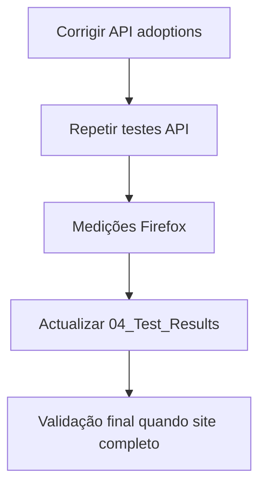

# Recomendações — Performance

Problemas identificados, melhorias sugeridas e oportunidades. Actualizado com base na **baseline inicial** (2026-05-30).

**Relacionado:** [Resultados](04_Test_Results.md) · [Estratégia](01_Performance_Strategy.md)

---

## Resumo

| Prioridade | Item | Impacto | Estado |
|------------|------|---------|--------|
| Alta | Corrigir `GET /api/animals/adoptions` (coluna BD) | Página adoções inutilizável | Aberto |
| Média | Completar medições Firefox (página inicial) | Evidência frontend em falta | Em curso |
| Média | Alinhar queries Mod2 com esquema DataLayer | Evitar 500 em listagens | Aberto |
| Baixa | Optimizar imagens e assets estáticos | Peso de página | A avaliar |
| Baixa | Testes de carga (k6 / ab) | RNF de concorrência | Planeado |

---

## Problemas confirmados (baseline)

### 1. API adoções — HTTP 500

**Sintoma:** `GET /api/animals/adoptions` devolve erro 500 em ~4 ms.

**Causa provável:** coluna `dat_bir_ani` referenciada no código/SQL não existe no esquema actual da BD.

**Acção sugerida:**

1. Comparar query em `MiaCaoMigo_` (model/controller Mod2) com esquema em `MiaCaoMigo_DataLayer`.
2. Renomear coluna na query ou migrar/alias na BD.
3. Repetir medição em [04_Test_Results.md](04_Test_Results.md) e validar página [adoções](02_Frontend_Performance.md).

**Classificação:** **Vermelho** — bloqueia fluxo M2 no frontend.

---

### 2. Documentação de performance sem medição Firefox completa

**Sintoma:** resultados actuais baseiam-se sobretudo em `curl` (só HTML ou API isolada).

**Acção sugerida:** executar [exercício §7](01_Performance_Strategy.md#7-primeiro-exercício-prático-firefox) e guardar capturas em `06_Performance/evidence/` (opcional).

---

## Melhorias preventivas (ainda sem medição completa)

Estas recomendações seguem boas práticas e a [estratégia §6 Fase 4](01_Performance_Strategy.md#6-plano-de-trabalho-em-fases). Priorizar depois dos erros **Vermelho**.

| # | Área | Recomendação | Benefício esperado |
|---|------|--------------|-------------------|
| 1 | Imagens | Comprimir PNG/JPEG; usar dimensões adequadas | Menos KB na Rede |
| 2 | JS/CSS | Evitar duplicar bibliotecas em cada página | Menos pedidos |
| 3 | API | Índices em colunas de filtro/join frequentes | Listagens &lt; 1 s estáveis |
| 4 | API | Paginação em listas grandes (animais, consultas) | Menor body JSON |
| 5 | Frontend | Carregar scripts no fim do body ou `defer` | DOMContentLoaded mais cedo |
| 6 | Cache | Cabeçalhos `Cache-Control` para assets estáticos | Recargas mais rápidas |
| 7 | Auth | Medir login com 10 repetições vs RNF_M1_01 | Prova académica 95% |

---

## O que já está aceitável (baseline)

| Item | Observação |
|------|------------|
| `GET /db-test` | Ligação PG funcional; tempos &lt; 5 ms em localhost |
| HTML estático (inicial, login, adoções) | Ficheiros pequenos (&lt; 15 KB cada) |
| Tempo de resposta em erro 500 | Rápido, mas incorrecto funcionalmente — não confundir com “performance boa” |

---

## Plano de follow-up

| Ordem | Tarefa | Responsável |
|-------|--------|-------------|
| 1 | Corrigir coluna `dat_bir_ani` / query adoções | Dev backend + DataLayer |
| 2 | Repetir baseline API adoções | Performance docs |
| 3 | Firefox: index, login, adocoes | Performance docs |
| 4 | Login: 10× `POST /auth/login` vs RNF_M1_01 | Performance docs |
| 5 | Revisão final antes de entrega APS | Equipa |

---

## Parágrafo modelo (relatório APS)

> Foi realizada uma baseline inicial de performance em ambiente local (`localhost:3000`), com medições automáticas à API e preparação de testes manuais no Firefox. A ligação à base de dados responde de forma rápida (`/db-test`), mas o endpoint de adoções apresentou erro 500 por desalinhamento de esquema, impedindo a validação do requisito RNF_M2_13 nesta fase. Os ficheiros HTML estáticos são leves; a validação completa do frontend aguarda medições DevTools e correcção da API. Recomenda-se corrigir o endpoint, repetir os testes e só então considerar optimizações de assets e carga.

---

## Próximo passo

Actualizar este documento sempre que [04_Test_Results.md](04_Test_Results.md) registar nova sessão ou mudança de classificação Verde/Amarelo/Vermelho.
