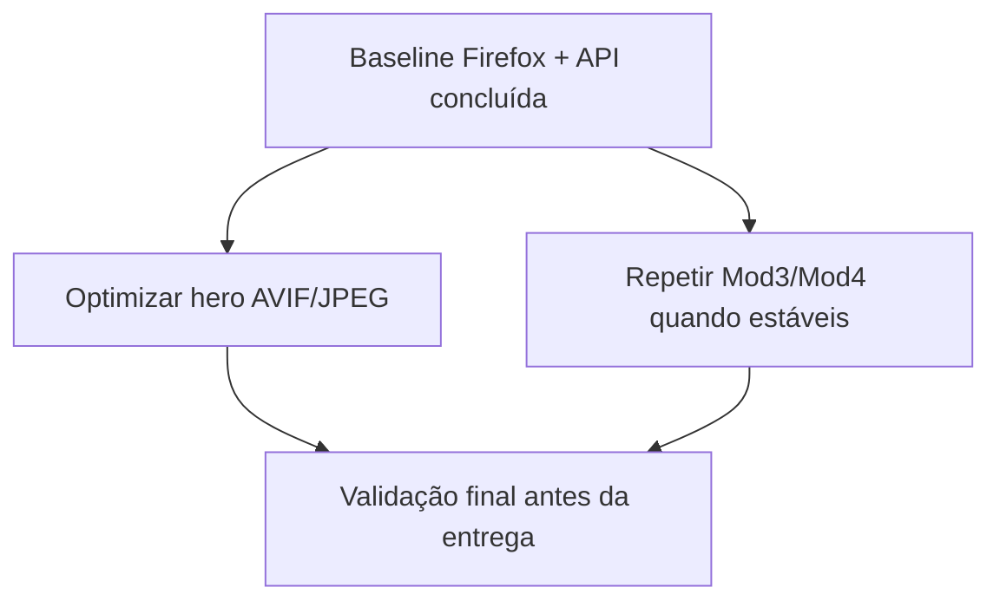

# Recomendações — Performance

Problemas identificados, melhorias sugeridas e oportunidades. Actualizado com base na **baseline inicial** (2026-05-30 / 2026-06-01).

**Relacionado:** [Resultados](04_Test_Results.md) · [Estratégia](01_Performance_Strategy.md)

---

## Resumo

| Prioridade | Item | Impacto | Estado |
|------------|------|---------|--------|
| Alta | Converter `background_pagInicial.jpeg` (AVIF ~2 MB, extensão incorrecta) | ~70% do peso da página inicial | Aberto |
| Baixa | Repetir print da Consola da página inicial, se exigido | Evidência JS explícita | Opcional |
| — | ~~Login 10× vs RNF_M1_01~~ | 8/8 &lt; 2 s em localhost | Fechado |
| — | ~~Corrigir `GET /api/animals/adoptions`~~ | Resolvido 2026-06-01 (`JOIN` em `animaisModel.js`) | Fechado |
| Média | Alinhar queries Mod2 com esquema DataLayer | Evitar 500 em listagens | Aberto |
| Baixa | Optimizar imagens e assets estáticos | Peso de página | A avaliar |
| Baixa | Testes de carga (k6 / ab) | RNF de concorrência | Planeado |

---

## Problemas confirmados (baseline)

### 1. Peso da página inicial — imagem de fundo

**Sintoma:** na medição Firefox, `background_pagInicial.jpeg` pesa ~2,03 MB (~70% dos ~2,72 MB transferidos).

**Causa técnica:** o ficheiro em `FrontEnd/img/background_pagInicial.jpeg` é **AVIF** (`ftypavif`), não JPEG, apesar da extensão `.jpeg`.

**Acção sugerida:**

1. Converter para JPEG ou WebP real (ex.: `ffmpeg -i background_pagInicial.jpeg.bak -q:v 82 background_pagInicial.jpg`).
2. Actualizar `FrontEnd/CSS/index.css` para o novo nome/formato.
3. Opcional: largura máxima ~1920 px para hero.

**Classificação:** **Amarelo** — não bloqueia funcionalidade em localhost; afecta redes lentas.

---

### 2. Evidência de Consola ainda não explícita

**Sintoma:** login, adoções e área cliente já têm prints de Rede; o ficheiro `indexConsoleResult.jpeg` mostra Rede, não Consola.

**Acção sugerida:** se for necessário provar ausência de erros JavaScript, repetir apenas o print da página inicial no separador **Consola**.

---

## Melhorias preventivas (ainda sem medição completa)

Estas recomendações seguem boas práticas e a [estratégia §6 Fase 4](01_Performance_Strategy.md#6-plano-de-trabalho-em-fases). Priorizar depois dos erros **Vermelho**.

| # | Área | Recomendação | Benefício esperado |
|---|------|--------------|-------------------|
| 1 | Imagens | Comprimir PNG/JPEG; usar dimensões adequadas | Menos KB na Rede |
| 2 | JS/CSS | Evitar duplicar bibliotecas em cada página | Menos pedidos |
| 3 | API | Índices em colunas de filtro/join frequentes | Listagens &lt; 1 s estáveis |
| 4 | API | Paginação em listas grandes (animais, consultas) | Menor body JSON |
| 5 | Frontend | Carregar scripts no fim do body ou `defer` | DOMContentLoaded mais cedo |
| 6 | Cache | Cabeçalhos `Cache-Control` para assets estáticos | Recargas mais rápidas |
| 7 | Auth | Medir login com 10 repetições vs RNF_M1_01 | Prova académica 95% |

---

## O que já está aceitável (baseline)

| Item | Observação |
|------|------------|
| `GET /db-test` | Ligação PG funcional; tempos &lt; 5 ms em localhost |
| HTML estático (inicial, login, adoções) | Ficheiros pequenos (&lt; 15 KB cada) |
| `GET /api/animals/adoptions` | Corrigido após desalinhamento query/view; agora HTTP 200 e dentro do RNF_M2_13 |

---

## Plano de follow-up

| Ordem | Tarefa | Responsável |
|-------|--------|-------------|
| 1 | Converter hero AVIF → JPEG/WebP optimizado | Dev frontend |
| 2 | Integrar secção 3.11 no relatório APS | **Feito** |
| 3 | Repetir baseline Mod3/Mod4 quando estável | Equipa |
| 4 | Revisão final antes de entrega APS | Equipa |

---

## Parágrafo modelo (relatório APS)

> Foi realizada uma baseline inicial de performance em ambiente local (`localhost:3000`), com medições automáticas à API e medições manuais no Firefox 151.0.2. A ligação à base de dados responde de forma rápida (`/db-test`) e o endpoint de adoções, após correcção da query no modelo, passou a responder com HTTP 200 e tempos inferiores a 1 s, cumprindo o RNF_M2_13 em localhost. As páginas inicial, login, adoções e área cliente apresentaram carregamento rápido no Firefox; a principal oportunidade de melhoria observada é a optimização da imagem `background_pagInicial.jpeg`, que representa grande parte do peso da página inicial.

---

## Próximo passo

Actualizar este documento sempre que [04_Test_Results.md](04_Test_Results.md) registar nova sessão ou mudança de classificação Verde/Amarelo/Vermelho.
