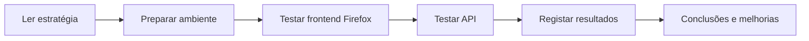

# Performance — MiaCaoMigo Website

Documentação de **desempenho (performance)** do website e da API do projeto MiaCaoMigo.

**Implementação:** repositório irmão `MiaCaoMigo_` (`FrontEnd/` + `Backend/`).  
**Requisitos de referência:** [Requisitos Não Funcionais](../02_Requirements/01_Non_Functional_Requirements.md) (tipo *Performance*).

!!! info "Estado da secção"
    A metodologia e os templates estão disponíveis. Os **resultados** são **baseline inicial** (testes exploratórios), não validação final — o website ainda está em desenvolvimento.

---

## Objetivo da secção

Esta pasta documenta **como** é avaliado o desempenho, **o que** é testado, **com que ferramentas** (prioridade: **Mozilla Firefox**) e **que conclusões** são retiradas.

| Objetivo académico | Descrição |
|--------------------|-----------|
| 1 | Compreender o que “performance web” significa |
| 2 | Executar testes reproduzíveis em ambiente local |
| 3 | Relacionar resultados com os RNF do projeto |
| 4 | Documentar evidências (capturas, tabelas, tempos) |

---

## Documentos nesta pasta

| Ficheiro | Estado | Conteúdo |
|----------|--------|----------|
| [01_Performance_Strategy.md](01_Performance_Strategy.md) | **Disponível** | Enquadramento, ferramentas, métricas, critérios e plano de trabalho |
| [02_Frontend_Performance.md](02_Frontend_Performance.md) | **Baseline** | Páginas no scope, procedimento Firefox, template por página |
| [03_Backend_Performance.md](03_Backend_Performance.md) | **Baseline** | Endpoints, payloads, ligação aos RNF |
| [04_Test_Results.md](04_Test_Results.md) | **Baseline inicial** | Resultados medidos (parciais) |
| [05_Recommendations.md](05_Recommendations.md) | **Em evolução** | Problemas observados e melhorias sugeridas |

**Começar por:** [01_Performance_Strategy.md](01_Performance_Strategy.md) → exercício §7 → registar em [04_Test_Results.md](04_Test_Results.md).

---

## Tipos de teste

| Tipo | Quando usar | Estado atual |
|------|-------------|--------------|
| **Baseline inicial** | Website incompleto; medir o que já funciona | Em curso |
| **Validação final** | Fluxos críticos fechados; comparar com RNF | Planeado |
| **Regressão** | Após alterações relevantes (BD, API, assets) | Planeado |

---

## Passo a passo (visão geral)

| Passo | Atividade | Documento |
|-------|-----------|-------------|
| 1 | Compreender carregamento, interação e servidor | [01 §1](01_Performance_Strategy.md#1-o-que-significa-performance-num-website) |
| 2 | Arrancar site localmente | [02_Runtime_Setup](../04_Architecture/02_Application/02_Runtime_Setup.md) |
| 3 | Medir páginas no Firefox (Rede, Consola) | [02_Frontend_Performance.md](02_Frontend_Performance.md) |
| 4 | Medir tempos da API | [03_Backend_Performance.md](03_Backend_Performance.md) |
| 5 | Preencher tabelas e capturas | [04_Test_Results.md](04_Test_Results.md) |
| 6 | Recomendações e conclusão APS | [05_Recommendations.md](05_Recommendations.md) |

---

## Ligação aos RNF

| RNF | Resumo | Onde testar |
|-----|--------|-------------|
| RNF_M1_01 | Autenticação ≤ 2 s (95%) | `POST /api/users/auth/login` |
| RNF_M2_13 | Consultas simples animais &lt; 1 s | `GET /api/animals/adoptions` |
| RNF_M4_01 | Histórico clínico &lt; 3 s (95%) | Rotas Mod4 (quando estáveis) |

Lista completa: [01_Non_Functional_Requirements.md](../02_Requirements/01_Non_Functional_Requirements.md).

---

## Navegador de referência

Testes manuais com **Mozilla Firefox** (F12 → Rede, Consola). Compatibilidade Chrome/Edge: [RNF_M1_10](../02_Requirements/01_Non_Functional_Requirements.md) — subconjunto opcional para comparação.

---

## Ambiente local

| Serviço | URL típica |
|---------|------------|
| Website + API | `http://localhost:3000` |
| Documentação (MkDocs) | `http://localhost:8000` |
| PostgreSQL (host) | `localhost:5433` |

Ver [02_Runtime_Setup](../04_Architecture/02_Application/02_Runtime_Setup.md).

---

## Próximo passo

1. Executar o [primeiro exercício Firefox](01_Performance_Strategy.md#7-primeiro-exercício-prático-firefox) na página inicial.
2. Atualizar [04_Test_Results.md](04_Test_Results.md) com os valores observados.
3. Repetir para as páginas marcadas como **Pronta para baseline** em [02_Frontend_Performance.md](02_Frontend_Performance.md).
