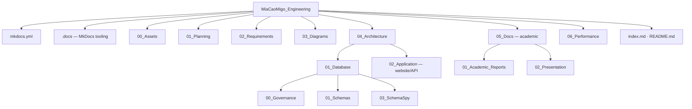

# Estrutura do repositório — `MiaCaoMigo_Engineering`

Mapa de diretorias e ficheiros do portal documental MiaCaoMigo Engineering.  
**Implementação executável:** repositórios irmãos `MiaCaoMigo_` (ApplicationLayer) e `MiaCaoMigo_DataLayer` (DataLayer).

| Métrica | Valor |
|---------|-------|
| Ficheiros totais (aprox.) | ~747 |
| Excl. `03_SchemaSpy/02_Output` | ~181 |
| Páginas Markdown (aprox.) | ~79 |

---

## Visão geral



---

## Raiz

| Path | Função |
|------|--------|
| [`index.md`](index.md) | Homepage MkDocs — hub de navegação |
| [`README.md`](README.md) | README do repositório |
| [`STRUCTURE.md`](STRUCTURE.md) | Este mapa estrutural |
| [`.gitignore`](.gitignore) | Exclusões Git |
| [`home.md`](home.md) | Portal overview (MkDocs) |
| [`DOCUMENTATION_LAYERS.md`](DOCUMENTATION_LAYERS.md) | Modelo de camadas documentais |
| [`mkdocs.yml`](mkdocs.yml) | Configuração MkDocs (navegação, tema, caminhos) |

---

## `.docs/` — infraestrutura MkDocs

> Diretoria protegida: Docker, overrides do tema e scripts de rendering; não alterar sem necessidade explícita. A configuração principal está em [`mkdocs.yml`](mkdocs.yml) na raiz.

```
.docs/
├── docker-compose.yml
├── requirements.txt
└── scripts/
    ├── setup_docs.ps1
    ├── run_docs.ps1
    ├── run_docs_docker.ps1
    ├── stop_docs_docker.ps1
    └── generate.sh
```

| Ficheiro | Função |
|----------|--------|
| `docker-compose.yml` | Servidor de documentação em container |
| `requirements.txt` | Dependências Python (inclui `mkdocs-same-dir` para `docs_dir: .` na raiz) |
| `overrides/` | Overrides do tema Material |

---

## `00_Assets/` — branding

```
00_Assets/
├── 00_Branding/
│   ├── 00_logos/
│   │   ├── Logo.png
│   │   ├── Logo_nBack.png
│   │   └── Logo_partialBack.png
│   └── 01_icons/
│       ├── Logo_nBack.ico
│       └── Logo_pBack.ico
└── 01_Screenshots/
```

---

## `01_Planning/` — sprints e user stories

```
01_Planning/
├── README.md
├── 00_Sprints/
│   ├── Sprint_1/          Sprint_01.md, PDFs, docx, QR
│   ├── Sprint_2/          Sprint_02.md, APS/, Modelo_ER/, BPMN (.vpp)
│   ├── Sprint_3/          Sprint_03.md
│   └── Sprint_4/          Sprint_04.md
└── 01_UserStories/
    ├── README.md
    ├── 01_Narrative_Stories/     Human-readable cast narratives
    │   ├── README.md
    │   ├── Customers/   CLI_*.md
    │   ├── Employees/   EMP_*.md
    │   ├── Animals/     ANI_*.md
    │   └── External_Entities/  EXT_*.md
    └── 02_Operational_Scenarios/   DemoData / QA validation
        ├── 00_ECOSYSTEM.md
        ├── README.md
        ├── 01_Chronology/   TIMELINE_LAUNCH_2026.md
        ├── 02_People/       Customers/, Employees/ (+ README indexes)
        ├── 03_Animals/      ANI_*.md + README.md
        ├── 04_External/     EXT_*.md + README.md
        └── 05_Operations/   OPS_*.md
```

---

## `02_Requirements/` — requisitos

```
02_Requirements/
├── README.md
├── 00_Functional_Requirements.md
├── 01_Non_Functional_Requirements.md
├── 02_Business_Rules.md
├── 03_Business_Processes.md
├── 04_Acceptance_Criteria.md
├── 06_Implementation_Matrix.md
└── 07_Constraints.md
```

| Entrada recomendada | Path |
|---------------------|------|
| Hub | [`02_Requirements/README.md`](02_Requirements/README.md) |
| Matriz de implementação | [`06_Implementation_Matrix.md`](02_Requirements/06_Implementation_Matrix.md) |
| PDF normativo | [`01_Planning/00_Sprints/Sprint_2/APS/Sprint_2.pdf`](01_Planning/00_Sprints/Sprint_2/APS/Sprint_2.pdf) |

---

## `03_Diagrams/` — modelos E-R e UML

```
03_Diagrams/
├── 00_ER_Model/
│   ├── er_model.md
│   ├── ER_V0/             00_Modelo_E-R_V0.drawio
│   ├── ER_V3/             PNG (visão geral + 4 módulos)
│   ├── ER_V8/
│   │   ├── Struct_ER_Model.pdf
│   │   └── Atributos/     01–04_Module*.md (legado parcial)
│   └── ER_V10/            ← alinhado com DataLayer
│       ├── ER_V10.pdf
│       ├── ER_V10.png
│       └── Atributos/
│           ├── README.md
│           └── 01–04_Module*.md
└── 01_UML/                (pasta vazia — reservada)
```

| Entrada recomendada | Path |
|---------------------|------|
| Modelo estrutural PDF | `ER_V8/Struct_ER_Model.pdf` |
| Atributos (fonte DataLayer) | [`ER_V10/Atributos/README.md`](03_Diagrams/00_ER_Model/ER_V10/Atributos/README.md) |

---

## `04_Architecture/` — arquitetura

```
04_Architecture/
├── README.md
├── 00_System_Architecture.md
├── 02_Application/                    website/API architecture, flows and setup
│   ├── README.md
│   ├── 00_Application_Overview.md
│   ├── 01_Website_Flows.md
│   ├── 02_Runtime_Setup.md
│   ├── 03_Implementation_Evidence.md
│   ├── 05_Academic_Report.md          redirect → 05_Docs
│   └── 04_Generated_Docs/             application documentation hub (MkDocs)
│       ├── README.md
│       ├── Backend.md
│       ├── Frontend.md
│       ├── Frontend_Flow.md
│       ├── Swagger.md
│       ├── OpenAPI.md
│       └── Update_Docs.md
└── 01_Database/
    ├── README.md
    ├── Architecture_Overview.md
    ├── 00_Governance/
    │   ├── Overview.md
    │   ├── 00_Naming_Conventions/
    │   ├── 01_SQL_Standards/
    │   └── 02_Integrity_Rules/
    ├── 02_Templates/                  .tpl + 00_SQL_Authoring_Templates.md
    ├── 01_Schemas/
    │   ├── 00_Overview.md
    │   └── 00_Public_Schema/            00_Database.md · 01–04_Module*.md
    └── 03_SchemaSpy/
        ├── 00_Guide/
        └── 02_Output/                   (~566 ficheiros — NÃO editar)
```

### Pontos de entrada — database

| Tema | Documento |
|------|-----------|
| Hub | [`01_Database/README.md`](04_Architecture/01_Database/README.md) |
| Visão geral | [`Architecture_Overview.md`](04_Architecture/01_Database/Architecture_Overview.md) |
| Governação | [`00_Governance/Overview.md`](04_Architecture/01_Database/00_Governance/Overview.md) |
| SchemaSpy | [`03_SchemaSpy/00_Guide/00_Overview.md`](04_Architecture/01_Database/03_SchemaSpy/00_Guide/00_Overview.md) → `02_Output/index.html` |

---

## `05_Docs/` — entregas académicas

```
05_Docs/
├── README.md
├── 00_Statements/                     statements + PDFs APS/PW/PBD
├── 01_Academic_Reports/
│   ├── README.md
│   └── Application_Report.md          relatório defesa aplicação (~15 min)
└── 02_Presentation/
    ├── README.md
    ├── 15min_Structure.md
    └── Screenshots_Checklist.md
```

| Entrada recomendada | Path |
|---------------------|------|
| Hub académico | [`05_Docs/README.md`](05_Docs/README.md) |
| Relatório aplicação | [`01_Academic_Reports/Application_Report.md`](05_Docs/01_Academic_Reports/Application_Report.md) |

---

## `06_Performance/` — desempenho (APS)

```
06_Performance/
├── README.md
├── 01_Performance_Strategy.md
├── 02_Frontend_Performance.md
├── 03_Backend_Performance.md
├── 04_Test_Results.md
└── 05_Recommendations.md
```

---

## Resumo por tipo de conteúdo

| Tipo | Localização | Notas |
|------|-------------|--------|
| Markdown | Toda a árvore (exc. SchemaSpy output) | ~79 ficheiros |
| Templates SQL | `04_Architecture/01_Database/02_Templates/` | `.tpl` authoring patterns |
| Diagramas | `03_Diagrams/` | V0, V3, V8, V10 |
| User stories | `01_Planning/01_UserStories/` | Narrative + Operational (ecosystem) |
| Artefactos gerados | `03_SchemaSpy/02_Output/` | Regeneráveis; ignorar em revisões doc |
| Binários | Sprints, ER PDF/PNG, statements | Entregas e figuras |

---

## Navegação MkDocs vs disco

A sidebar em [`mkdocs.yml`](mkdocs.yml) espelha a estrutura de pastas. Excepções úteis:

| No disco | Na nav MkDocs |
|----------|----------------|
| `ER_V10/Atributos/` | Nav MkDocs lista módulos V10 |
| Relatório académico | Canonical em `05_Docs/`; redirect em `04_Architecture/02_Application/05_Academic_Report.md` |
| `03_SchemaSpy/02_Output/` | Acesso via guia SchemaSpy; não editar manualmente |

---

## Repositórios relacionados

| Repositório | Papel |
|-------------|--------|
| **`MiaCaoMigo_DataLayer`** | Source of truth — SQL, bootstrap, QA |
| **`MiaCaoMigo_`** | ApplicationLayer — frontend, API and runtime integration |
| **`MiaCaoMigo_Engineering`** | Este portal |

---

<div style="text-align:center; opacity:0.85; margin-top:2rem;">

MiaCaoMigo Engineering — estrutura documental

</div>
