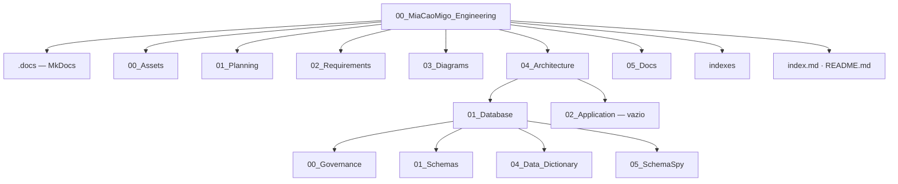

# Estrutura do repositório — `00_MiaCaoMigo_Engineering`

Mapa de diretorias e ficheiros do portal documental MiaCaoMigo Engineering.  
**Implementação executável:** repositório irmão [`01_MiaCaoMigo_DataLayer`](../01_MiaCaoMigo_DataLayer).

| Métrica | Valor |
|---------|-------|
| Ficheiros totais (aprox.) | ~747 |
| Excl. `05_SchemaSpy/02_Output` | ~181 |
| Páginas Markdown (aprox.) | ~79 |

---

## Visão geral



---

## Raiz

| Path | Função |
|------|--------|
| [`index.md`](index.md) | Homepage MkDocs — hub de navegação |
| [`README.md`](README.md) | README do repositório |
| [`STRUCTURE.md`](STRUCTURE.md) | Este mapa estrutural |
| [`.gitignore`](.gitignore) | Exclusões Git |
| [`indexes/home.md`](indexes/home.md) | Índice compacto |

---

## `.docs/` — infraestrutura MkDocs

> Diretoria protegida: configuração e scripts de rendering; não alterar sem necessidade explícita.

```
.docs/
├── mkdocs.yml
├── docker-compose.yml
├── requirements.txt
└── scripts/
    ├── setup_docs.ps1
    ├── run_docs.ps1
    ├── run_docs_docker.ps1
    ├── stop_docs_docker.ps1
    └── generate.sh
```

| Ficheiro | Função |
|----------|--------|
| `mkdocs.yml` | Navegação lateral e tema Material |
| `docker-compose.yml` | Servidor de documentação em container |
| `requirements.txt` | Dependências Python |

---

## `00_Assets/` — branding

```
00_Assets/
├── 00_Branding/
│   ├── 00_logos/
│   │   ├── Logo.png
│   │   ├── Logo_nBack.png
│   │   └── Logo_partialBack.png
│   └── 01_icons/
│       ├── Logo_nBack.ico
│       └── Logo_pBack.ico
└── 01_Screenshots/
```

---

## `01_Planning/` — sprints e user stories

```
01_Planning/
├── 00_Sprints/
│   ├── Sprint_1/          Sprint_01.md, PDFs, docx, QR
│   ├── Sprint_2/          Sprint_02.md, APS/, Modelo_ER/, BPMN (.vpp)
│   ├── Sprint_3/          Sprint_03.md
│   └── Sprint_4/          Sprint_04.md
└── 01_UserStories/
    ├── 00_ECOSYSTEM.md
    ├── README.md
    ├── 01_Chronology/     TIMELINE_LAUNCH_2026.md
    ├── 02_People/
    │   ├── Customers/     CLI_*.md
    │   └── Employees/     EMP_*.md
    ├── 03_Animals/        ANI_*.md
    ├── 04_External/       EXT_*.md
    └── 05_Operations/     OPS_*.md
```

---

## `02_Requirements/` — requisitos

| Ficheiro |
|----------|
| `00_Functional_Requirements.md` |
| `01_Non_Functional_Requirements.md` |
| `02_User_Requirements.md` |
| `03_Business_Requirements.md` |
| `04_Acceptance_Criteria.md` |
| `05_Constraints.md` |

---

## `03_Diagrams/` — modelos E-R e UML

```
03_Diagrams/
├── 00_ER_Model/
│   ├── er_model.md
│   ├── ER_V0/             00_Modelo_E-R_V0.drawio
│   ├── ER_V3/             PNG (visão geral + 4 módulos)
│   ├── ER_V8/
│   │   ├── Struct_ER_Model.pdf
│   │   └── Atributos/     01–04_Module*.md (legado parcial)
│   └── ER_V10/            ← alinhado com DataLayer
│       ├── ER_V10.pdf
│       ├── ER_V10.png
│       └── Atributos/
│           ├── README.md
│           └── 01–04_Module*.md
└── 01_UML/                (pasta vazia — reservada)
```

| Entrada recomendada | Path |
|---------------------|------|
| Modelo estrutural PDF | `ER_V8/Struct_ER_Model.pdf` |
| Atributos (fonte DataLayer) | [`ER_V10/Atributos/README.md`](03_Diagrams/00_ER_Model/ER_V10/Atributos/README.md) |

---

## `04_Architecture/` — arquitetura

```
04_Architecture/
├── README.md
├── 00_System_Architecture.md
├── 02_Application/                    (vazia — app em desenvolvimento)
└── 01_Database/
    ├── README.md
    ├── 00_Schema_Build_Pipeline.md
    ├── 00_Governance/
    │   ├── README.md
    │   ├── 00_Naming_Conventions/     3 × .md
    │   ├── 01_SQL_Standards/          00_SQL_Standards.md
    │   ├── 02_Integrity_Rules/
    │   │   ├── 00_Integrity_Strategy.md
    │   │   ├── 01_Module1_Integrity/  3 × .md
    │   │   ├── 02_Module2_Integrity/  00_Overview.md
    │   │   ├── 03_Module3_Integrity/  00_Overview.md
    │   │   ├── 04_Module4_Integrity/  00_Overview.md
    │   │   ├── 02_Model2_Integrity/   (vazia — legacy)
    │   │   ├── 03_Model3_Integrity/   (vazia — legacy)
    │   │   └── 04_Model4_Integrity/   (vazia — legacy)
    │   └── 03_Templates/
    │       ├── README.md
    │       ├── 00_Meta/               5 × .tpl
    │       ├── 01_Schema/             11 × .tpl
    │       ├── 02_Services/           11 × .tpl
    │       ├── 03_Comments/           1 × .tpl
    │       ├── 04_Bootstrap/          3 × .tpl
    │       ├── 05_DataSeed/           2 × .tpl
    │       └── 06_QA/                 5 × .tpl
    ├── 01_Schemas/
    │   ├── README.md
    │   └── 00_Public_Schema/
    │       ├── 00_Database_Architecture.md
    │       └── 01–04_Module*_Architecture.md
    ├── 04_Data_Dictionary/
    │   ├── 00_Overview.md
    │   └── 01–04_Module*.md
    └── 05_SchemaSpy/
        ├── 00_README.md
        ├── schemaspy.md
        ├── 01_Scripts/
        │   ├── generate_docs.ps1
        │   └── generate_docs.sh
        └── 02_Output/                 (~566 ficheiros — NÃO editar)
            ├── index.html
            ├── tables/*.html
            ├── diagrams/
            └── bower/
```

### Pontos de entrada — database

| Tema | Documento |
|------|-----------|
| Hub | [`01_Database/README.md`](04_Architecture/01_Database/README.md) |
| Build / bootstrap | [`00_Schema_Build_Pipeline.md`](04_Architecture/01_Database/00_Schema_Build_Pipeline.md) |
| Governação | [`00_Governance/README.md`](04_Architecture/01_Database/00_Governance/README.md) |
| M3 soft references | [`03_Module3_Architecture.md#soft-references`](04_Architecture/01_Database/01_Schemas/00_Public_Schema/03_Module3_Architecture.md#soft-references-logical-not-physical-fk) |
| SchemaSpy interativo | [`schemaspy.md`](04_Architecture/01_Database/05_SchemaSpy/schemaspy.md) → `02_Output/index.html` |

---

## `05_Docs/` — entregas académicas

```
05_Docs/
└── 00_Statements/
    ├── statements.md
    ├── 00_ProjectStatement_APS.pdf
    ├── 01_ProjectStatement_PW.pdf
    └── 02_ProjectStatement_PBD.pdf
```

---

## `indexes/`

| Ficheiro | Função |
|----------|--------|
| [`home.md`](indexes/home.md) | Índice rápido (portal, database, ER V10, repos) |

---

## Resumo por tipo de conteúdo

| Tipo | Localização | Notas |
|------|-------------|--------|
| Markdown | Toda a árvore (exc. SchemaSpy output) | ~79 ficheiros |
| Templates SQL | `03_Templates/` | 38 `.tpl` |
| Diagramas | `03_Diagrams/` | V0, V3, V8, V10 |
| User stories | `01_Planning/01_UserStories/` | Narrativa demo/QA |
| Artefactos gerados | `05_SchemaSpy/02_Output/` | Regeneráveis; ignorar em revisões doc |
| Binários | Sprints, ER PDF/PNG, statements | Entregas e figuras |

---

## Navegação MkDocs vs disco

A sidebar em [`.docs/mkdocs.yml`](.docs/mkdocs.yml) espelha a estrutura de pastas. Excepções úteis:

| No disco | Na nav MkDocs |
|----------|----------------|
| `ER_V10/Atributos/` | Preferir links em `er_model.md` e `index.md` (nav ainda referencia ER_V8 em atributos) |
| `STRUCTURE.md` | Não indexado por defeito — mapa de manutenção |
| `05_SchemaSpy/02_Output/` | Acesso via `schemaspy.md` apenas |

---

## Repositórios relacionados

| Repositório | Papel |
|-------------|--------|
| **`01_MiaCaoMigo_DataLayer`** | Source of truth — SQL, bootstrap, QA |
| **`02_MiaCaoMigo_Application`** | Em desenvolvimento — consome `svc_*` |
| **`00_MiaCaoMigo_Engineering`** | Este portal |

---

<div style="text-align:center; opacity:0.85; margin-top:2rem;">

MiaCaoMigo Engineering — estrutura documental

</div>
