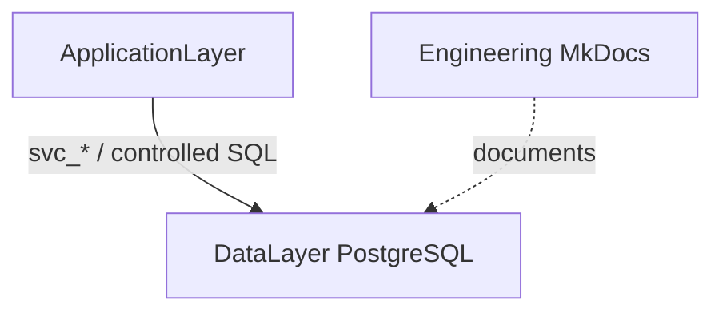

<h1 style="margin-bottom: 8px;">MiaCaoMigo Engineering</h1>

<h3 style="margin-top: 0; color: #6b7280; font-weight: normal;">
Central Engineering &amp; Architecture Portal
</h3>

Structured documentation for architecture, database engineering, integrity validation,
requirements, diagrams, and academic deliverables — rendered with <strong>MkDocs Material</strong>.

---

## Explore the portal

<h4 style="margin-top:0;">Architecture</h4>

System layers and PostgreSQL hub.

<a href="04_Architecture/README.md"><strong>Architecture index</strong></a> 
<a href="04_Architecture/00_System_Architecture.md">System architecture</a> 
<a href="04_Architecture/01_Database/README.md">Database hub</a>

<h4 style="margin-top:0;">Database engineering</h4>

Governance, modules, dictionary, SchemaSpy.

<a href="04_Architecture/01_Database/00_Governance/README.md">Governance</a> 
<a href="04_Architecture/01_Database/04_Data_Dictionary/00_Overview.md">Data dictionary</a> 
<a href="04_Architecture/01_Database/05_SchemaSpy/schemaspy.md">SchemaSpy (interactive)</a>

<h4 style="margin-top:0;">Modeling</h4>

ER attributes and UML views.

<a href="03_Diagrams/00_ER_Model/er_model.md">ER model</a> 
<a href="03_Diagrams/01_UML.md">UML</a>

<h4 style="margin-top:0;">Planning &amp; requirements</h4>

Sprints and specification sets.

<a href="01_Planning/00_Sprints/Sprint_1/Sprint_01.md">Sprints</a> 
<a href="02_Requirements/00_Functional_Requirements.md">Requirements</a>

<h4 style="margin-top:0;">Implementation</h4>

Sibling repository — source of truth for SQL.

<code>01_MiaCaoMigo_DataLayer</code> 
<small><code>DataBase/</code> Bootstrap · Schema · Services · QA</small>

<h4 style="margin-top:0;">Academic &amp; meta</h4>

Statements and repo README.

<a href="05_Docs/00_Statements/statements.md">Academic statements</a> 
<a href="README.md">Engineering README</a>

---

## Ecosystem layers

| Layer | Repository | Responsibility |
|-------|------------|----------------|
| **DataLayer** | `01_MiaCaoMigo_DataLayer` | PostgreSQL schema, services, bootstrap, QA |
| **ApplicationLayer** | (sibling) | APIs, UI, business orchestration |
| **DataEngineering** | `00_MiaCaoMigo_Engineering` | This documentation portal |

---

## Technology stack

| Component | Technology |
|-----------|------------|
| Database | PostgreSQL (+ pg_cron, btree_gist) |
| Containers | Docker / Docker Compose |
| Documentation | MkDocs + Material theme |
| DB visualization | SchemaSpy → `02_Output/index.html` |

---

## Engineering principles

- **As-implemented documentation** — Engineering text follows `01_MiaCaoMigo_DataLayer`, not the reverse.
- **Modular integrity** — structural DDL, triggers, procedures, and QA contracts per module.
- **Separation of layers** — Schema vs Services vs Bootstrap vs host-side QA.
- **Traceability** — naming conventions, templates, and build pipeline documented alongside code.

---

## Documentation map (sidebar)

Use the left navigation (mirrors repository layout):

| Top-level | Focus |
|-----------|--------|
| **Home** | This page · [Home index](indexes/home.md) |
| **Planning** | Sprint artefacts |
| **Requirements** | Functional / NFR / acceptance |
| **Diagrams** | ER V8 attributes · UML |
| **Architecture** | System + **Database** (governance → schemas → dictionary → SchemaSpy) |
| **Documentation** | README · academic statements |

!!! tip "Database onboarding"
    Start at [Database hub](04_Architecture/01_Database/README.md), then [Schema build pipeline](04_Architecture/01_Database/00_Schema_Build_Pipeline.md) and [Governance](04_Architecture/01_Database/00_Governance/README.md).

---

<h3>MiaCaoMigo Project</h3>

Engineering · Architecture · Documentation · Standards

