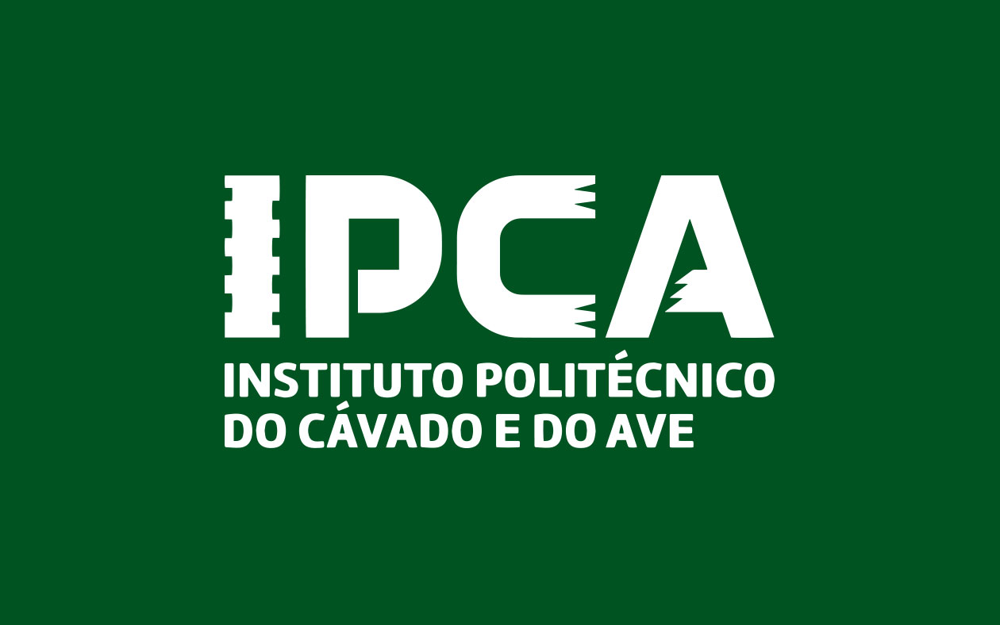

MiaCaoMigo Engineering

Central Engineering & Documentation Portal

Academic engineering and documentation platform dedicated to the planning, modeling, architecture and technical documentation of the MiaCaoMigo ecosystem.

This portal centralizes conceptual, operational and technical documentation produced throughout the project lifecycle.

---

-   **Academic Context**

    Instituto Politécnico do Cávado e do Ave (IPCA)

-   **Academic Year**

    2025 / 2026

-   **Project Type**

    Academic Engineering Project

-   **Platform**

    MkDocs Material Documentation Portal

---

## Authors

- Ivo Sá — 22604  
- Gonçalo Rego — 22603  
- Tiago Mendes — 31595  
- João Marques — 31067  
- Isabel Carvalho — 33234  
- João Navarro — 28028  

---

